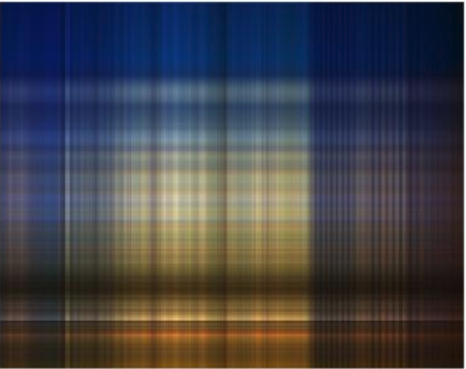
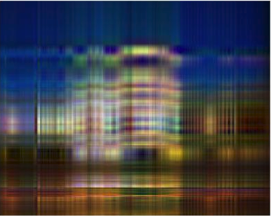
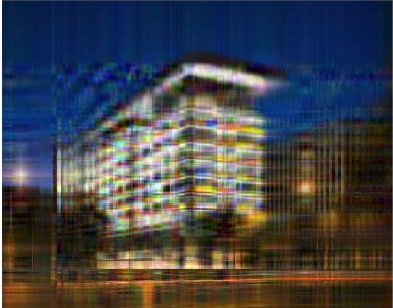
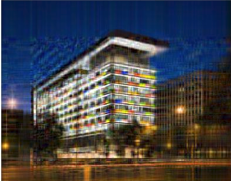
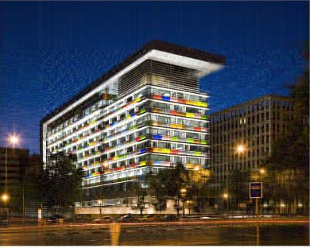
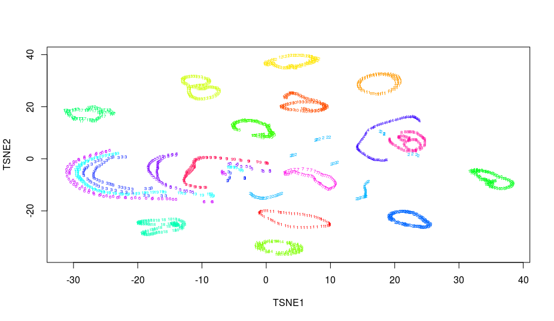

class: middle, center, inverse

# Introducción

---

## Aprendizaje Supervisado


* Espacio de las muestras de entrada: $\mathcal{X}$

* Espacio de las salidas: $\mathcal{Y}$

**Dados**:

* Conjunto de **entrenamiento**: $S = \{x_i,\, y_i\}_{i=1}^N$, con $x_i, y_i \in \mathcal{X} \times \mathcal{Y}$

* Visión probabilística: $x_i, y_i \sim P(X,Y)$


**Objetivo**: 

  * Aprender una regla de predicción (hipótesis), $h: \mathcal{X} \rightarrow \mathcal{Y}$
  
  * Visión probabilística: estimar $P(Y|X)$
  
---

## Aprendizaje Supervisado
**Estrategia básica**: 

  * MLE de algún modelo paramétrico
  
  $$\arg\max_{w} \prod_{i=1}^N P(y_i|x_i, w)$$
  
**Facilidades**:

  * $\mathcal{Y}$ es tiene dimensión baja
  
  * Es sencillo cuantificar el error: natural definir función de coste. Error = valor esperado de coste bajo $P(X,Y)$.
  

---

## Aprendizaje No Supervisado

**Dados**:

* No hay salidas: $S = \{x_i\}_{i=1}^N$, con $x_i \in \mathcal{X}$

* Visión probabilística: $x_i \sim P(X)$

**Objetivo**: 

  * Estimar $P(X)$
  
  * Inferir alguna propiedad de $P(X)$
  
  * Muestrear de $P(X)$


---

## Retos del Aprendizaje No Supervisado

* $X$ generalmente es de alta dimensión (piensa en imágenes: $128 \times 128 \times 3 = 49152)$

* Propiedades de interés que queremos inferir son más complejas que simples parámetros

* No hay una medida directa de cuantificar el error

* Métodos heurísticos no solo para motivar los algoritmos sino también para medir la calidad de los resultados

```{r, fig.height=3.5, fig.align='center', echo=F}
library(ggplot2)
pages = c(0.1, 0.9, 0.23, 0.77)
Topico = c("UL", "SL", "UL", "SL")
Libro = c("ESL", "ESL", "Bishop", "Bishop")
data = data.frame(pages, Topico, Libro)
p = ggplot(data, aes(x=Libro, y=pages, fill=Topico)) + 
  geom_bar(stat = "identity", position = "dodge")
p = p + xlab("Libro")+ ylab("Proporción de páginas")
p
```

**Buen proxy de la dificultad de cada área !!**
---

## Una taxonomía de algoritmos de aprendizaje no supervisado según su objetivo

* Métodos de estimación de densidades

* Manifold learning: PCA, PCA no lineal, self-organizing maps, modelos de variables latentes, ...

* Encontrar regiones convexas del espacio que contengan modas de $P(X)$: análisis de cluster, modelos de mixturas,
...

* Muestrear de $P(X)$: GAN, autoencoders, autoencoders variacionales, ...


---

class: middle, center, inverse

# Repaso Álgebra Lineal

---

## Aplicaciones lineales

* Dado $\boldsymbol{x} \in \mathbb{R}^N$, una **aplicación (función) lineal**  $f : \mathbb{R}^N \rightarrow \mathbb{R}^M$ se expresa como
$$
f(\boldsymbol{x}) = W \boldsymbol{x}
$$
donde $W$ es una matriz de tamaño $M \times N$.

* Para el caso $M = N$, los **autovalores** $\lambda \in \mathbb{R}$ y los **autovectores** $\boldsymbol{v} \in \mathbb{R}^M$ son los elementos que cumplen

$$
W \boldsymbol{v} = \lambda \boldsymbol{v}
$$


* Si los vectores columna de $W = \left[ w_1, \ldots, w_M \right]$ son ortonormales (esto es, $w_i^{\intercal} w_j = 0, w_i^{\intercal} w_i = 1$), se dice que $W$ es una proyección ortonormal. En este caso, los vectores $\left[ w_1, \ldots, w_M \right]$ forman una base ortonormal.


---


## Derivadas matriciales

* Será necesario considerar derivadas de vectores respecto a escalares. En este caso,

$$
\left( \frac{\partial \boldsymbol{a}}{\partial x}  \right)_i = \frac{\partial \boldsymbol{a}_i}{\partial x}
$$

* También podemos derivar respecto a vectores o matrices:

\begin{equation}
\left( \frac{\partial x}{\partial \boldsymbol{a}}  \right)_i = \frac{\partial x}{\partial \boldsymbol{a}_i}, \left( \frac{\partial \boldsymbol{a}}{\partial \boldsymbol{b}}  \right)_{i,j} = \frac{\partial \boldsymbol{a}_i}{\partial \boldsymbol{b}_j} 
\end{equation}

* *Ejercicio*. Probar que

$$
\frac{\partial \boldsymbol{x}^{\intercal} \boldsymbol{a}}{\partial \boldsymbol{x}} = \frac{\partial \boldsymbol{a}^{\intercal} \boldsymbol{x}}{\partial \boldsymbol{x}} = \boldsymbol{a}
$$
y que
$$
\frac{\partial \boldsymbol{A} \boldsymbol{B}}{\partial x} = \frac{\partial \boldsymbol{A}}{\partial x}\boldsymbol{B} + \frac{\partial \boldsymbol{B}}{\partial x}\boldsymbol{A}.
$$

---


## Optimización

* Queremos optimizar una función diferenciable $f(\boldsymbol{x})$ tal que $f : \mathbb{R}^N \rightarrow \mathbb{R}$. Los **óptimos locales** verifican

$$
\frac{\partial f(\boldsymbol{x})}{\partial \boldsymbol{x}} = 0
$$

* En el caso de querer optimizar $f(\boldsymbol{x})$ sujeto a demás a una restricción $g(\boldsymbol{x}) = 0$, podemos utilizar el **Teorema de los multiplicadores de Lagrange** y optimizar la siguiente función objetivo (ya sin restricciones):

$$
f(\boldsymbol{x}) + \lambda g(\boldsymbol{x})
$$


---

class: middle, center, inverse

# Métodos Lineales reducción de dimensionalidad
# Análisis de Componentes Principales 

---

## Dos definiciones alternativas

* Proyección ortogonal de datos a subespacio de dimensión inferior tal que varianza de proyecciones es máxima

* Proyección lineal que minimiza el *coste medio de proyección* = distancia media cuadrática entre datos y sus proyecciones

* Ambos dan lugar al mismo algoritmo!

* Diferentes aplicaciones: reducción de dimensionalidad, compresión, visualización de datos, extracción de variables predictoras...


---

class: middle, center, inverse

# Formulación por Máxima Varianza
---

## PCA: Formulación por Máxima Varianza (1)

* Dados: $x_n \in \mathbb{R}^D,\quad n = 1, \ldots, N$

* Objetivo: encontrar proyección lineal $\pi: \mathbb{R}^D \rightarrow \mathbb{R}^M$ tal que $M < D$ y se maximize la varianza de los datos proyectados. 

--

* Ejemplo $\mathbb{R}^2 \rightarrow \mathbb{R}^1$:


---


## PCA: Formulación por Máxima Varianza (2)

* Empezamos considerando proyección a $\mathbb{R}$ ( $M = 1$ ).

* Una proyección viene representada por su dirección, esto es, un vector $\boldsymbol{u}_1 \in \mathbb{R}^D$. Como sólo nos interesa la dirección, imponemos $\boldsymbol{u}_1^\intercal \boldsymbol{u}_1 = 1$.

* $\boldsymbol{u}_1^\intercal x_n$ es la proyección del n-ésimo punto.

* También nos interesa calcular:
  
  * La media de los datos proyectados
    $$ \frac{1}{N} \sum_{n=1}^N \boldsymbol{u}_1^\intercal x_n = \boldsymbol{u}_1^\intercal \bar{x}  $$
    
  * La varianza de los datos proyectados
  
    $$  \frac{1}{N} \sum_{n=1}^N (\boldsymbol{u}_1^\intercal x_n - \boldsymbol{u}_1^\intercal \bar{x})^2 = \boldsymbol{u}_1^\intercal \boldsymbol{S} \boldsymbol{u}_1 $$
    
    

---


## PCA: Formulación por Máxima Varianza (3)

* Ahora ya podemos plantear un problema de optimización, con objetivo:

$$
\max_{\boldsymbol{u}_1} \boldsymbol{u}_1^\intercal \boldsymbol{S} \boldsymbol{u}_1
$$

* con la restricción:

$$
\boldsymbol{u}_1^\intercal \boldsymbol{u}_1 = 1
$$

* Para resolverlo, utilizamos la formulación Lagrangiana, con lo que lo convertimos al siguiente problema de optimización sin restricciones:

$$
\max_{\boldsymbol{u}_1} \boldsymbol{u}_1^\intercal \boldsymbol{S} \boldsymbol{u}_1 + \lambda_1 (\boldsymbol{u}_1^\intercal \boldsymbol{u}_1 - 1)
$$

* Derivamos...

---

## PCA: Formulación por Máxima Varianza (4)

* Queda que

$$
\boldsymbol{S} \boldsymbol{u}_1 = \lambda_1 \boldsymbol{u}_1
$$
es decir, $\boldsymbol{u}_1$ es *autovector de la matriz de covarianzas* $\boldsymbol{S}$.

* Más aún,

$$
\boldsymbol{u}_1^\intercal \boldsymbol{S} \boldsymbol{u}_1 = \lambda_1
$$
la *varianza es precisamente el mayor autovalor* 

* El autovector $\boldsymbol{u}_1$ asociado al mayor autovalor, $\lambda_1$ es conocido como *primera componente principal*.


---

class: middle, center, inverse

# Minimización de Error de Proyección

---

## PCA: Minimización de Error de Proyección (1)

* Considérese  el conjunto de observaciones $\lbrace x_n \rbrace_{n=1}^{N}$, donde $x_n \in \mathbb{R}^D$

* $\lbrace u_i \rbrace_{i=1}^{D}$: base ortonormal completa de dimension $D$

\begin{equation}
x_n = \sum_{i=1}^D \alpha_{ni} u_i
\end{equation}

--

* Sin pérdida de generalidad

\begin{equation}
x_n = \sum_{i=1}^D (x_n^\top u_i) u_i
\end{equation}

* Interés: aproximar dato usando representación que requiera $M<D$ parámetros.

---

## PCA: Minimización de Error de Proyección (2)

* Representamos el subespacio de dimensión $M$ con los primeros $M$ vectores de la base

\begin{equation}
\tilde{x}_n = \sum_{i=1}^M (z_{ni} u_i)  + \sum_{i=M+1}^D b_i u_i
\end{equation}

* Escogemos $\{z_{in}\}$, $\{b_{i}\}$ y $\{u_{i}\}$ para distorsión introducida por reducción de dimensión

\begin{equation}
J = \frac{1}{N}\sum_{n=1}^N \Vert x_n - \tilde{x}_n \Vert^2
\end{equation}

--

* Minimizando respecto $\{z_{in}\}$

\begin{equation}
z_{nj} = x_n^\top u_j
\end{equation}

* Minimizando respecto $\{b_{i}\}$

\begin{equation}
b_{j} = \left( \frac{1}{N} \sum_{n=1}^N x_n^\top \right)^\top u_j = \bar{x}^\top u_j
\end{equation}

---

## PCA: Minimización de Error de Proyección (3)

* Substituyendo en la expresión de $\tilde{x}_n$

\begin{equation}
x_n - \tilde{x}_n = \sum_{i=M+1}^D \left \lbrace (x_n - \bar{x})^\top u_i  \right \rbrace u_i
\end{equation}

* Vector desplazamiento ortogonal al *subespacio principal*. Substituendo en $J$

\begin{equation}
J = \frac{1}{N} \sum_{n=1}^N \sum_{i=M+1}^D \left( x_n^\top u_i - \bar{x}^\top u_i \right)^2 = \sum_{i=M+1}^D u^\top_i S u_i
\end{equation}

Donde $S = \frac{1}{N} \sum_{i=1}^N (x_n - \bar{x})(x_n - \bar{x})^\top$.

* Falta minimizar respecto de $\{u_{i}\}$, sujeto a $u_i^\top u_i = 1$

---

## PCA: Minimización de Error de Proyección (4)

* Intuición: $D=2$ y $M=1$: encontra $u_2$ que minimice $J = u^\top_2 S u_2$, sujeto a $u_2^Tu_2 = 1$.

\begin{equation}
\tilde{J} = u_2^\top S u_2 + \lambda_2(1-u_2^\top u_2)
\end{equation}

* Derivando e igualando a 0: $S u_2 = \lambda_2 u_2$ $\Rightarrow$ todo autovector define un punto estacionario.

* En el mínimio $J=\lambda_2$: escogemos $u_2$ con autovalor mínimo. Luego **subespacio principal** definido por autovectores de autovalor máximo.

---

## PCA: Minimización de Error de Proyección (5)

* Solución general: escoger como $\{u_{i}\}$ los autovectores de la matriz de covarianza

\begin{equation}
S u_i = \lambda_i u_i
\end{equation}

* El valor de distorsión es entonces $J = \sum_{i= M+1}^D \lambda_i$. 

* $J$ será mínimo si escogemos los $D-M$ autovectores de menor autovalor.

* Los autovectores definiendo el subespacio principal, serán los de mayor autovalor.


---

class: middle, center, inverse

# Aplicaciones de PCA

---

## Aplicación: compresión de datos

* Cada punto de dimensión $D$ se representa como vector de dimensión $M$

\begin{equation}
\tilde{x}_n = \bar{x} + \sum_{i=1}^M (x_n^\top - \bar{x}^\top u_i)u_i
\end{equation}

---

## Aplicación: compresión de datos

* M = 1



---

## Aplicación: compresión de datos

* M = 3




---

## Aplicación: compresión de datos

* M = 10




---

## Aplicación: compresión de datos

* M = 20




---

## Aplicación: compresión de datos

* M = 50




---

## Aplicación: compresión de datos

* M = 200


  
  
---

## Aplicación: visualización de datos

* Es conveniente realizarla antes de elegir el modelo predictivo, para tener una idea de cómo es la estructura de los datos.

* Representar los datos directamente es fácil cuando están en 2D ó 3D.

* ¿Cómo hacerlo cuando $D >> 3$?. Situación habitual:

  * MNIST: $D = 28 \times  28$.
  * CIFAR10: $D = 32 \times 32 \times 3$.
  
* Con PCA: $Z = X W^\top$ donde

  1. $W$ es $M \times D$.
  2. $X$ es la matriz de datos $N \times D$.
  
---

## Ejemplo práctico

* Código en *exercises/03-unsupervised/src/tSNE_coil20R.R*.

* Base de datos COIL20: imágenes de 20 objetos desde 72 ángulos diferentes.

```{r, fig.height=5.5, fig.align='center', echo=F, cache=T, message=F}
library(coil20)
# coil20 <- download_coil20(verbose = TRUE)  # Tarda unos 3 min, solo hacerlo la primera vez
# Para que vaya más rápido, cargamos uno ya descargado antes
# saveRDS(coil20, file = "coil20.rds")
coil20 <- readRDS(file = '../../exercises/03-unsupervised/src/coil20.rds')

#1440 imagenes en escala de gris a 128 x 128  
# (20 objetos con 72 poses cada), 
# con 16,384 features (128 x 128 px). 
#dim(coil20)

show_object(coil20, object = 4, pose = 0)

```  

---

## Ejemplo práctico

* Código en *exercises/03-unsupervised/src/tSNE_coil20R.R*.

* Base de datos COIL20: imágenes de 20 objetos desde 72 ángulos diferentes.

```{r, fig.height=5.5, fig.align='center', echo=F, cache=T, message=F}
library(coil20)
# coil20 <- download_coil20(verbose = TRUE)  # Tarda unos 3 min, solo hacerlo la primera vez
# Para que vaya más rápido, cargamos uno ya descargado antes
# saveRDS(coil20, file = "coil20.rds")
coil20 <- readRDS(file = '../../exercises/03-unsupervised/src/coil20.rds')

#1440 imagenes en escala de gris a 128 x 128  
# (20 objetos con 72 poses cada), 
# con 16,384 features (128 x 128 px). 
#dim(coil20)

show_object(coil20, object = 4, pose = 1)

```  

---

## Ejemplo práctico

* Código en *exercises/03-unsupervised/src/tSNE_coil20R.R*.

* Base de datos COIL20: imágenes de 20 objetos desde 72 ángulos diferentes.

```{r, fig.height=5.5, fig.align='center', echo=F, cache=T, message=F}
library(coil20)
# coil20 <- download_coil20(verbose = TRUE)  # Tarda unos 3 min, solo hacerlo la primera vez
# Para que vaya más rápido, cargamos uno ya descargado antes
# saveRDS(coil20, file = "coil20.rds")
coil20 <- readRDS(file = '../../exercises/03-unsupervised/src/coil20.rds')

#1440 imagenes en escala de gris a 128 x 128  
# (20 objetos con 72 poses cada), 
# con 16,384 features (128 x 128 px). 
#dim(coil20)

show_object(coil20, object = 4, pose = 2)

```  

---

## Ejemplo práctico

* Código en *exercises/03-unsupervised/src/tSNE_coil20R.R*.

* Base de datos COIL20: imágenes de 20 objetos desde 72 ángulos diferentes.

```{r, fig.height=5.5, fig.align='center', echo=F, cache=T, message=F}
library(coil20)
# coil20 <- download_coil20(verbose = TRUE)  # Tarda unos 3 min, solo hacerlo la primera vez
# Para que vaya más rápido, cargamos uno ya descargado antes
# saveRDS(coil20, file = "coil20.rds")
coil20 <- readRDS(file = '../../exercises/03-unsupervised/src/coil20.rds')

#1440 imagenes en escala de gris a 128 x 128  
# (20 objetos con 72 poses cada), 
# con 16,384 features (128 x 128 px). 
#dim(coil20)

show_object(coil20, object = 4, pose = 3)

```  

---

## Ejemplo práctico

* Proyección a 2D mediante PCA:


  
---

class: middle, center, inverse

# Cuestiones de implementación

---


## Datos de alta dimensionalidad

* En muchos casos $D > N$, por ejemplo imágenes: $|D| = \mbox{ancho} \times \mbox{alto} \times 3$.

* La complejidad de calcular los autovectores de una matriz $D\times D$ escala según $\mathcal{O}(D^3)$. 

* $N$ puntos en un espacio de dimensión $D > N$ forman un subespacio de dimensión $N-1$ (¡o menos!).


* No tiene sentido aplicar PCA con $M > N-1$: saldrán autovalores $0$.

---

### Datos de alta dimensionalidad

* Consideramos $\boldsymbol{X} \in \mathbb{R}^{N \times D}$ cuya fila n-ésima es $x_n - \bar{x}$. 

* La matriz de covarianzas es $\boldsymbol{S} = N^{-1}\boldsymbol{X}^\intercal \boldsymbol{X}$, luego obtenemos autovectores mediante

$$
\frac{1}{N}\boldsymbol{X}^\intercal \boldsymbol{X} \boldsymbol{u}_i = \lambda_i \boldsymbol{u}_i
$$

* Multiplicando ambos miembros por la izquierda por $\boldsymbol{X}$ llegamos a

$$
\frac{1}{N}\boldsymbol{X} \boldsymbol{X}^\intercal (\boldsymbol{X} \boldsymbol{u}_i) = \lambda_i (\boldsymbol{X} \boldsymbol{u}_i)
$$
con lo que $\boldsymbol{v}_i = \boldsymbol{X} \boldsymbol{u}_i$ es un autovector de la matriz $N^{-1}\boldsymbol{X} \boldsymbol{X}^\intercal$, de tamaño $N \times N$.


* ¡La complejidad ahora es $\mathcal{O}(N^3)!$


---

### Datos de alta dimensionalidad

* Pero tenemos que obtener los autovectores en el espacio original... 

* Multiplicando ahora por $\boldsymbol{X}^\intercal$:

$$
(\frac{1}{N}\boldsymbol{X}^\intercal \boldsymbol{X}) (\boldsymbol{X}^\intercal \boldsymbol{v}_i) = \lambda_i (\boldsymbol{X}^\intercal \boldsymbol{v}_i)
$$

* Con lo que $\boldsymbol{X}^\intercal \boldsymbol{v}_i$ es autovector de $\boldsymbol{S}$ con mismo autovalor $\lambda_i$.

En resumen:

1. Calculamos autovectores $\boldsymbol{v}_i$.

2. $\boldsymbol{u}_i =  \boldsymbol{X}^\intercal \boldsymbol{v}_i$ y normalizamos $\boldsymbol{u}_i$.

3. En concreto, $$\boldsymbol{u}_i = \frac{1}{(N\lambda_i)^{1/2}} \boldsymbol{X}^\intercal \boldsymbol{v}_i   $$

---

class: middle, center, inverse

# Análisis de Componentes Principales Probabilístico

---
# PCA Probabilístico

* PCA = solución de máxima verosimilitud de modelo probabilístico de variables latentes. 

* Permite tratamiento natural de datos ausentes.

* Permite la formulación Bayesiana en la que la dimensión del subespacio principal puede ser aprendida de los datos.

* Permite modelizar densidades condicionadas a clases y por tanto clasificar.

* Puede generar muestras de la distribución de interés.

---
# PPCA - Modelo Generativo

* Idea: explicar cómo los datos observados se han generado a partir de variables latentes.

* Cada dato observado $\textbf{x}$ se ha generado de esta manera:

  1. Se muestrea la variable latente $\textbf{z} \sim  \mathcal{N}(\textbf{z} \vert 0, \textbf{I})$.
  
  2. $\textbf{x} = \textbf{W} \boldsymbol{z} + \boldsymbol{\mu} + \boldsymbol{\epsilon}$. Donde $\boldsymbol{\epsilon}$ sigue una distribución normal de media 0 y covarianza $\sigma^2\textbf{I}$. 
  
--

* Ahora, supongamos que queremos determinar $\textbf{W}, \boldsymbol{\mu}$ y $\sigma^2$ usando máxima verosimilitd. Necesitamos escribir la distribución marginal $p(\textbf{x})$.

\begin{equation}
p(\boldsymbol{x}) = \int p(\boldsymbol{x}|\boldsymbol{z})p(\boldsymbol{z})d\boldsymbol{z} 
\end{equation}

--

* Como estamos ante un modelo lineal-Gaussiano, la marginal seguirá una distribución normal con


\begin{eqnarray}
\mathbb{E}[\boldsymbol{x}] &=& \mathbb{E}[\boldsymbol{Wz} + \boldsymbol{\mu} + \boldsymbol{\epsilon}] = \boldsymbol{\mu} \\
\text{cov}[\boldsymbol{x}] &=& \mathbb{E}[(\boldsymbol{Wz} + \boldsymbol{\epsilon})(\boldsymbol{Wz} + \boldsymbol{\epsilon})^\top] = \mathbb{E}[\boldsymbol{Wz} \boldsymbol{z}^\top \boldsymbol{W}^\top] + \mathbb{E}[\boldsymbol{\epsilon} \boldsymbol{\epsilon}^\top] = \boldsymbol{W} \boldsymbol{W}^\top + \sigma^2 \boldsymbol{I} = \boldsymbol{C}
\end{eqnarray}

---
# PPCA - Solución de máxima verosimilitud

* Dado un conjunto de datos observados $\boldsymbol(X) = \lbrace \boldsymbol{x_n} \rbrace$, la log-verosimilitud viene dada por

\begin{eqnarray}
\log p(\boldsymbol X \vert \boldsymbol W ,\boldsymbol \mu ,\sigma^2) &=&\sum_{n=1}^N \log p(\boldsymbol{x}_n \vert \boldsymbol W,\boldsymbol \mu,\sigma^2) \\
&=& -\frac{ND}{2} \log(2\pi)-\frac{N}{2} \log(|\boldsymbol{C}|) - \frac{1}{2} \sum_{n=1}^N (\boldsymbol{x}_n - \boldsymbol \mu )^\top \boldsymbol{C}^{-1} (\boldsymbol{x}_n - \boldsymbol \mu )
\end{eqnarray}

--

* Tipping and Bishop, [Probabilistic principal component analysis](https://rss.onlinelibrary.wiley.com/doi/pdf/10.1111/1467-9868.00196) resuelven el problema de optimización.

\begin{eqnarray}
\boldsymbol{\mu} &=& \bar{\boldsymbol{x}} \\
\boldsymbol{W}_{ML} &=& \boldsymbol{U}_M (\boldsymbol{L}_M - \sigma^2 \boldsymbol{I})^{1/2} \boldsymbol{R} \\
\sigma_{ML}^2 &=& \frac{1}{D-M} \sum_{i=M+1}^D \lambda_i
\end{eqnarray}

donde $\lambda_i$ son los $D-M$ autovalores de la matriz de covarianza de menor valor, $\boldsymbol{U}_M$ es una matriz formada por los $M$ autovectores de mayor autovalor y $\boldsymbol{L}_M$ es una matriz diagonal con estos autovectores.

---
# PPCA - Recuperando PCA

* PCA: proyección de puntos de un espacio $D$-dimensional a uno $M$-dimensional.

* PPCA: al revés. Para aplicaciones, invertimos esta proyección usando el teorema de Bayes.

--

* Cualquier punto $\boldsymbol{x}$, puede ser resumido usando media y covarianza a posteriori.

\begin{eqnarray}
\mathbb{E}[\boldsymbol{z} \vert \boldsymbol{x}] &=& \boldsymbol{M}^{-1}\boldsymbol{W}_{ML}^\top (\boldsymbol{x} -\boldsymbol{\bar{x}}) \\
\text{cov}[\boldsymbol{z} \vert \boldsymbol{x}] &=& \sigma^2 \boldsymbol{M}^{-1}
\end{eqnarray}

con $\boldsymbol{M} = \boldsymbol{W}^\top  \boldsymbol{W} + \sigma^2 \boldsymbol{I}$.

--

* En el límite $\sigma^2 \rightarrow 0$, la media a posteriori representa una proyección ortogonal del punto al espacio latente y la covarianza es cero, por tanto la densidad es singular, recuperando PCA.

* **IMPORTANTE**: PPCA permite definir una distribución Gaussiana multivariante en la que el número de grados de libertad, puede ser contralado y al mismo tiempo capturar correlaciones en los datos.


---

class: middle, center, inverse

# Métodos Lineales reducción de dimensionalidad
# Factorización de matrices no negativas


---
## NMF - Algoritmo

* Sea $\textbf{X}$ la matriz $N \times p$ de observaciones. Buscamos aproximarla por

\begin{equation}
\textbf{X} \simeq \textbf{W} \textbf{H}  
\end{equation}

* $\textbf{W}$ matrix $N \times r$ y $\textbf{H}$ matriz $r \times p$. $\textbf{X}$, $\textbf{W}$ y $\textbf{H}$ tiene todos sus elementos no negativos.

* $\textbf{W}$ y $\textbf{H}$ son tales que minimizan alguna función de coste.

--

* Tantos algoritmos diferentes como funciones de coste. Dos comunes:

  1. Norma de Frobenius
\begin{equation}
\Vert \textbf{X} - \textbf{W} \textbf{H} \Vert^2 = \sum_{i=1}^N \sum_{j=1}^p \left ( \textbf{X}_{ij} - [\textbf{W} \textbf{H}]_{ij} \right)^2
\end{equation}
  2. *Divergencia Kullback-Leibler*
\begin{equation}
D( X\Vert \textbf{W} \textbf{H}  ) =  \sum_{i=1}^N \sum_{j=1}^p \left( \textbf{X}_{ij} \log \frac{\textbf{X}_{ij}}{[\textbf{W} \textbf{H}]_{ij}} - \textbf{X}_{ij} + [\textbf{W} \textbf{H}]_{ij} \right)
\end{equation}


Aquí se explica cómo resolver los problemas de optimización correspondientes.

* Lee and Seung [Algorithms for Non-negative Matrix Factorization](https://papers.nips.cc/paper/1861-algorithms-for-non-negative-matrix-factorization.pdf)
   
---
# Ejercicio

Demuéstrese que encontrar $\textbf{W} \textbf{H}$ que minimizan la *Divergencia Kullback-Leibler*, equivale a maximizar la log-verosimilitud de un modelo que asume $\textbf{X}_{ij} \sim \text{Po}([\textbf{W} \textbf{H}]_{ij})$. Es decir, $\textbf{X}_{ij}$ sigue una distribución de Poisson de media $[\textbf{W} \textbf{H}]_{ij}$.


---
# NMF - Sistemas de Recomendación

* Muchos usos: sistemas de recomendación, minería de textos, reducción de dimensionalidad
* Ejemplo: **Sistemas de recomendación**. 

<center>  </center>

* Cada elemento de $\textbf{X}$ es número de compras que el cliente ha realizado del producto.
--

* Cada columna de $\textbf{W}$ define un segmento. Cuanto mayor es el *peso* de un producto en el segmento, más determinado está este segmento por el producto. 

* Las columnas de $\textbf{H}$ asignan a cada cliente pesos de pertenencia a cada segmento.

* Cada cliente está descrito por una combinación lineal de segmentos, con coeficientes dados por las columnas de $\textbf{H}$.


---
# NMF - Sistemas de Recomendación

* **Cada cliente se genera como combinación de variables ocultas (segmentos). NMF genera estas variables.**

* El analista debe interpretar los segmentos

--

* **¿Cómo recomendar?**

1. Reconstruír la matrix $\textbf{X}$.

2. Para un cliente dado, recomendar productos con mayor peso.

3. Para un producto dado, recomendar a los clientes que mayor peso dan al producto.

--

¿Cómo usarías la Factorización No Negativa de Matrices en problemas de minería de textos?

???

Para un cliente dado, la matriz reconstruida dará mucho peso a los productos que pertenezcan a los segmentos a los que más peso asigna este cliente.

Para un producto dado, la matriz reconstruida dará mucho peso a los clientes que den peso a los segmentos de los que este producto es más representativo.

Para minería de textos, cada columnda de X es un documento y cada fila una palabra. Los elementos de X son número de apariciones. Las variables ocultas o segmentos pueden identificarse con distintas temáticas. Entonces cada documento se expresa como combinación lineal de temáticas.


---

class: middle, center, inverse

# Métodos no lineales reducción de dimensionalidad


---

# Métodos no lineales

* PCA realiza una transformación lineal a los datos: $z_n = \textbf{W}x_n$.

* ¿Cómo podemos extenderlo de forma no lineal?

--

* ¡Apilando múltiples capas!

$$
z^{(1)}_n = \sigma(\textbf{W}^{(i)} x_n)
$$
$$
\ldots
$$
$$
z^{(i+1)}_n = \sigma(\textbf{W}^{(i)} z^{(i)}_n)
$$
donde $\sigma$ es una función no lineal (por ejemplo $\sigma(z) = \max \lbrace 0, z \rbrace$).

* Es la base de los *autoencoders* (autocodificadores), uno de los bloques principales del *deep learning* (aprendizaje pofundo).

* [Ejemplo de autoencoders en Keras](https://blog.keras.io/building-autoencoders-in-keras.html)


---

## t-distributed Stochastic Neighbor Embedding (tSNE)


* Usaremos técnicas de reducción de dimensionalidad, concretamente aquellas que:

  1. Preserven distancias.
  
  2. Preserven topologías.
  
* Problema original: encontrar una transformación (no lineal)

$$
\mathcal{X} := \lbrace x_1, \ldots, x_N \in \mathbb{R}^D \rbrace \rightarrow
\mathcal{Y} := \lbrace y_1, \ldots, y_N \in \mathbb{R}^M \rbrace
$$

de forma que ambas distribuciones *se parezcan* lo más posible

$$
\min_{\mathcal{Y}} C(\mathcal{X}, \mathcal{Y})
$$
* donde $\mathcal{C}$ será una **divergencia** (mide similaridad entre distribuciones).

---

##  Stochastic Neighbor Embedding (SNE)

* SNE convierte **distancias euclídeas** en **similaridades** , que pueden ser interpretadas como probabilidades:

\begin{equation}
p_{j|i} = \frac{\exp \lbrace -||  x_i - x_j  ||^2/2\sigma_i^2 \rbrace }{ \sum_{k \neq j} \exp \lbrace -||  x_i - x_j  ||^2 / 2\sigma_i^2 \rbrace}
\end{equation}
\begin{equation}
q_{j|i} = \frac{\exp \lbrace -||  y_i - y_j  ||^2 \rbrace }{ \sum_{k \neq j} \exp \lbrace -||  y_i - y_j  ||^2  \rbrace}
\end{equation}

* Las distribuciones de los vecinos del punto $i$ son $P_i = \lbrace p_{1|i}, \ldots, p_{N|i} \rbrace$ y $Q_i = \lbrace q_{1|i}, \ldots, q_{N|i} \rbrace$

* Optimizamos la divergencia de Kullback-Leiber

\begin{equation}
C = \sum_i KL(P_i || Q_i) = \sum_i \sum_j p_{j|i} \log \frac{p_{j|i}}{q_{j|i}}
\end{equation}


---

## De SNE a tSNE

* SNE simétrico: optimizamos más eficientemente $C = KL(P||Q)$ definiendo:

\begin{equation}
p_{ij} = \frac{p_{j|i} + p_{i|j}}{2n}
\end{equation}
\begin{equation}
q_{ij} = \frac{\exp \lbrace -||  y_i - y_j  ||^2 \rbrace }{ \sum_{k \neq j} \exp \lbrace -||  y_i - y_j  ||^2  \rbrace}
\end{equation}

* tSNE: en lugar de kernel Gaussiano usamos t-Student en el espacio $\mathcal{Y}$:

\begin{equation}
q_{ij} = \frac{(1 + ||  y_i - y_j  ||^2)^{-1} }{ \sum_{k \neq j} (1 + ||  y_i - y_j  ||^2)^{-1}}
\end{equation}

(la t-Student tiene colas más pesadas que la Normal, evitando que los puntos se colapsen mucho en el espacio $\mathcal{Y}$)


---

## Ejemplo práctico

* Base de datos COIL20: imágenes de 20 objetos desde 72 ángulos diferentes.

* Proyección a 2D mediante PCA:


---

## Ejemplo práctico

* Proyección a 2D mediante tSNE:




---
# Referencias

   1. Randal J. Barnes [Matrix Differentiation (and some othe stuff)](https://atmos.washington.edu/~dennis/MatrixCalculus.pdf)
   
   2. Lee and Seung [Algorithms for Non-negative Matrix Factorization](https://papers.nips.cc/paper/1861-algorithms-for-non-negative-matrix-factorization.pdf)
   
   3. Tipping and Bishop, [Probabilistic principal component analysis](https://rss.onlinelibrary.wiley.com/doi/pdf/10.1111/1467-9868.00196)
   
   


