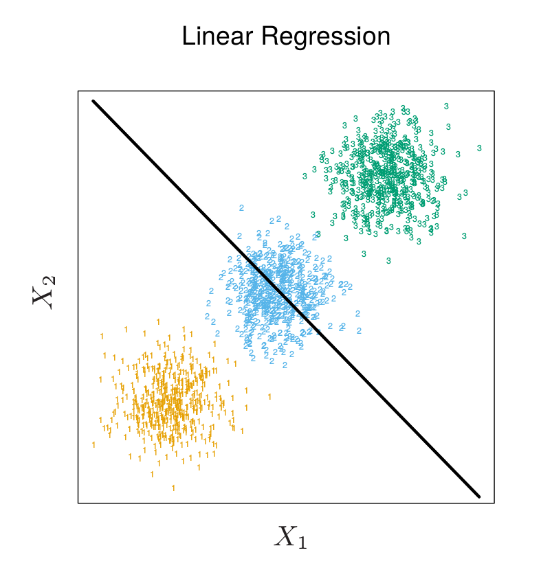
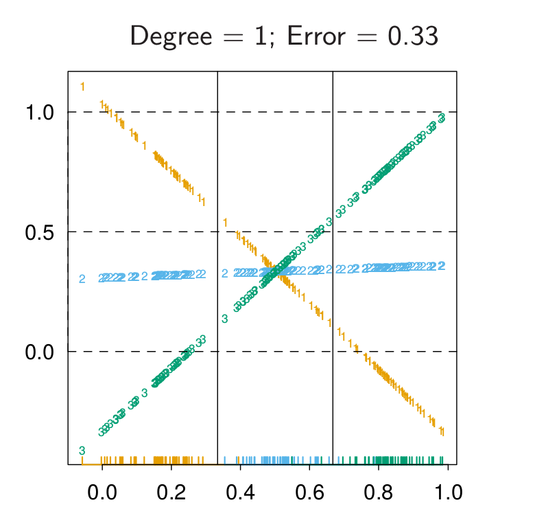
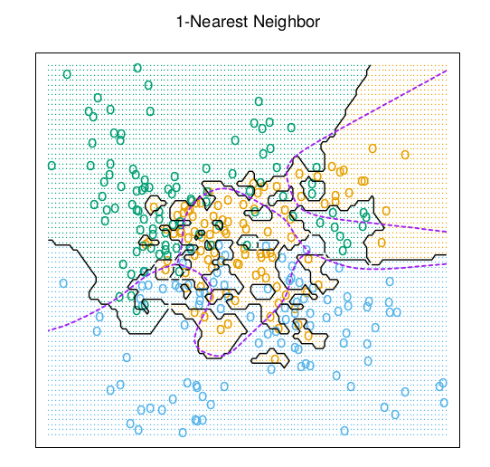
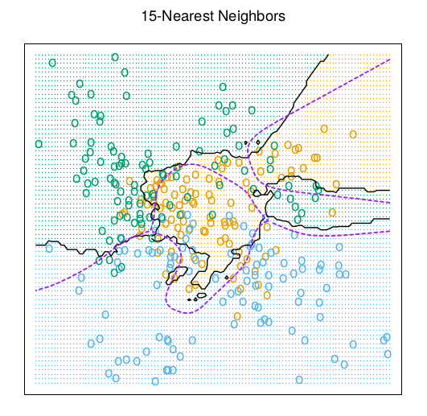

class: middle, center, inverse

# Regresión Lineal en problemas de clasificación

---

## ¿Cómo aplicar regresión lineal a problema de clasificación multiclase?

* Consideramos $K$ categorías.

* **One Hot Encoding** de las categorías: para categoría *k*, crear vector $K$ dimensional $t_k$ con tan solo un 1 en posición $k$ (resto ceros).

* $y_i = t_k$ si la categoría del ejemplo i-ésimo es $k$.

--

* Problema de predicción: reproducir el target de cada observación. Resolver

\begin{equation}
\min_{\textbf{B}} \sum_{i=1}^N \Vert y_i - [(1,x_i^\top) \textbf{B}]^\top\Vert^2
\end{equation}

* Para clasificar nueva observación se calcula el vector $\hat{f}(x)$ y se clasifica resolviendo

\begin{equation}
\arg\min_{k} \Vert \hat{f}(x) - t_k \Vert^2
\end{equation}

* Es fácil ver que el problema desacopla en $K$ problemas de regresión (uno para cada clase).

---

## Problema - *masking*

* Cuando $K \geq 3$ unas clases pueden enmascarar otras.

 

*Fuente*: Elements of Statistical Learning

---

class: middle, center, inverse

# Introducción

---

## Teoría de la decisión estadística

* Sea $X \in \mathbb{R}^p$, vector de variables predictoras.

* Sea $Y \in  \lbrace Y_1, Y_2, \dots, Y_K\rbrace$, respuesta categórica.

* Distribución de los datos $X, Y \sim p(X,Y)$.

--

* Dado nuevo $X$ necesitamos estimar $\widehat{Y} (X) \in \lbrace \lbrace Y_1, Y_2, \dots, Y_K \rbrace$.
 
* Definimos función de coste $L[Y, \widehat{Y} (X)]$. Una bastante común: coste $0/1$ (0 si acertamos, 1 si nos equivocamos).

--

* Objetivo: Escoger $\widehat{Y} (X)$ que minimice coste esperado

\begin{eqnarray}
\mathbb{E}_{X,Y} \left[ L(Y, \widehat{Y} (X)) \right] &=& \mathbb{E}_{X} \mathbb{E}_{Y\vert X}\left[ L(Y, \widehat{Y} (X)) \right] \\
&=& \mathbb{E}_{X} \sum_{i=1}^K L[Y_i, \widehat{Y} (X)] P(Y=Y_k \vert X)
\end{eqnarray}
---

## Teoría de la decisión estadística

* Es suficiente minimizar el coste esperado para cada $x$

\begin{eqnarray}
\widehat{Y} (x) = \arg_\min{y} \sum_{i=1}^K L[Y_i, y] P(Y=Y_k \vert X = x)
\end{eqnarray}

--

* Con el coste $0/1$ 

\begin{eqnarray}
\widehat{Y} (x) = \arg_\min{y} \left[ 1 - P(y \vert X = x) \right]
\end{eqnarray}

* Asignamos la clase con más probabilidad a posteriori.

---

## Teoría de la decisión estadística

* Hemos separado el problema de clasificación en dos partes

  1. **Inferencia**: usar datos de entrenamiento para encontrar $P(Y=Y_k \vert X = x)$.
  2. **Decisión**: usar las distribuciones a posteriori para tomar decisión óptima de clasificación (minimizar coste esperado, maximizar utilidad esperada...)
  
* Posibilidad alternativa: aprender directamente funciones que mapeen $X$ en $Y$. 

  
---

## Tres maneras de enfrentar los problemas de clasificación

1. *Modelos generativos*: tratan de modelizar $P(Y,X)$ (Naive-Bayes).

  + Permiten muestrear.
  + Detección de outliers (si $P(X)$ es pequeño).
  - Más dífícil (si $X$ es de dimensión alta...).
  
2. *Modelos discriminativos*: tratan de modelizar $P(Y \vert X)$ (Regresión logística).

  + Si solo interesa clasificar: más fácil computacionalmente.
  
3. *Funciones discriminantes*: Aprenden funciones que mapean $X$ en $Y$ directamente (Perceptrón).
  
  - No tenemos acceso a las probabilidades a posteriori cada vez que queramos tomar nuevas decisiones.
  - Probabilidades a posteriori **muy útiles**: cambaimos frecuentemente función de coste, queremos tener opción de rechazo, combinar modelos, etc.

---

class: middle, center, inverse

# Análisis Discriminante Lineal

---

## LDA

* Sea $f_k(x)$ la densidad de probabilidad de $x$ condicionada a la clase $Y_k$. 
* Sea $\pi_k$ el prior de la clase $Y_k$. Se tiene

\begin{equation}
P(Y=Y_k \vert X=x) = \frac{f_k(x) \pi_k}{\sum_{i=1}^K f_i (x) \pi_{i}}
\end{equation}

* ¿Es este un modelo generativo, discriminativo o función discriminante?

---

## LDA

* Asumamos modelo Gaussiano para $f_k(x)$

\begin{equation}
f_k(x) = \frac{1}{(2 \pi)^{p/2} \vert \boldsymbol{\Sigma_k}\vert^{1/2}} \exp \left[ -\frac{1}{2} (x-\mu_k)^\top \boldsymbol{\Sigma_k}^{-1}(x-\mu_k) \right]
\end{equation}

* LDA: Asume que las clases tienen matriz de covarianza común $\boldsymbol{\Sigma_k} = \boldsymbol{\Sigma}$ $\forall k$.

--

* Comparamos dos clases

\begin{eqnarray}
\log \frac{P(Y=Y_k \vert x)}{P(Y=Y_j \vert x)} &=& \log \frac{f_k(x)}{f_j(x)} + \log \frac{\pi_k(x)}{\pi_j(x)} \\
&=& \log \frac{\pi_k(x)}{\pi_j(x)} - \frac{1}{2} (\mu_k + \mu_j)^\top \boldsymbol{\Sigma}^{-1} (\mu_k + \mu_j) + x^\top {\Sigma}^{-1} (\mu_k - \mu_l)
\end{eqnarray}

* Frontera de decisión lineal!!

* El hecho de que $\boldsymbol{\Sigma}$ no dependa de la clase causa la linealidad.

---

## LDA

* Vemos que asignar a $X=x$ la clase con más probabilidad a posteriori es equivalente a asignar la clase con *función discriminante lineal* $\delta_k (x)$ más grande

\begin{equation}
\delta_k (x) = x^\top \boldsymbol{\Sigma}^{-1} \mu_k - \frac{1}{2} \mu_k^\top \boldsymbol{\Sigma}^{-1}\mu_k + \log \pi_k
\end{equation}

--

* Para estimar parámetros desconocidos, usamos datos de entrenamiento (MLE) 

  1. $\hat{\pi}_k = N_k/N$
  2. $\hat{\mu}_k = \sum_{x_i \vert y_i = Y_k} x_i/N_k$
  3. $\boldsymbol{\Sigma} = \sum_{k=1}^K \sum_{x_i \vert y_i = Y_k} (x_i - \hat{\mu}_k)(x_i - \hat{\mu}_k)^\top / (N-K)$

* $\mathcal{O}$(Kp)$
---

## QDA

* Si no asumimos que las matrices de covarianza son independientes de las clases, llegamos al **Análisis Discriminante Cuadrático**.

\begin{equation}
\delta_k (x) = -\frac{1}{2} \log \vert \boldsymbol{\Sigma}_k \vert - \frac{1}{2} (x - \mu_k)^\top \boldsymbol{\Sigma}_k^{-1}(x - \mu_k) + \log \pi_k
\end{equation}

* La frontera de decisión ahora es cuadrática.

--

* Para estimar parámetros desconocidos, usamos datos de entrenamiento (MLE) 

  1. $\hat{\pi}_k = N_k/N$
  2. $\hat{\mu}_k = \sum_{x_i \vert y_i = Y_k} x_i/N_k$
  3. $\boldsymbol{\Sigma}_k = \sum_{x_i \vert y_i = Y_k} (x_i - \hat{\mu}_k)(x_i - \hat{\mu}_k)^\top / (N-K)$

* $\mathcal{O}$(Kp^2)$ parámetros (ojo cuando $p$ es grande!!).

---

## Análisis Discriminante Regularizado

* Compromiso entre LDA y QDA, regularizando la matriz de covarianza.

\begin{equation}
\hat{\boldsymbol{\Sigma}}_k(\alpha) = \alpha \hat{\boldsymbol{\Sigma}}_k + (1-\alpha)\hat{\boldsymbol{\Sigma}}
\end{equation}

* $\alpha \in [0,1]$ permite un contínuo de modelos entre LDA y QDA.

* $\alpha$ suele escogerse usando validación cruzada, validación hold-out,...

* Otra posibilidad

\begin{equation}
\hat{\boldsymbol{\Sigma}}_k(\gamma) = \gamma \hat{\boldsymbol{\Sigma}} + (1-\gamma) \sigma^2 \boldsymbol{I}
\end{equation}

---

## Computación para LDA

* La computación se simplifica diagonalizando la matriz $\hat{\boldsymbol{\Sigma}}$.

* Sea $\hat{\boldsymbol{\Sigma}} = \boldsymbol{U} \boldsymbol{D} \boldsymbol{U}^\top$ la descomposición en autovalores de la matriz de covarianza.

* Para clasificar podemos:

  1. *Esferizar* los datos usando $X^* = \boldsymbol{D}^{-\frac{1}{2}} \boldsymbol{U}^\top X$. Ahora la matriz de covarianza es la identidad.
  2. Clasificar una nueva instancia a la clase del centroide más cercano en el espacio transformado, modulo el efecto de los priors $\pi_k$.
  3. Esto es así pues podemos escribir la función discriminante como
  
  \begin{equation}
  \delta_k'(x) = -\frac{1}{2} (x - \mu_k)^\top \boldsymbol{\Sigma}^{-1}(x - \mu_k) + \log \pi_k
  \end{equation}

---

class: middle, center, inverse

## Regresión Logística y Optimización Estocástica

---

## Regresión logística (repaso)

* Clasificación binaria:

\begin{equation*}
p(y = 1 | x) = \sigma (w^\intercal x + b)
\end{equation*}

* Clasificación en $M > 2$ clases: cambiar la función sigmoide $\sigma$ por la **softmax** $s: \mathbb{R}^M \rightarrow \mathbb{R}^M$, definida como

\begin{equation*}
s(z)_i = \frac{e^{z_i}}{\sum_{j=1}^M e^{z_j}}
\end{equation*}

donde $z = Wx + B$, con $W \in \mathbb{R}^{M \times D}, B \in \mathbb{R}^{M \times 1}$.

* Aprendizaje mediante mínimos cuadrados no lineales, descenso por el gradiente: los algoritmos vistos requieren acceso a la matriz $X$ entera en cada iteración.

* ¿Qué hacer cuando $X$ no cabe en memoria?

---

## Descenso por el gradiente (GD)

* Habitualmente se considera el problema de minimizar una función con la siguiente forma:

\begin{equation*}
f(w) = \frac{1}{N}\sum_{i=1}^N f_i(w)
\end{equation*}

(por ejemplo, al minimizar el error/pérdida promedio sobre la muestra de entrenamiento)

--

* Optimizamos iterando:

\begin{equation*}
w^{t+1} = w^t - \eta \nabla_w f(w^t)
\end{equation*}

* Problema: complejidad $\mathcal{O}(N)$

---

## Descenso por el gradiente estocástico (SGD)

* En cada iteración, barajeamos los datos y escogemos **uno** al azar

\begin{equation*}
w^{t+1} = w^t - \eta \nabla_w f_i(w^t)
\end{equation*}

* También podemos seleccionar un **minilote** $\mathcal{B} = \lbrace i_1, \ldots, i_B \rbrace \subset \lbrace 1, \ldots N \rbrace$ al azar en cada iteración:

\begin{equation*}
w^{t+1} = w^t - \eta \nabla_w \frac{1}{B} \sum_{i \in \mathcal{B}} f_i(w^t)
\end{equation*}

* La complejidad pasa de $\mathcal{O}(N)$ a $\mathcal{O}(B)$, además, no es necesario tener toda la matriz $X$, sino solo los datos del minilote $\mathcal{B}$.

* Otra ventaja: mayor probabilidad de escapar óptimos locales que con GD: un punto estacionario de la función objetivo en GD no lo será en SGD generalmente.

---

## Ejemplo

Figuras mostrando trayectorias vs tamaño del lote.

---

## Propiedades del SGD

* *Ejercicio: demostrar que el estimador por minilotes es **insesgado**. *

* Citar a Robins & Munro.

* Citar asintótico cuando B = 1.

---

## Nuevos desarrollos desde SGD

### Momentum

### AdaGrad

### RMSProp

### Adam

---

class: middle, center, inverse

# Interacciones y Máquinas de Factorización (FMs)

---

class: middle, center, inverse

# k Vecinos Más Próximos (k-NN)

---

## Fundamentos

* k-NN es un algoritmo robusto y versátil que suele usarse como base antes de modelos más complejos.

* Es de tipo **supervisado**: aprende una función $h: \mathcal{X} \rightarrow \mathcal{Y}$, donde $\mathcal{Y}$ puede ser discreto (clasificación) o continuo (regresión).

* Es **no paramétrico**: no hace ninguna suposición acerca de la estructura de $h$ (por ejemplo, que sea lineal, $h(x) = w^{\intercal} x)$. Esto ayuda para prevenir errores de modelización.

* El aprendizaje es **basado en instancias**: en lugar de aprender parámetros, **memoriza** los datos de entrenamiento, que serán usados directamente como *conocimiento* para la fase de inferencia.

* En consecuencia: solo al predecir sobre datos de test el algoritmo usa los datos de entrenamiento.

---

## Algoritmo

### (Pre)entrenamiento

1. Almacenar el dataset de entrenamiento $\mathcal{D}_{tr}$.

2. Especificar una función de distancia $d : \mathcal{X} \times \mathcal{X} \rightarrow \mathbb{R}_{+}$

--

### Predicción 

1. Dado una instancia de test $x_0$, encontrar los $k$ puntos $\lbrace x_{(1)}, \ldots, x_{(k)} \rbrace := \mathcal{A} \subset \mathcal{D}_{tr}$ más cercanos a $x_0$ según $d$.

2. La clase predicha será la **mayoritaria** de las clases de los elementos en $\mathcal{A}$, es decir,

\begin{equation*}
P(y = j | x_0 ) = \frac{1}{k} \sum_{i \in \mathcal{A}} I(y_{(i)} = j)
\end{equation*}

donde $I$ es la función indicatriz.

---

## Funciones de distancia

* Supongamos $x_1, x_2 \in \mathcal{X} = \mathbb{R}^D$.

* **Distancia L1**: $d_1(x_1, x_2) = \sum_{d=1}^D | x_{1,d} - x_{2,d} |$.

* **Distancia L2**: $d_2(x_1, x_2) = \sqrt{\sum_{d=1}^D (x_{1,d} - x_{2,d})^2 }$.

* **L1 vs L2**: la L2 penaliza mucho más puntos alejados que la L1.

* ¡Es conveniente estandarizar las variables a media 0 y varianza 1 ya que pueden estar en distintas escalas!

---

## El hiperparámetro $k$

* Intuititivamente, aumentar $k$ tiende a suavizar la frontera de decisión, es decir, el clasificador es más resistente a outliers. 

*Fuente*: Elements of Statistical Learning

---

## El hiperparámetro $k$

* Intuititivamente, aumentar $k$ tiende a suavizar la frontera de decisión, es decir, el clasificador es más resistente a outliers. 

*Fuente*: Elements of Statistical Learning

---

## Ventajas

* Sencillo y válido para regresión y clasificación multiclase (no solo binaria).

* **No hace suposiciones** sobre la estructura de los datos.

## Inconvenientes

* Predicción **muy costosa en tiempo**: en la mayoría de las aplicaciones, interesa que la predicción sea rápida y el entrenamiento lento.

* Necesario almacenar todo el dataset de entrenamiento.

* En **alta dimensión**, las distancias no son intuitivas.

---

## Propiedades asintóticas

## Versiones aproximadas: LSH (TODO)

---

## En la práctica: resumen

* Preprocesar los datos: estandarizar.

* Si los datos tienen mucha dimensionalidad, considera utilizar técnicas de reducción de dimensionalidad.

* Validar en el hiperparámetro $k$ y la distancia $d$.

* Si tiempo es crítico, considerar usar variantes aproximadas: https://github.com/eddelbuettel/rcppannoy

---
# Referencias

   1. Randal J. Barnes [Matrix Differentiation (and some othe stuff)](https://atmos.washington.edu/~dennis/MatrixCalculus.pdf)
   

   

