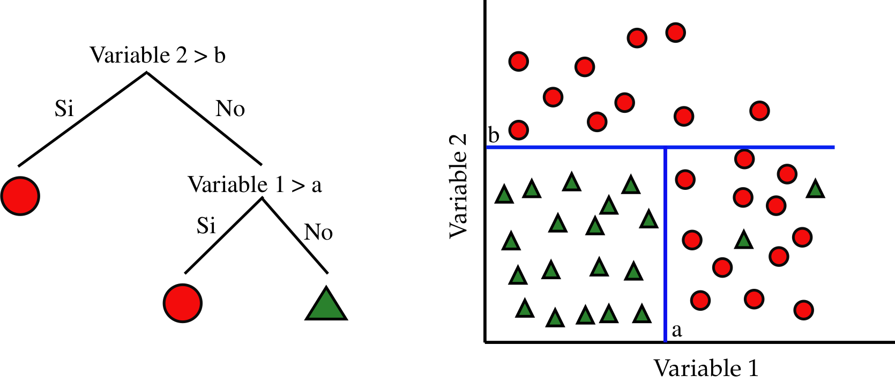
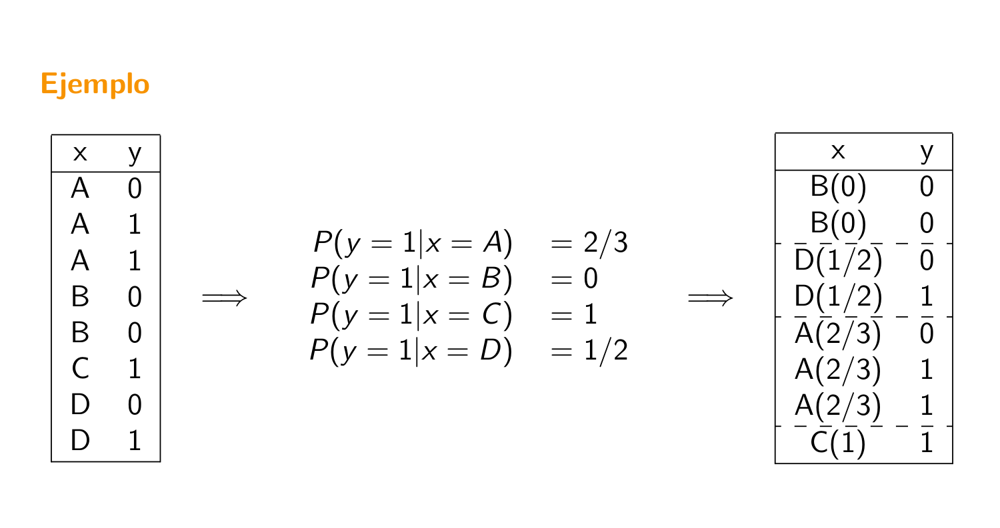
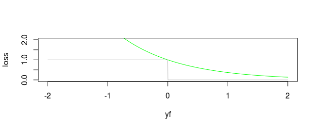
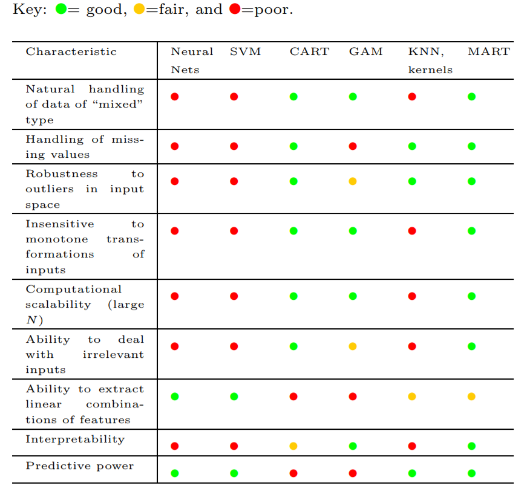
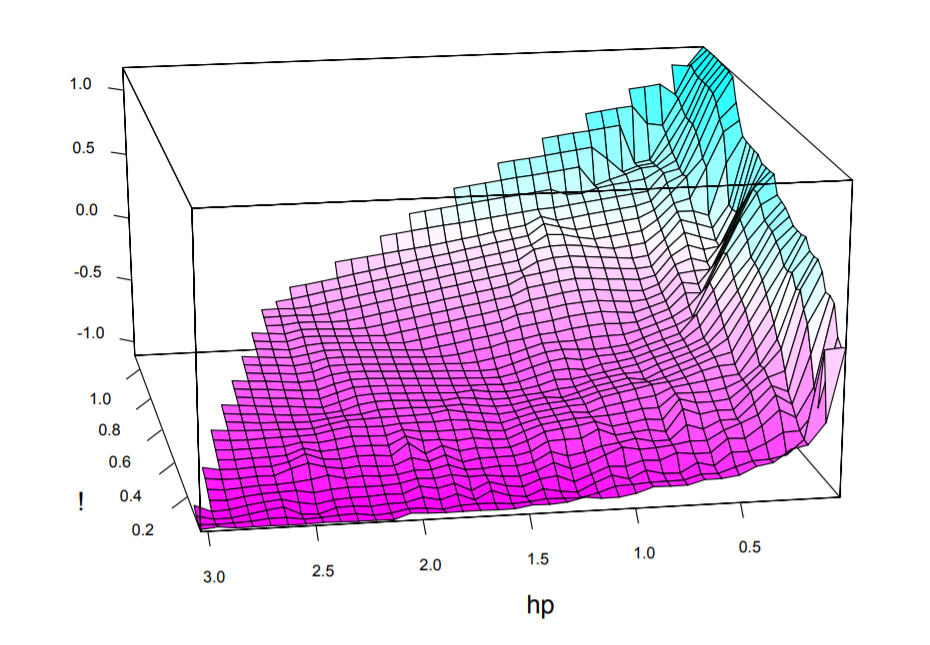
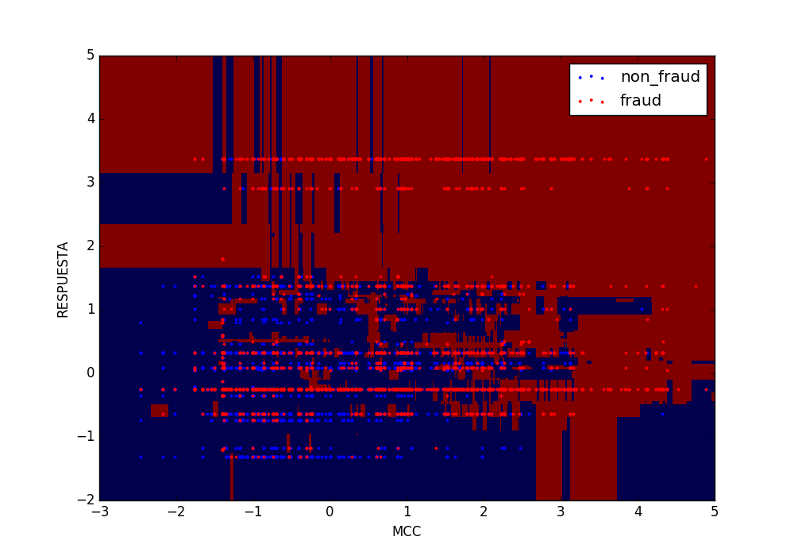
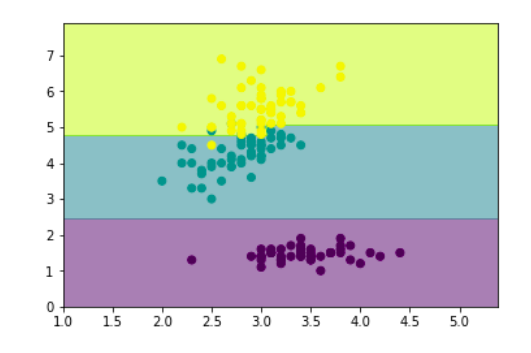
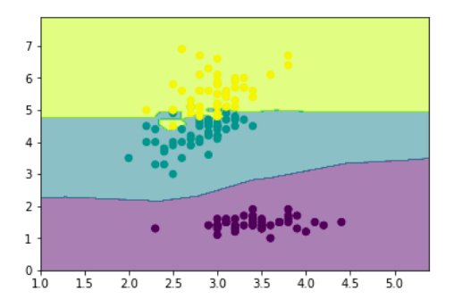
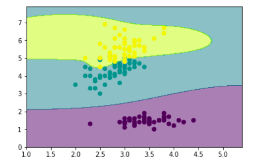
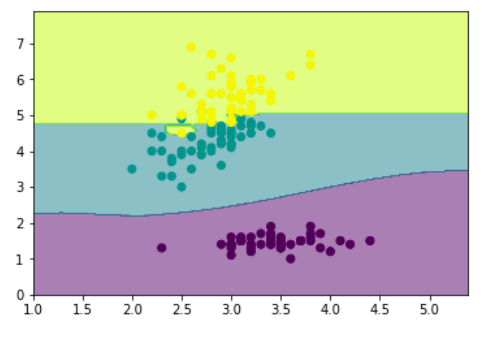

class: middle, center, inverse

# Árboles de Clasificación y Regresión (CART)

---

## Introducción

* Idea de los árboles: particionar el espacio de variables predictores en rectángulos.

* Ajustar modelo muy sencillo a cada partición.

* Tarea: encontrar usando el train las estructura del árbol (variables del corte y umbral) y el modelo en cada partición.

--

* Punto fuerte: interpretabilidad

* Importante en ciencias médicas: imita la forma de pensar de los doctores.

---

## Árboles de regresión (1)

* Sean datos de entrenamiento $\lbrace (x_i, y_i) \rbrace_{i=1}^N$, donde cada $x_i$ es un vector de $p$ variables predictoras. 

* Supongamos que particionamos el espacio de variables predictoras en $M$ regiones $R_1, \dots, R_M$ y para cada una ajustamos una constante $c_m$. La respuestas es

\begin{equation}
f(x) = \sum_{m=1}^M c_m I(x \in R_m)
\end{equation}

* Si nuestro criterio es minimizar $\sum (y_i - f(x_i))^2$, entonces dada la región $R_m$ la mejor $c_m$ es la media de los $y_i$ de los $x_i \in R_m$.

---

## Árboles de regresión (2)

* Buscar la mejor partición $R_1,\dots, R_M$ en términos minimizar la suma de cuadrados es **computacionalmente inviable**.

* Alternativa greedy: buscar mejores particiones binarias de forma secuencial.

* Empezando con todos los datos, sea $j$ la variable de partición y $s$ el umbral. Esto define dos regiones del espacio $R_1$ $(X_j \leq s)$ y $R_2$ $(X_j > s)$.

* Hay que resolver

\begin{equation}
\min_{j,s} \left[ \min_{c_1} \sum_{x_i \in R_1(j,s)} (y_i - c_1)^2 +  \min_{c_2} \sum_{x_i \in R_2(j,s)} (y_i - c_2)^2\right]
\end{equation}

--

* Para cada $j,s$ el problema interno se resuelve inmediatamente: $c_1$ es la media de los $y_i$ de los $x_i \in R_1$ (igual para $c_2$).

* Para cada variable $j$ encontrar el punto de partición $s$ es rápido.

* Se puede inspeccionar todas las variables de partición y encontrar el mejor par $(j,s)$.

* Iterar el proceso en las regiones resultantes.

---

## Árboles de regresión (3)

* ¿Cuándo parar?

* Árbol profundo hace overfitting, árbol pequeño tiene mucho sesgo.

* Tamaño del árbol es un hiperparámetro.

--

* Estrategia óptima: construír un árbol muy profundo $(T_0)$ y **podarlo**.

* Sea $T$ cualquier subárbol de $T_0$ obtenido colapsando algún nodo interno.

* Sea $|T|$ el número de nodos terminales en $T$ y $N_m$ el número de instancias en el nodo terminal $m$-ésimo. Entonces

\begin{equation}
Q_m(T) = \frac{1}{N_m} \sum_{x_i \in R_m} (y_i - \hat{c}_m)^2
\end{equation}

--

* El criterio a optimizar en la poda es

\begin{equation}
\sum_{m=1}^{|T|} N_m Q_m(T) + \alpha |T|
\end{equation}

---

## Árboles de regresión (4)

* El criterio a optimizar en la poda es

\begin{equation}
C_\alpha (T) = \sum_{m=1}^{|T|} N_m Q_m(T) + \alpha |T|
\end{equation}

* $\alpha$ es un hiperparámetro que penaliza el tamaño de los árboles.

* Para cada $\alpha$ existe un subarbol $T_\alpha$ tal que $C_\alpha (T_\alpha)$ es mínimo. 

--

* Estrategia de búsqueda de $T_\alpha$: colapsar el nodo que produce el menos incremento en $\sum_{m=1}^{|T|} N_m Q_m(T)$, hasta quedarnos con un solo nodo.

* Esta secuencia de subárboles contiene el óptimo!

---

## Árboles de clasificación

* Debemos cambiar el criterio para particionar y para podar.

* Sea un nodo $m$ que representa la región $R_m$ con $N_m$ observaciones. Definimos $\hat{p}_{mk}$ como la proporción de instancias de clase $k$ en el nodo $m$.

* Denominamos $k(m)$ a la clase mayoritaria en el nodo $m$ (aquella para la cual $\hat{p}_{mk}$ es máximo)

--

* **Medidas de impuridad**

  1. Error de clasificación:  $1 - \hat{p}_{mk(m)}$
  2. Índice de Gini:  $\sum_{k=1}^K \hat{p}_{mk} (1- \hat{p}_{mk})$
  3. Entropía cruzada: $- \sum_{k=1}^K \hat{p}_{mk} \log \hat{p}_{mk}$

* Gini y entropía cruzada **son diferenciables**.

* OJO: pesar con número de ejemplos en cada partición resultante!! Es decir, minimizar 

\begin{equation}
n_L Q_L + n_R Q_R
\end{equation}

---

## Detalle técnico (1)

* **Ejercicio**: ¿Cuántas particiones posibles de una variable categórica con $q$ categorías en dos grupos existen?

--

* Fácil ver que $2^{q-1} - 1$. **Escalado catastrófico**.

* Si la respuestas es binaria (0-1) hay solución. Sea $x$ variable categórica con categorías $x^1, \dots, x^q$.

* Ordenamos las categorías en orden creciente de $P(Y=1|x=x_i)$.

* El corte óptimo es alguno de los que respeta este orden, si la impureza es Gini o entropía cruzada.

--

* También se cumple para output cuantitativo ordenando en valor creciente de la media de la respuesta.

---

## Detalle técnico (2)

---
class: middle, center, inverse

# Boosting
---

## Aprendiendo de los errores

* Dado un dataset de entrenamiento $\lbrace (x_i, y_i) \rbrace_{i=1}^N$, ajustamos un modelo $G(x)$ y calculamos la tasa de error sobre el conjunto de entrenamiento
\begin{equation*}
err = \frac{1}{N} \sum_{i=1}^N I(y_i \neq G(x_i))
\end{equation*}

* Partiendo de que $G(x)$ es un clasificador débil, ¿cómo podemos hacer que además vaya corrigiendo sus errores?

--

* **Boosting**: iremos aplicando el algoritmo a versiones modificadas de los datos de entrenamiento, obteniendo una secuencia de clasificadores

\begin{equation*}
G_m(x),\quad m=1,\ldots,M
\end{equation*}

---

## Aprendiendo de los errores

---

## AdaBoost.M1 (1997) (1)

* **Idea**: remuestrear los datos de entrenamiento, dando mayor peso a las instancias mal clasificadas.

* Algoritmo: input: $(x_i, y_i),\qquad y_i \in \lbrace -1, +1 \rbrace,\qquad 1 \leq i \leq N$.

  1. Inicialmente pesos uniformes: $w_i = \frac{1}{N}$
  
  2. Desde $m=1$ hasta $M$:
    + Ajustar $G_m(x)$ a los datos de entrenamiento
    + Calculamos el error sobre la muestra de entrenamiento
    + Aumentamos $w_i$ en los ejemplos mal clasificados
      

---

## AdaBoost.M1 (1997) (2)

* Algoritmo: input: $(x_i, y_i),\qquad y_i \in \lbrace -1, +1 \rbrace,\qquad 1 \leq i \leq N$.

  1. Inicialmente pesos uniformes: $w_i = \frac{1}{N}$
  
  2. Desde $m=1$ hasta $M$:
    + Ajustar $G_m(x)$ a los datos de entrenamiento
    + Cálculo del error ponderado:
\begin{equation*}
err_{m} = \frac{\sum_{i=1}^N w_i I(y_i \neq G_m(x_i))}{\sum_{i=1}^N w_i}
\end{equation*}
    + Calcular 
\begin{equation*}
\alpha_m = \log(\frac{1-err_m}{err_m})
\end{equation*}
    + Actualizar los pesos
\begin{equation*}
w_i \leftarrow w_i \exp \lbrace \alpha_m I(y_i \neq G_m(x_i)) \rbrace
\end{equation*}
  3. Predecir con $G(x) = \mbox{sign} \left[  \sum_{m=1}^M \alpha_m G_m(x)  \right]$

---

## ¿Qué ajusta realmente boosting?

* Ajusta un modelo aditivo (GAM) de la forma 

\begin{equation*}
f(x) = \sum_{m=1}^M \beta_m b(x; \gamma_m)
\end{equation*}

* En el ámbito de los GAMs los parámetros $\beta_m, \gamma_m$ se ajustan de forma conjunta.

* En boosting, esos parámetros se ajustan por etapas (en cada $m$), lo que conduce a un **aprendizaje lento** pero que en la práctica **reduce el sobreajuste** (overfitting).

---

## Mínimos cuadrados por etapas (stagewise LS)

1. Tenemos 
\begin{equation*}
f_{m-1}(x) = \sum_{j=1}^{m-1} \beta_j b(x; \gamma_j)
\end{equation*}

2. Resolvemos

\begin{equation*}
\min_{\beta, \gamma} \sum_{j=1}^N (y_i - f_{m-1}(x_i) - \beta b(x_i; \gamma))^2
\end{equation*}

* Esto es: añadimos el término $\beta_m b(x; \gamma_m)$ que mejor ajuste los **residuales** ( $y_i - f_{m-1}(x_i)$ ) tras la iteración $m-1$. 

--

* Podemos **generalizarlo cambiando la función de coste cuadrático**.

---

## La función de coste exponencial

* Introducimos esta nueva función de coste:

\begin{equation*}
L(y, f(x)) = \exp (-y f(x))
\end{equation*}

* En cada iteración, hay que resolver

\begin{equation*}
\min_{\beta, \gamma} \sum_{j=1}^N \exp(- y_i f_{m-1}(x_i) + \beta b(x_i; \gamma))
\end{equation*}

--

* ¿Por qué el coste exponencial?

  * Es una cota superior monótona y diferenciable del error de clasificación.
  
  * Da lugar a una actualización de remuestreo simple.
  
  * $\mbox{argmin}_{f(x)} \mathbb{E}_{Y|x} \left[ \exp(-Yf(x))\right] = \frac{1}{2} \log \frac{P(Y = +1|x)}{P(Y = -1|x)} \rightarrow P(Y = +1|x) = \frac{1}{1 + \exp(-2 f^*(x))}$, lo cual justifica la regla predictiva del signo.

  

  
---

## Otras funciones objetivo

* Clasificación

  + Exponencial: $\exp(-yf(x))$.
  
  + Desviación binomial (más robusta): $\log (1 + \exp(-2yf(x)))$.
  
--
  
* Regresión

  + Cuadrático: $\frac{1}{2}(y - f(x))^2$.
  
  + Valor absoluto: $| y - f(x) |$.

---

## Implementación con árboles

* ¿Qué usamos como modelo débil dentro del esquema de boosting?

* Hastie, Tibshirani et al. argumentan que los árboles de decisión son excelentes para ser usados como clasificadores/regresores débiles (ver siguiente slide)

--

* Por tanto, la estructura del modelo colectivo será

\begin{align*}
f_M(x) = \sum_{m=1}^M T(x, \Theta_m)
\end{align*}

* donde $T(x, \Theta) = \sum_{j=1}^J c_j I(x \in R_j)$ es un árbol de decisión. 

---

## Implementación con árboles

---

## Gradient Boosting

* En cada iteración, habrá que resolver

\begin{equation*}
\hat{\Theta}_m = \mbox{argmin}_{\Theta_m} \sum_{i=1}^N L(y_i, f_{m-1}(x_i) + T(x_i; \Theta_m))
\end{equation*}

* Resolverlo de forma exacta es muy costoso.

--

* Aprovechando que la función de coste es diferenciable, calculamos los gradientes

\begin{equation*}
g_{im} = \left[ \frac{\partial L(y_i, f(x_i))}{\partial f(x_i)} \right]_{f(x_i) = f_{m-1}(x_i)}
\end{equation*}

* $f_{m-1}(x_i) - lr*g_{im}$ tiene menos pérdida que $f_{m-1}(x_i)$.

* Por tanto, $T(x_i, \Theta_m)$ será un **árbol de regresión** ajustado a predecir los gradientes $g_{im}$ !!

---

## Gradient Boosting (Algoritmo)

* Modelo inicial: $f_0(x) = \mbox{argmin}_{\gamma} \sum_{i=1}^N L(y_i, \gamma)$

* Desde $m=1$ hasta $M$:
  
  1. Calcular gradientes $g_{im}$.
  
  2. Ajustar un árbol de regresión al target $-g_{im}$, obteniendo las regiones terminales $R_{jm},j=1,\ldots,J_m$.
  
  3. Para cada región $R_{jm}$, calcular $\gamma_{jm} = \mbox{argmin}_{\gamma} \sum_{x_i \in R_{jm}} L(y_i, f_{m-1}(x_i) + \gamma)$.
  
  4. Actualizar: $f_{m} (x) = f_{m-1}(x) + \sum_{j=1}^{J_{m}} \gamma_{jm} I(x \in R_{jm})$.

---

## Hiperparámetros

* $J_m$, tamaño de cada árbol: se tiende a escoger $J = J_m$ para simplificar complejidad.

  * $J = 2$: no interacciones (solo hay una decisión/subdivisión).
  
  * $J = 3$: interacciones entre dos variables (subdivisiones sucesivas).
  
  * Con $J$ se permiten hasta $J-1$ interacciones.
  
  * Según ESL, típicamente escoger $4 \leq J \leq 8$.
  
--
  
* $M$, número de iteraciones/árboles.

  * El error de entrenamiento se podría reducir arbitrariamente con $M \rightarrow \infty$.
  
  * Ajustarlo mediante un conjunto de validación, y dejar de iterar cuando el error de validación no mejore tras unas pocas iteraciones (**early stopping**).
  
---

## Regularización

* $\eta \in \left[ 0, 1\right]$, tasa de muestreo/subsampling:

  * En lugar de estimar el gradiente sobre todo el conjunto de entrenamiento, $\mathcal{O}(N)$,
  
  * lo hacemos con una muestra aleatoria uniforme, $\mathcal{O}(\eta N)$ (como en SGD).
  
  * Típicamente $\eta \leq 1/2$.
  
--

* $\nu \in \left[ 0, 1\right]$, parámetro de encogimiento/shrinkage:

  * Se sustituye $f_m(x) = f_{m-1}(x) + \sum_{j=1}^{J_m} \gamma_{jm} I (x \in R_{jm})$
  
  * por $f_m(x) = f_{m-1}(x) + \nu \sum_{j=1}^{J_m} \gamma_{jm} I (x \in R_{jm})$.
  
  * Controla la tasa de aprendizaje del boosting.
  
  * Empíricamente $\nu$ bajo favorece generalización (bajo error en test), aunque hace que aumente el número de iteraciones $M$.
  

---

## Interpretabilidad

### Importancia de variables

* Para un solo árbol, Breiman propuso como medida de **importancia de una variable** $X_l$

\begin{equation*}
\mathcal{I}_l^2 (T) = \sum_{t=1}^{J-1} \hat{i}_t^2 I(v(t) = l),
\end{equation*}

(En cada nodo $t$, una de las variables $X_{v(t)}$ es la escogida para hacer el corte en dos subregiones. Tal variable escogida es la que maximiza la mejora estimada en el riesgo cuadrático $\hat{i}_t^2$)

* Para un conjunto de $M$ árboles, podemos promediarla

\begin{equation*}
\mathcal{I}_l^2  = \frac{1}{M} \sum_{m=1}^{M} \mathcal{I}_l^2 (T).
\end{equation*}

---

## Interpretabilidad

### Gráficos de dependencia parcial

* Dividimos las variables predictoras $X = (X_1, X_2, \ldots, X_p)$ en dos grupos disjuntos:

\begin{equation*}
X = (X_{\mathcal{S}}, X_{\mathcal{C}})\mbox{ tal que } \mathcal{S} \cup \mathcal{C} = \lbrace 1, 2, \ldots, p \rbrace. 
\end{equation*}

* En lugar de inspeccionar la respuesta (por ej, probabilidad de +) $f(X)$, representamos una aproximación definida sobre $X_{\mathcal{S}}$:

\begin{equation*}
f_{\mathcal{S}} (X_{\mathcal{S}}) = \mathbb{E}_{X_{\mathcal{C}}} \left[ f(X_{\mathcal{S}}, X_{\mathcal{C}})\right] \approx \frac{1}{N} \sum_{i=1}^N f(X_{\mathcal{S}}, x_{i\mathcal{C}})
\end{equation*}

* $|\mathcal{S}|$ bajo para poder visualizarlo.

* Ejemplo en los ejercicios de hoy.

---

## Interpretabilidad

* Gráfico de dependencia parcial para detección de spam: aumento del uso del símbolo ! aumenta probabilidad de spam, mientras que con la marca HP sucede a la inversa.

---

## Librerías para R

* **gbm**: la implementación original. Soporta gráficos de dependencia parcial para interpretabilidad.

  * https://cran.r-project.org/web/packages/gbm/index.html

* **xgboost**: usada por varios ganadores de la plataforma Kaggle. ~10 veces más rápida que gbm, soporta matrices dispersas. También soporta boosting de modelos lineales.

  * https://cran.r-project.org/web/packages/xgboost/index.html
  
---

## Resumen

* Boosting como proceso de **optimización por etapas y suave**. Por ejemplo, **gradient boosting** aproxima los gradientes en cada iteración por un árbol ajustado a ellos.

* Boosting como alternativa al bagging. Mientras que boosting es un proceso que busca la **reducción del sesgo**, el bagging se emplea como **reducción de la varianza**.

* Fácil de hacer overfiting: usar conjunto de validación como **terminación temprana**.

* **Interpretabilidad decente**: importancia de variables y gráficos de dependencia parcial.

---

class: middle, center, inverse

# Random Forest

---

## Introducción - Bootstrap

* Técnica para medir precisión de estimadores. 

* Permite estimar la distribución de casi cualquier estadístico (y por tanto cualquier propiedad de interés, como la varianza).

--

* Idea

  1. Muestrear al azar los datos de entrenamiento **con reemplazo**.
  2. Generar $B$ *muestras bootstrap*, del mismo tamaño que el train.
  3. En cada muestra, calcular el estadístico de interés: **bootstrap estimates**.
  4. La distribución empírica de las **bootstrap estimates** es una estimación de la distribución del estimador.
  
---

## Introducción - Bagging

* Además de servir para cuantificar la predicción de una estimación, el bootstrap puede usarse para mejorar la predicción!

* Ajustamos **modelo de regresión** a datos de entrenamiento $T = \lbrace (x_1,y_1), \dots, (x_N, y_N)\rbrace$ 

* $\hat{f}(x)$ es la predicción del modelo en el punto $x$.

--

* **Bagging** (bootstrap aggregation) promedia esta predicción sobre una colección de muestras bootstrap del conjunto de entrenamiento,

* Para cada muestra bootstrap $T^{i}$, $i = 1,2, \dots, B$ ajustamos el modelo obteniendo $f^{i}(x).$ La estimación de bagging es

\begin{equation}
\hat{f}_{bag} = \frac{1}{B} \sum_{i=1}^B f^{i}(x)
\end{equation}

* Interesante para árboles pues cada árbol bootstrap *se fijará* en variables diferentes.

---

## Introducción - Bagging

* En **clasificación** cada muestra bagging predice una clase. La predicción final será la clase más votada.

* Para estimar probabilidades no usar proporciones de votos. Promediar la estimaciones de probabilidad de cada muestra (por ejemplo en árboles de decisión la proporción de las clases en nodos terminales).

--

* Bagging es una técnica para reducir la varianza de una función predictiva.

* De forma empírica: funciona bien para procedimientos con poco sesgo y mucha varianza (árboles de decisión).

---

## Introducción - Random Forests

* Random Forests es una modificación de bagging de árboles de decisión, que produce un comité de árboles **decorrelados**.

* Resultados similares a boosting pero más sencillos de entrenar y tunear.

---

## RF - Bagging

* La idea subyacente es promediar muchos modelos ruidosos pero aproximadamente insegados y así reducir la varianza.

* Los árboles son candidatos ideales: si son profundos son aproximadamente insesgados.

* Como cada árbol generado con bagging está idénticamente distribuido, la media de $B$ árboles de bagging es la misma.

* El sesgo de los predicción del bagging de árboles es el mismo que el de cada árbol individual. Podemos mejora reduciendo varianza..,

---

## RF - Bagging 

* Intuición en regresión: si el training set $(x_i, y_i)$ con $i=1,2, \dots, N$ es iid de la distribución $P$, el estimador agregado ideal es $f_{ag}(x) = \mathbb{E}_P(\hat{f}^*(x))$ (aquí las muestras bootstrap son muestras de tamaño $N$ de P).

\begin{eqnarray}
\mathbb{E}_P [Y- \hat{f}^*(x)]^2 &=& \mathbb{E}_P [Y - f_{ag}(x) + f_{ag}(x) - \hat{f}^*(x)]^2 \\
&=& \mathbb{E}_P[Y - f_{ag}(x)]^2 + \mathbb{E}_P[f_{ag}(x) - \hat{f}^*(x)]^2 \\
&\geq& \mathbb{E}_P[Y - f_{ag}(x)]^2
\end{eqnarray}

--

* La agregación usando la población real **nunca** incrementa el error cuadrático medio.

* Esto sugiere que usando baggin con los datos de train quizás disminuiremos el error cuadrático medio...

---
## RF - Decorrelación

* La media de $B$ variables aleatorias independientes e idénticamente distribuidas tiene varianza $\frac{1}{B} \sigma^2$.

* (Ejercicio) Si las variables son simplemente idénticamente distribuidas (pero no independientes) con correlación positiva $\rho$ entonces la varianza de la media es

\begin{equation}
\rho \sigma^2 + \frac{1-\rho}{B}\sigma^2
\end{equation}

--

* Al aumentar $B$ el segundo término se anula.

* Podemos mejorar la reducción de la varianza si reducimos $\rho$ (sin pasarse para no aumentar mucho $\sigma^2$).

* En RF se consigue así: Antes de cada separación en cada árbol, seleccionar al azar $m$ variables predictoras y buscar el corte óptimo usando solo esas.

* Menor $m$ $\Rightarrow$ Menor $\rho$.

---

## Ejercicio 

Si las variables son simplemente idénticamente distribuidas (pero no independientes) con correlación positiva $\rho$ entonces la varianza de la media es

\begin{equation}
\rho \sigma^2 + \frac{1-\rho}{B}\sigma^2
\end{equation}

Tenemos que

\begin{eqnarray}
\text{Var} \left( \frac{1}{B} \sum X_i  \right) =  \frac{1}{B^2} \text{Var} \left( \sum X_i  \right) = \frac{1}{B^2} \left[ \mathbb{E} \left[\left(\sum X_i \right)^2 \right] - \mathbb{E} \left[\sum X_i\right]^2   \right]
\end{eqnarray}

El segundo término vale

\begin{eqnarray}
\mathbb{E} \left[\sum X_i\right]^2  = B^2 \mu^2
\end{eqnarray}

El primero

\begin{eqnarray}
 \mathbb{E} \left[\left(\sum X_i \right)^2 \right] =  \mathbb{E} \left[ \left(\sum_{i=1}^B X_i^2 \right) + 2 \left(\sum_{i=1}^B \sum_{j<i} X_i X_j \right) \right] = B(\sigma^2 + \mu^2) + B(B-1)(\rho \sigma^2 + \mu^2)
\end{eqnarray}

Sustituyendo llegamos a la expresión de partida.

---

## RF - Detalles Técnicos

* En **regresión**: hacer la media de predicción de cada árbol.

* En **clasificación**: voto mayoritario.

--

* En **regresión** se recomienda: $m = p/3$ y tamaño mínimo de nodos para permitir división 5. 

* En **clasificaión** se recomienda: $m = \sqrt{p}$ y tamaño mínimo de nodos 1. 

* Mejor tunear estos hiperparámetros (son los más importantes).

--

* RF es muy fácil de tunear y suele dar buenos resultados: recomendable usarlo como primera opción.

* Además es trivial de paralelizar!!

---

## Muestras *Out of bag*

* RF permite hacer validación cruzada al mismo tiempo que se entrena!!

* En cada muestra bootstrap, es fácil probar que aproximadamente $1/3$ de observaciones quedan fuera del correspondiente árbol.

* Estas se denominan muestras *Out of Bag* (OOB).

--

* Para construír una estimación del OOB: Para cada observación $(x_i, y_i)$ construír su predictor promediando únicamente los árboles correspondientes a muestras bootstrap donde no aparece $(x_i, y_i)$.

* Esta estimación es asintóticamente idéntica a la obtenida con N-fold cross validation.

* Usar esto para validar los hiperparámetros de interés!

--

* Se puede probar que RF no incremenetan el error de generalización cuando se añaden más árboles.

* Luego se puede observar el comportamiento del error OOB y terminar el entrenamiento cuando este se estabiliza.

---

## Medidas de importancia de las variables

* Dos formas posibles de medir importancia.

* Para cada variable $m$ medir cuánto decrece el criterio de impuridad Gini (o la entropía) en cada corte de esta variable y cada árbol del bosque.

* Sumar a todos los árboles.

--

* Pasar las muestras oob por el enésimo árbol y calcular la precisión.

* Permutar aleatoriamente el valor de la variable $m$ en las muestras OOB y calcular de nuevo la precisión.

* Promediar el decrecimiento en precisión en todos los árboles del bosque.

* Cuanto más decrece la precisión debido a permutaciones de la variable $m$, más importante es la variable-

--

* La medida de decrecimiento del criterio de impuridad puede favorecer a variables con número de categorías muy alto (respecto a variables con pocas categorías).

---

## Matrices de proximidad y valores ausentes

* Al crecer un RF, se puede calcular la metriz $N \times N$ de proximidad.

* Para cada árbol, cualquier par de observaciones OOB que compartan el nodo terminal, incrementar su proximidad en una unidad.

--

* Esto puede utilizarse para imputar valores ausentes.

* En primer lugar, rellenar los valores ausentes de manera poco precisa (mediana o moda de ejemplos de la misma clase).

* Calcular la matriz de proximidad.

--

* Para una variable contínua $m$, si es ausente en el ejemplo $n$, imputarla con la media de los valores no ausentes de esa variable, pesada con la proximidad entre el ejemplo $n$ y el ejemplo no ausente.

* Si es categórica, imputar con el valor más frecuente, con frecuencias pesadas con la proximidad.

---

class: middle, center, inverse

# Métodos basados en Colectividades

---

* **Ensembling methods**, también denominados **comités** de modelos.

* Supongamos que tenemos 3 clasificadores $G_i(x)$, que para cierta instancia $x_0$ pronostican:

\begin{align*}
G_1(x_0) &= 1 \\
G_2(x_0) &= 0 \\
G_3(x_0) &= 1 \\
\end{align*}

* ¿Qué clase deberíamos asignar a $x_0$?

--

* Varias opciones:

  * **Voto uniforme**: cada modelo cuenta lo mismo
  
  * **Voto ponderado**: asignamos mayor peso a los modelos con más confianza.
  
  * **Regresión**: tomamos la media o la mediana.

---

## Ejemplo con dataset Iris

* Árbol de clasificación (tasa de acierto: 92%)

---

## Ejemplo con dataset Iris

* kNN con $k=1$ (tasa de acierto: 90.7%)

---

## Ejemplo con dataset Iris

* SVM (tasa de acierto: 92.7%)

---

## Ejemplo con dataset Iris

* Comité de los tres modelos anteriores, votación uniforme (tasa de acierto: **94%**)

---

## ¿Por qué funciona esto?

* Por ejemplo, asumimos que tenemos 10 observaciones a clasificar (0 ó 1), cuyas etiquetas reales son 

\begin{align*}
1111111111
\end{align*}

--

* Tenemos tres modelos incorrelados entre sí, cada uno con un 70% de tasa de acierto. Por tanto, tres ejemplos de predicciones de cada modelo podrían ser

\begin{align*}
0110101111 \\
1010111110 \\
1101110011 \\
\end{align*}

--

* Al tomar la clase mayoritaria en cada observación, nos quedaría:

\begin{align*}
1110111111 
\end{align*}

(90% de tasa de acierto)

---

## Ejercicio (1)

* Para el caso de regresión, demostrar que si los errores de $M$ modelos son incorrelados y de media $0$, entonces el error del comité es menor que los errores de cada modelo promediados

--

* La predicción del comité viene dada por

\begin{equation*}
y_{COM}(x) = \frac{1}{M} \sum_{m=1}^M y_m(x)
\end{equation*}

* Supongamos que la verdadera función de regresión es $h(x)$, por lo que cada modelo es de la forma

\begin{equation*}
y_m(x) = h(x) + \epsilon_m(x)
\end{equation*}

* El error (cuadrático) promedio es:

\begin{equation*}
\mathbb{E}_x \left[ (y_m(x) - h(x))^2\right] = \mathbb{E}_x \left[  \epsilon_m(x)^2 \right]
\end{equation*}

* El error, además promediado sobre $M$, es:

\begin{equation*}
E_{PR} =  \frac{1}{M} \sum_{m=1}^M \mathbb{E}_x \left[  \epsilon_m(x)^2 \right]
\end{equation*}

---

## Ejercicio (2)

* El error promedio para el comité es

\begin{equation*}
E_{COM} = \mathbb{E}_x \left[ ( \frac{1}{M} \sum_{m=1}^M y_m(x) - h(x)  )^2 \right]  = 
\mathbb{E}_x \left[  (\frac{1}{M}\sum_{m=1}^M \epsilon_m(x))^2 \right]
\end{equation*}

* Con la hipótesis del enunciado:

\begin{align*}
\mathbb{E}_x \left[  \epsilon_m(x) \right] &= 0 \\
\mathbb{E}_x \left[  \epsilon_m(x) \epsilon_n(x)  \right] &= 0 \qquad n \neq m
\end{align*}

* Obtenemos que 

\begin{align*}
E_{COM} = \mathbb{E}_x \left[  \frac{1}{M} \frac{1}{M} \sum_{m=1}^M \epsilon_m(x)^2 \right] = \frac{1}{M} E_{PR}
\end{align*}

* En general, los (errores de los) modelos **no serán totalmente incorrelados**.

---

## Promediado Bayesiano de modelos (BMA)

* Los comités tiene una interpretación bastante natural en Estadística Bayesiana.

* Asumimos que tenemos $k = 1, \ldots, K$ modelos distintos

* $p(k)$ es la importancia de cada modelo.

* $p(y|x,k)$ es la probabilidad de que el modelo $k$ clasifique $x$ como de clase $y$.

* Por la Ley de Probabilidad Total:

\begin{align*}
p(y|x) = \sum_{k=1}^K p(y|x,k)p(k)
\end{align*}

* La suma sobre $k$ representa nuestra incertidumbre sobre cual de los $k$ modelos es el que más se aproxima a la realidad.

---

## Generalizando

* Previamente teníamos un comité de la forma

\begin{align*}
p(y|x) = \sum_{k=1}^K p(y|x,k)\mathbf{p(k)}
\end{align*}

* ¿Por qué $p(k)$ debería ser homogénea (igual en todo el dominio $\mathcal{X}$)?

--

* Llegamos a las **mixturas de expertos**

\begin{align*}
p(y|x) = \sum_{k=1}^K p(y|x,k)\mathbf{p(k|x)}
\end{align*}

* Diferentes componentes se especializan en modelar distintas regiones del espacio $\mathcal{X}$.

* La visión probabilista/Bayesiana del aprendizaje automático permite este tipo de construcciones, y da algoritmos generales para ajustarlos (como el algoritmo EM).

* Más en las sesiones de modelos Bayesianos / Aprendizaje profundo.

