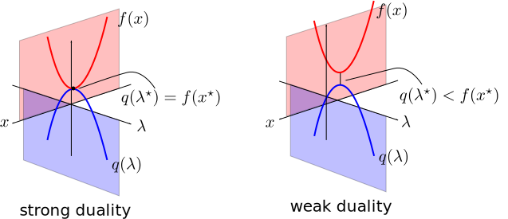
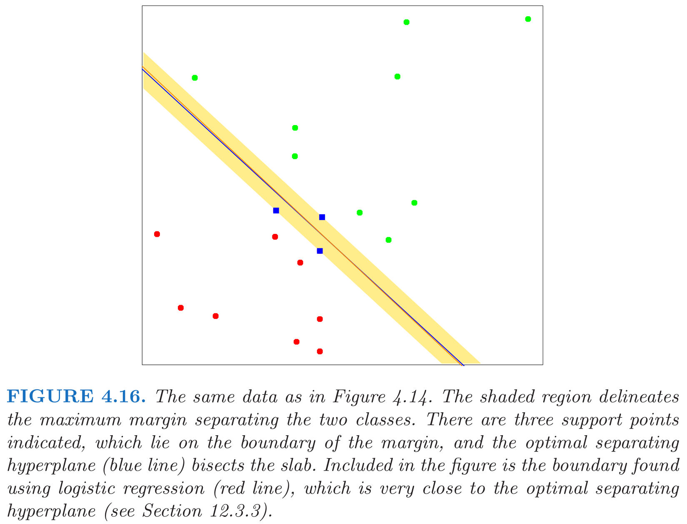
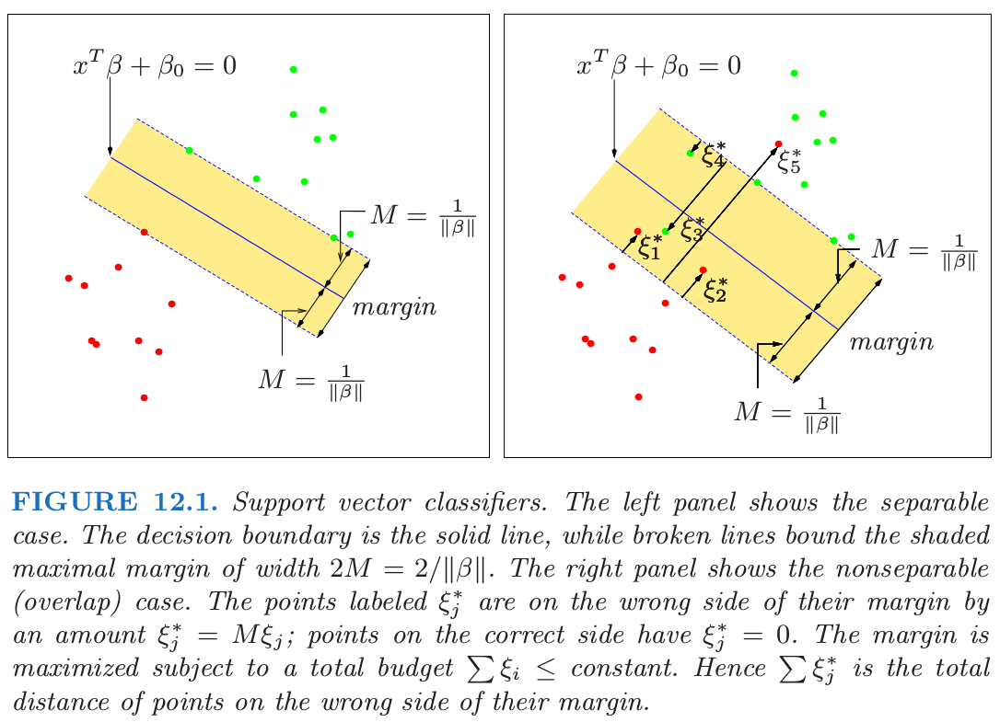
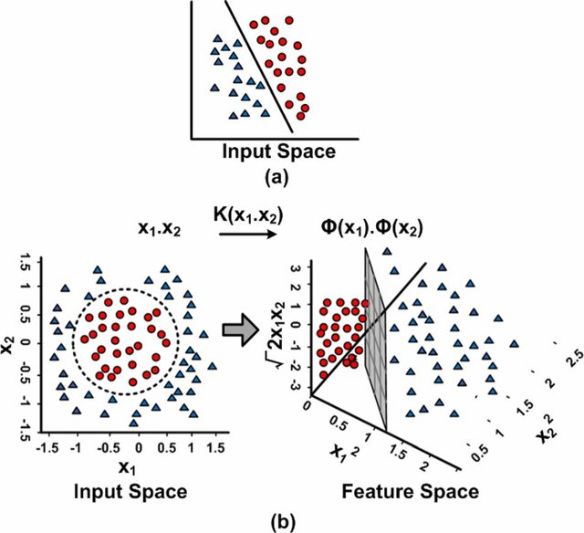

## Introducción

 * Regresión logística y LDA son clasificadores lineales
 
 * Lineal $\Rightarrow$ la frontera de decisión es un hyperplano en $\Rbb^d$,
 
 $$f(x) = w_0 + w^T x = 0$$

 * Existen clasificadores que intentan separar las clases lo mejor posible:
 
    - Perceptron
    
    - SVM

---

## Perceptron

 * Rosenblatt, 1958
 
 * Inspiración de las redes neuronales
 
 * Idea: minimizar la distancia de los puntos mal clasificados:
 
    1. Si $y_i = 1$, $x_i^T w + b < 0$
    
    2. Si $y_i = -1$, $x_i^T w + b> 0$

 * Definimos $D(w_0, w) = - \sum_{i \in M}{y_i(x_i^T w + b)}$

    * Positiva
    
    * Proporcional a la distancia de los puntos mal clasificados a la printera

???

Stochastic gradient descent: a step is taken after each observation is visited.
Hence the misclassified observations are visited in some sequence, and the
parameters β are updated

---

## Ejemplo perceptron

  

---

## Problemas perceptron

* Si las clases son linealmente separables:

  1. Converge a una solución
  
  2. Número de iteraciones finito

* Pero:

  1. Muchas soluciones posibles, dependen del punto inicial

  2. Convergencia lenta
  
  3. No converge si las clases no son linealmente separables

---

class: middel, center

---

## Clasificación de máximo margen

* Margen: distancia entre el hiperplano y el punto más cercano de una de las clases

* Idea: maximizar el margen

  1. solución única
  
  2. mejor generalización en el conjunto de test

* $M$ es el margen, queremos encontrar el hiperplano:

\begin{aligned}
\max_{w,b}  &&& M\\
\mbox{s.t}  &&& y_i(x_i^T w + b) \geq M\quad \forall i \\
            &&& ||w||_2 = 1
\end{aligned}

* La restricción nos asegura que todos los puntos están en el lado correcto del hiperplano

---

## SVM lineal

* Podemos eliminar la restricción $||w||_2 = 1$ reescalando $$y_i(x_i^T w + b) \geq M||w||_2$$

* Si $w$ y $b$ satisfacen las restricciones, podemos multiplicar por cualquier número positivo

* Por comodidad escogemos $||w||_2 = 1/M$

* Problema de optimización

\begin{aligned}
\min_{w,b}  &&& \frac{1}{2}||w||_2^2\\
\mbox{s.t}  &&& y_i(x_i^T w + b)-1 \geq 0\quad \forall i \\
\end{aligned}

* **Notas**: 

  1. maximizar se convierte en minimizar porque $w$ está en el denominador

  2. $1/2$ y el cuadrado se añaden por conveniencia
  
???

la norma obtiene el optimo en el mismo punto, con o sin cuadrado

---

class: center, middle

[Wikipedia](https://en.wikipedia.org/wiki/Support_vector_machine)

---

## Dualidad (Lagrange)

*  Dado un problema de optimización (problema **primal**), se puede definir otro relacionado (problema **dual**)

*  A menudo tiene propiedades complementarias

*  Dualidad fuerte: los problemas primal y dual tienen la misma solución:

    * un ejemplo: función convexa y restricciones afines $h(x) = Ax-b$

*  En esos casos podemos elegir resolver uno u otro indistintamente

---

## Dualidad fuerte

.center[]

.center[[Fuente](http://www.onmyphd.com/?p=duality.theory)]

---

## SVM: derivación problema dual

* Lagrangiano $$L_P = \frac{1}{2}||w||_2^2 - \sum_{i=1}^{n}{\alpha_i y_i(x_i^T w + b)} + \sum_{i=1}^n{\alpha_i}$$

* Problema dual: $$\max_\alpha\, \{ \min_{w, b}\, L_P \}\quad\text{s.t.}\quad \alpha > 0$$

* Resolvemos el problema interior igualando derivadas a 0:
\begin{align}
w &= \sum_{i=1}^{n}{\alpha_i y_i x_i}\\
0 &= \sum_{i=1}^{n}{\alpha_i y_i}
\end{align}

* Finalmente sustituimos en $L_P$

---

## SVM: problema dual

* Problema optimización:

\begin{aligned}
\max_{\alpha} &&& \sum_i{\alpha_i} - \frac{1}{2}\sum_{i,j}{\alpha_i \alpha_j y_i y_j x_i^T x_j}\\
\mbox{s.t}  &&& \alpha_i \geq 0 \quad \text{y} \quad \sum_{i}{\alpha_i y_i} = 0 \\
\end{aligned}

* La solución tiene que satisfacer las condiciones KKT, nos interesa una: $$\alpha_i[y_i(x_i^T w + b)-1] = 0$$

* Dos casos:

  1. $\alpha_i > 0$, entonces $y_i(x_i^T w + b) = 1$ y $x_i$ está justo en el margen
  2. $\alpha_i = 0$, y por tanto $y_i(x_i^T w + b) > 1$
  
* $w^*$ solo depende de los $x_i$ asociados a $\alpha_i > 0$ $\Rightarrow$ **vectores de soporte**

???

KKT = Karush–Kuhn–Tucker
No vamos a entrar en detalles

---

class: middle, center

---

## SVM: solución

* Dada una solución del problema dual $\alpha^*$, los coeficientes originales son $$w^* = \sum_{i=1}^n{\alpha_i^* y_i x_i}$$

* Para cualquier vector de soporte $(\alpha_i > 0)$: 
$$y_i(x_i^T w^* + b^*) = 1 \quad \Rightarrow \quad b^* = 1/y_i - x_i^T w^*$$
* En la práctica se hace la media para todos los vectores de soporte (estabilidad numérica)

---

## SVM: margen flexible

* ¿Que pasa si ambas clases no son separables por un hiperplano?

* Idea: maximizar el margen, pero permitir que algunos puntos estén en el lado incorrecto

* Cambiar las restricciones por: $$y_i(x_i^T w + b) \geq M(1 - \xi_i)$$ con $\xi_i \geq 0$ y $\sum{\xi_i} \leq \text{cte.}$

* $\xi_i$ indican la cantidad en proporcion por la que una variable está en el lado incorrecto:

  1. $\xi_i = 0$, punto clasificado correctamente
  
  2. $0 < \xi_i \leq 1$, punto **dentro** del margen
  
  3. $\xi > 1$, punto clasificado incorrectamente

---

class: center, middle

---

## C-SVM: formulación

* Número de puntos mal clasificados acotado superiormente por $\sum{\xi_i}$

* Maximizar el margen y minimizar el número de errores de clasificación:

\begin{aligned}
\min_{w,b,\xi}  &&& \frac{1}{2}||w||_2^2 + C\sum{\xi_i}\\
\mbox{s.t}  &&& y_i(x_i^T w+b) \geq 1 - \xi_i \quad \forall i \\
            &&& \xi_i \geq 0\quad \forall i.\\
\end{aligned}

* $C > 0$ es un hiper-parámetro que controla la complejidad:

  1. $\uparrow C$, más importancia a clasificar correctamente todos los puntos (menos regularización)
  
  2. $\downarrow C$, más importancia a maximizar el margen (más regularización)

---

## Efecto de C

Andreas C. Müller, [Linear Models for Classification](https://amueller.github.io/COMS4995-s18/slides/aml-06-020518-linear-models-classification/#1)

---

## C-SVM: formulación dual

* La formulación dual es:  

\begin{aligned}
\max_{\alpha}  &&& \sum_i{\alpha_i} - \frac{1}{2}\sum_{i,j}{\alpha_i \alpha_j y_i y_j x_i^T x_j}\\
\mbox{s.t}  &&& 0 \leq \alpha_i \leq C\quad \forall i \\
            &&& \sum_{i}{\alpha_i y_i} = 0. \\
\end{aligned}

* Notación vectorial:
$$\min_{\alpha}\, \bigg\{\frac{1}{2}\alpha^T \Qbf \alpha - \alpha^T \mathbf{1}\bigg\} \quad \text{s.t.} \quad {\alpha^T y = 0\quad \text{y}\quad 0 \leq \alpha_i \leq C,\;\forall i}$$
donde $\Qbf$ es una matriz $n\times n$ con elementos $Q_{ij} = y_i y_j x_i^T x_j$.

---

## SVM no lineal

* C-SVM acepta datos no separables linealmente, pero la frontera de decisión es lineal (hiperplano)

* Idea: transformar variables originales en otras variables de mayor dimensión

* En el espacio ampliado esperamos que las clases sean separables linealmente

* Si las transformaciones son no lineales, se traduce en una frontera de decisión no lineal en el espacio original

* Similar a lo que vimos en regresión lineal de añadir expansiones polinómicas

---

class: middle, center

Muhammad Awais Bin Altaf, [Research Gate](https://www.researchgate.net/publication/272520997_A_183_mJClassification_8-Channel_Patient-Specific_Epileptic_Seizure_Classification_SoC_Using_a_Non-Linear_Support_Vector_Machine)

---

## SVM no lineal: problemas

* $\phi(x_i): R^d \rightarrow R^D$, con $D >> d$

* Si intentamos calcular la función $\phi(x_i)$ explicitamente:

  1. El espacio ampliado puede tener dimensión $D$ muy grande, incluso infinita
  
  2. Computacionalmente muy costoso calcular la función $\phi$ cada vez que sea necesario
  
  3. Complicado de almacenar en memoria

---

## Kernel trick

* Elementos de la matriz $\Qbf$,  $Q_{ij} = y_i y_j x_i^T x_j$

* Solo depende del producto escalar de $x_i$ y $x_j$

* Podemos reemplazar el producto escalar por una función de kernel:
$$k(x_i, x_j) = \phi(x_i)^T \phi(x_j)$$ 

* No es necesario calcular $\phi$ explicitamente, solo $k$

* $k$ cualquier función simétrica (semi-) definida positiva

* Ejemplos:
  
  1. Kernel polinómico: $k(x, x') = (1 + x^T x')^d$ 

  2. Kernel RBF: $k(x, x') = \exp(-\gamma||x - x'||^2_2)$
  

---

## SVM no lineal

* Problema optimización: $$\min_{\alpha}\, \bigg\{\frac{1}{2}\alpha^T \Qbf \alpha - \alpha^T \mathbf{1}\bigg\} \quad \text{s.t.} \quad {\alpha^T y = 0\quad \text{y}\quad 0 \leq \alpha_i \leq C,\;\forall i}$$ con $Q_{ij} = y_i y_j k(x_i, x_j)$

* $\Qbf$ es la **matriz de kernel**

* Valor de hiper-parámetros es crítico para buen rendimiento:
  
  1. $C$, parámetro de complejidad
  
  2. Parámetros del kernel, por ejemplo $\gamma$ en el kernel RBF

---

## Cálculo de w y b

* El valor de $w$ es ahora: $$w^* = \sum_{i=1}^n{\alpha_i^* y_i \phi(x_i)}$$

* No podemos calcular su valor explicitamente, pero dado un nuevo $x'$: 

\begin{aligned}
f(x') = \phi(x')^T w^* + b^* &= \sum_{i=1}^n{\alpha_i^* y_i \phi(x')^T \phi(x_i)} + b^* \\ 
                             &= \sum_{i=1}^n{\alpha_i^* y_i k(x', x_i)} + b^*
\end{aligned}

* $b^*$ se puede calcular como antes, resolviendo $y_i f(x_i) = 1$ para cualquier vector de soporte $(\alpha_i > 0)$

---

## SVM para regresión

---

## SVM como regularización

---

## Sequential Minimal Optimization

*  SMO is probably the state-of-the-art algorithm to solve non-linear SVMs.

*  Solves the dual formulation, since the constraints are simpler and it is easy to include the non-linear version.

*  Similarly to Coordinate Descent, it optimizes only two coefficients at every iteration.

*  However, the coefficients are selected using heuristic rules.

*  Those rules try to maximize approximately the decrease in the objective function.

---

## SMO updates

*  The question is: can we do the same in SMO?

*  After selecting the two indexes, the SMO step has the form,

\begin{equation*}
\alpha^{k+1} = \alpha^{k} + \rho(y_ie_i - y_je_j) = \alpha^{k} + \rho d
\end{equation*}

where $e_k$ is the vector with all $0$ but a $1$ in position $k$.

*  Note that it is only updating two coefficients.

*  $\rho$ is computed by minimizing the function in the direction $d$ (line search).

*  We may need to clip $\rho$ to satisfy the constraints.

---

## SVM en R

[LIBLINEAR](https://www.csie.ntu.edu.tw/~cjlin/liblinear/)

[LIBSVM](https://www.csie.ntu.edu.tw/~cjlin/libsvm/)

[LiblineaR](https://cran.r-project.org/web/packages/LiblineaR/)

[e1071](https://cran.r-project.org/web/packages/e1071/)