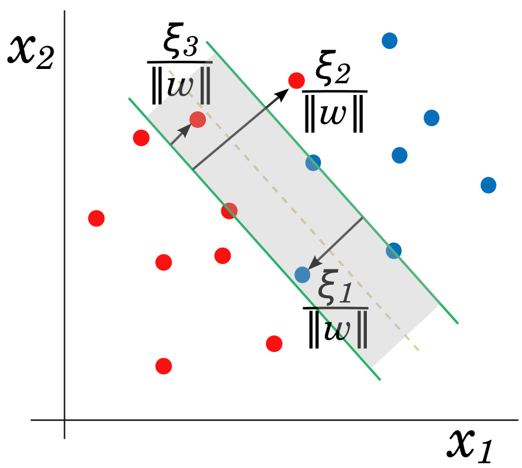

## Introducción

 * Regresión logística y LDA son clasificadores lineales
 
 * Lineal $\Rightarrow$ la frontera de decisión es un hyperplano en $\Rbb^d$,
 
 $$f(x) = w_0 + w^T x = 0$$

 * Existen clasificadores que intentan separar las clases lo mejor posible:
 
    - Perceptron
    
    - SVM

---

## Perceptron

 * Rosenblatt, 1958
 
 * Inspiración de las redes neuronales
 
 * Idea: minimizar la distancia de los puntos mal clasificados:
 
    1. Si $y_i = 1$, $x_i^T w + b < 0$
    
    2. Si $y_i = -1$, $x_i^T w + b> 0$

 * Definimos $D(w_0, w) = - \sum_{i \in M}{y_i(x_i^T w + b)}$

    * Positiva
    
    * Proporcional a la distancia de los puntos mal clasificados a la printera

???

Stochastic gradient descent: a step is taken after each observation is visited.
Hence the misclassified observations are visited in some sequence, and the
parameters β are updated

---

## Ejemplo perceptron

  

---

## Problemas perceptron

* Si las clases son linealmente separables:

  1. Converge a una solución
  
  2. Número de iteraciones finito

* Pero:

  1. Muchas soluciones posibles, dependen del punto inicial

  2. Convergencia lenta
  
  3. No converge si las clases no son linealmente separables

---

class: middel, center

---

## Clasificación de máximo margen

* Margen: distancia entre el hiperplano y el punto más cercano de una de las clases

* Idea: maximizar el margen

  1. solución única
  
  2. mejor generalización en el conjunto de test

* $M$ es el margen, queremos encontrar el hiperplano:

\begin{aligned}
\max_{w,b}  &&& M\\
\mbox{s.t}  &&& y_i(x_i^T w + b) \geq M\quad \forall i \\
            &&& ||w||_2 = 1
\end{aligned}

* La restricción nos asegura que todos los puntos están en el lado correcto del hiperplano

---

## SVM lineal

* Podemos eliminar la restricción $||w||_2 = 1$ reescalando $$y_i(x_i^T w + b) \geq M||w||_2$$

* Si $w$ y $b$ satisfacen las restricciones, podemos multiplicar por cualquier número positivo

* Por comodidad escogemos $||w||_2 = 1/M$

* Problema de optimización

\begin{aligned}
\min_{w,b}  &&& \frac{1}{2}||w||_2^2\\
\mbox{s.t}  &&& y_i(x_i^T w + b)-1 \geq 0\quad \forall i \\
\end{aligned}

* **Notas**: 

  1. maximizar se convierte en minimizar porque $w$ está en el denominador

  2. $1/2$ y el cuadrado se añaden por conveniencia
  
???

la norma obtiene el optimo en el mismo punto, con o sin cuadrado

---

class: center, middle

[Wikipedia](https://en.wikipedia.org/wiki/Support_vector_machine)

---

## Dualidad (Lagrange)

*  Dado un problema de optimización (problema **primal**), se puede definir otro relacionado (problema **dual**)

*  A menudo tiene propiedades complementarias

*  Dualidad fuerte: los problemas primal y dual tienen la misma solución:

    * un ejemplo: función convexa y restricciones afines $h(x) = Ax-b$

*  En esos casos podemos elegir resolver uno u otro indistintamente

---

## Dualidad fuerte

.center[]

.center[[Fuente](http://www.onmyphd.com/?p=duality.theory)]

---

## SVM: derivación problema dual

* Lagrangiano $$L_P = \frac{1}{2}||w||_2^2 - \sum_{i=1}^{n}{\alpha_i y_i(x_i^T w + b)} + \sum_{i=1}^n{\alpha_i}$$

* Problema dual: $$\max_\alpha\, \{ \min_{w, b}\, L_P \}\quad\text{s.t.}\quad \alpha > 0$$

* Resolvemos el problema interior igualando derivadas a 0:
\begin{align}
w &= \sum_{i=1}^{n}{\alpha_i y_i x_i}\\
0 &= \sum_{i=1}^{n}{\alpha_i y_i}
\end{align}

* Finalmente sustituimos en $L_P$

---

## SVM: problema dual

* Problema optimización:

\begin{aligned}
\max_{\alpha} &&& \sum_i{\alpha_i} - \frac{1}{2}\sum_{i,j}{\alpha_i \alpha_j y_i y_j x_i^T x_j}\\
\mbox{s.t}  &&& \alpha_i \geq 0 \quad \text{y} \quad \sum_{i}{\alpha_i y_i} = 0 \\
\end{aligned}

* La solución tiene que satisfacer las condiciones KKT, nos interesa una: $$\alpha_i[y_i(x_i^T w + b)-1] = 0$$

* Dos casos:

  1. $\alpha_i > 0$, entonces $y_i(x_i^T w + b) = 1$ y $x_i$ está justo en el margen
  2. $\alpha_i = 0$, y por tanto $y_i(x_i^T w + b) > 1$
  
* $w^*$ solo depende de los $x_i$ asociados a $\alpha_i > 0$ $\Rightarrow$ **vectores de soporte**

???

KKT = Karush–Kuhn–Tucker
No vamos a entrar en detalles

---

class: middle, center

---

## Soft-margin SVM

* The SVM can be extended to the case where the classes are not separable by an hyperplane.

* We introduce *slack variables* $\xi_i \geq 0$ that allow for a point to be inside de margin, $0 < \xi_i \leq 1$, or missclassified $\xi_i > 1$.

* We want to still maximize the margin while minimizing the missclassified points, which are upper-bounded by $\sum{\xi_i}$,

\begin{aligned}
\min_{w,b,\xi}  &&& \frac{1}{2}||w||_2^2 + C\sum{\xi_i}\\
\mbox{s.t}  &&& y_i(x_i^T w+b) \geq 1 - \xi_i \quad \forall i \\
            &&& \xi_i \geq 0\quad \forall i.\\
\end{aligned}

---

class: center, middle

[Fuente](http://efavdb.com/svm-classification/)

---

## SVM dual formulation

*  The dual formulation of the soft-margin SVM is

\begin{aligned}
\min_{\alpha}  &&& \frac{1}{2}\alpha^T \Qbf \alpha - \alpha^T \mathbf{1}\\
\mbox{s.t} &&& \sum{\alpha_i y_i} = 0, \\  
           &&& 0 \leq \alpha_i \leq C,\; i=1,\dots,n. \\
\end{aligned}

where $\Qbf$ is a $n\times n$ matrix with entries $Q_{ij} = y_i y_j x_i^T x_j$.

* It can be easily extended to the non-linear case replacing the dot products by a kernel,
$$k(x_i, x_j) = \phi(x_i)^T \phi(x_j),$$ where $\phi(\cdot)$ are non-linear functions.

---

## Sequential Minimal Optimization

*  SMO is probably the state-of-the-art algorithm to solve non-linear SVMs.

*  Solves the dual formulation, since the constraints are simpler and it is easy to include the non-linear version.

*  Similarly to Coordinate Descent, it optimizes only two coefficients at every iteration.

*  However, the coefficients are selected using heuristic rules.

*  Those rules try to maximize approximately the decrease in the objective function.

---

## SMO updates

*  The question is: can we do the same in SMO?

*  After selecting the two indexes, the SMO step has the form,

\begin{equation*}
\alpha^{k+1} = \alpha^{k} + \rho(y_ie_i - y_je_j) = \alpha^{k} + \rho d
\end{equation*}

where $e_k$ is the vector with all $0$ but a $1$ in position $k$.

*  Note that it is only updating two coefficients.

*  $\rho$ is computed by minimizing the function in the direction $d$ (line search).

*  We may need to clip $\rho$ to satisfy the constraints.