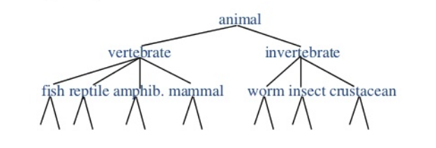
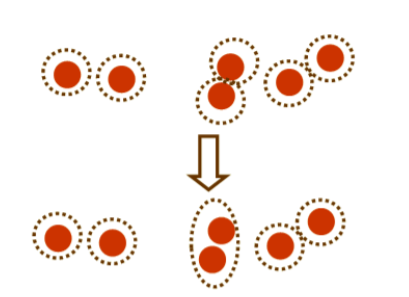
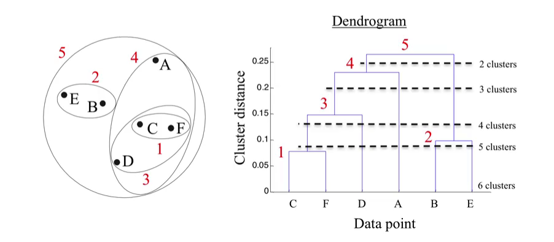
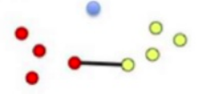
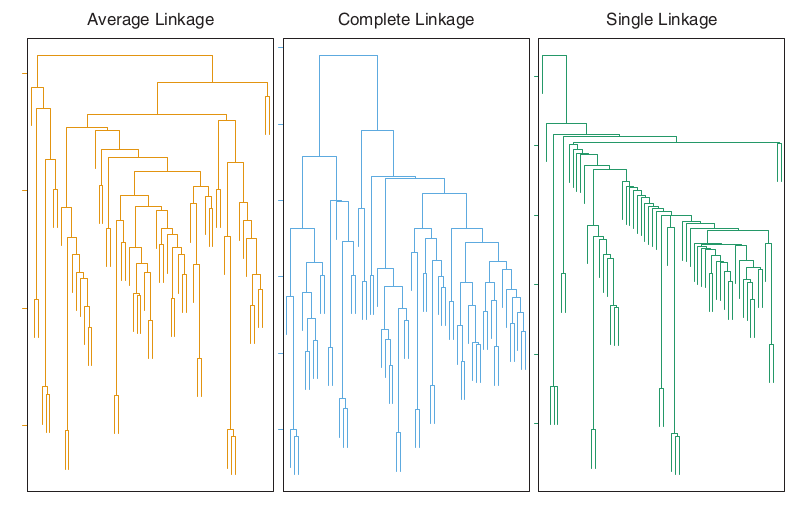
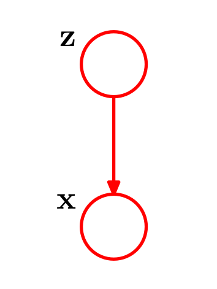
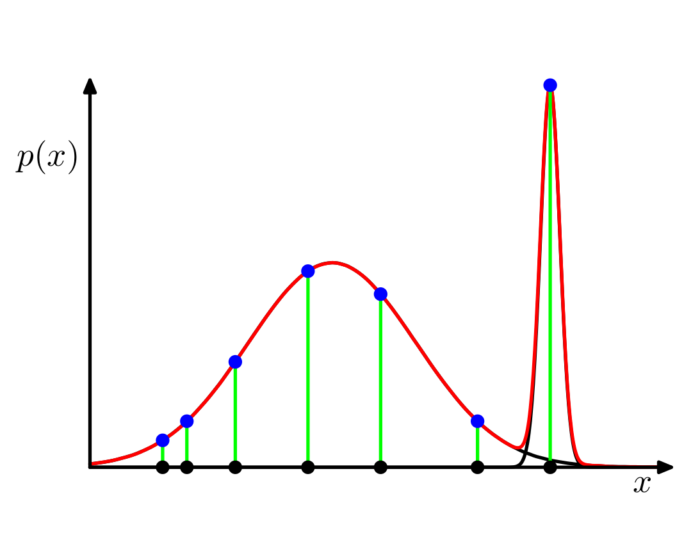

class: middle, center, inverse

# Introducción

---

## Repaso

* **Aprendizaje no supervisado**: solo tenemos datos $\mathcal{X} = \lbrace x_1, \ldots, x_N \rbrace$ sin etiquetar.

* Hasta ahora hemos visto PCA y NMF, que tratan de aprender una representación de los datos en un espacio de menor dimensión.

--

* Hoy nos centraremos en las técnicas de **clustering** (también conocidas como **segmentación de datos**), que buscan construir agrupaciones de datos basados en su similaridad.

* Ejemplo típico en banca:

---

### Introducción

* Objetivo: agrupar un conjunto de ejemplos en grupos denominados *clústers*.

* Ejemplos del mismo clúster más parecidos entre sí que ejemplos de diferentes clústers.

--

* Otro objetivo: ordenar clusters en jerarquías naturales.

* En cada nivel de la jerarquía, objetos en el mismo grupo más similares que objetos en grupos distintos.

--

* Estadístico descriptivo: ¿consisten los datos en un conjunto de subgrupos cada uno con propiedades diferentes?

--

* Fundamental: escoger medida de distancia (disimilaridad).
* Esto depende del problema concreto (similar a elección de coste en aprendizaje supervisado).

---

## Matrices de proximidad

La mayoría de algoritmos para clustering requieren la siguiente representación para los datos $x_1, \ldots, x_N$:

\begin{equation*}
  \mathbf{D} = 
  \begin{pmatrix}
  d_{11} & \ldots & d_{1N} \\
  \ldots & \ldots & \ldots \\
  d_{N1} & \ldots & d_{NN}
  \end{pmatrix}
\end{equation*}

* donde $d_{ii'}$ mide la **disimilaridad** entre $x_i$ y $x_{i'}$.

* $\mathbf{D}$ es una matriz de tamaño $N \times N$ (lo cual impone un requisito en la complejidad en memoria de los algoritmos de clustering).

* La mayoría de algoritmos asume una matriz simétrica (si no lo es, usar ( $\mathbf{D}+\mathbf{D}^\intercal)/2$ ).

* Las disimilaridades no son distancias en el sentido estricto, pues no verifican la desigualdad triangular $d_{ii'} \leq d_{ik} + d_{ki'}$.

* A continuación veremos como obtener medidas de disimilaridad de una forma estructurada.

---

## Medidas de disimilaridad entre atributos

* Datos: $x_{ij}$ con $i = 1,2,\dots,N$ y $j=1,2,\dots, p$. $N$ ejemplos con $p$ atributos.

* Técnicas populares de clustering toman matriz de disimilaridad como input. ¿Cómo construírla?

--

* Construír medidas de disimilaridad por pares.
* $d_j(x_{ij}, x_{i'j})$: disimilaridad entre valores de atributo $j$.

\begin{equation}
D(x_i, x_{i'}) = \sum_{j=1}^p d_j(x_{ij}, x_{i'j}) 
\end{equation}

* No hay por qué pesar todos los atributos igual...

---

## Medidas de disimilaridad entre atributos

* En función del tipo de atributo:

  1. Variables cuantitativas: 
  
\begin{equation}
d(x_i, x_{i'}) = l(|x_i - x_{i'}|)
\end{equation}

con $l$ función monótona creciente. Error cuadrático o absoluto. También es posible usar correlaciones (medida de similaridad):

\begin{equation}
\rho(x_i, x_{i'}) = \frac{\sum_{j} (x_{ij} - \bar{x}_i) (x_{i'j} - \bar{x}_{i'})}{\sqrt{\sum_{j} (x_{ij} - \bar{x}_i)^2 \sum_{j} (x_{i'j} - \bar{x}_{i'})^2}}
\end{equation}

---

## Medidas de disimilaridad entre atributos

* En función del tipo de atributo:

  1. Variables categóricas: Si tienen $M$ categorías, construír matriz $M \times M$.
  
\begin{eqnarray*}
L_{jj} = 0 & ~ & L_{jj'} = 1
\end{eqnarray*}
  
  Valores distintos de 1 pueden utilizarse para enfatizar unos errores más que otros.

---

## Medidas de disimilaridad entre objetos

* Procedimiento para combinar $p$ medidas de disimilaridad entre atributos en una medida de disimilarida entre ejemplos $D(x_i, x_{i'})$.

* Combinación convexa

\begin{eqnarray*}
  D(x_i, x_{i'}) = \sum_{j=1}^p \omega_j \cdot d_j(x_{ij}, x_{i'j}); &~& \sum_{j=1}^p \omega_j = 1
\end{eqnarray*}

* Elección de pesos, depende del problema en cuestión.

---

## Medidas de disimilaridad entre objetos

* Ojo: dar el mismo peso a todos los atributos, no signfica que todos contribuyan en la misma cantidad a la medida total de disimilaridad.

* Veámoslo:

\begin{equation}
\bar{D} = \frac{1}{N^2} \sum_{i=1}^N \sum_{i'=1}^N D(x_i, x_{i'}) = \sum_{j=1}^p \omega_j \bar{d}_j d_j(x_{ij}, x_{i'j})
\end{equation}

Con 

\begin{equation}
\bar{D} = \bar{d}_j = \frac{1}{N^2} \sum_{i=1}^N 
\end{equation}

* La influencia relativa de la variable $j$ es $\omega_j \bar{d}_j$ y si $\omega_j \sim 1/\bar{d}_j$, entonces todas tienen la misma influencia.

* **Ejercicio**: Si se usa distancia Euclídea $\bar{d}_j ~ 2\cdot \text{var}_j$.

---

## Medidas de disimilaridad entre objetos

* No suele ser conveniente dar a todas las variables la misma influencia.

* Importante: estudiar cada problema en concreto para construír tanto las medidas de disimilaridad entre atributos como los pesos.

* Aunque no se diga: esta es la parte más importante (y más costosa).

---

class: middle, center, inverse
# Algoritmos de clustering

---

## Tipos de algoritmos de clustering

* Algoritmos combinatorios: trabajan con los datos observados sin hacer referencia al modelo probabilístico subyacente.

* Modelos de mixturas: asumen que datos son muestas iid de una mixtura de densidades de probabilidad. Cada componente describe un cluster.

* *Mode Seekers*: modelos no paramétricos que estiman modas.

---

class: middle, center, inverse

# Algoritmos de clustering combinatorios: K-Means

---

## Algoritmos combinatorios

* Asignan cada observación a un cluster, sin preocuparse de la distribución de probailidad de subyacente.

* Etiquetamos cada observación con $i \in \lbrace 1,2,\dots,N   \rbrace$

* Postulamos un número fijo de clusters $K<N$, etiquetados con $k \in \lbrace 1, \dots, K \rbrace$.

--

* Objetivos construír función de asignación $k = C(i)$ para cada $i$.

* Buscar asignación que minimice **dispersión dentro del cluster**

\begin{equation}
W(C) = \frac{1}{2} \sum_{k=1}^K \sum_{i:C(i)=k} \sum_{i':C(i')=k} d(x_i, x_{i'})
\end{equation}

---

## Algoritmos combinatorios

* La dispersión total es

\begin{eqnarray}
T &=& \frac{1}{2} \sum_{i=1}^N \sum_{i'=1}^N d(x_i, x_{i'}) = \frac{1}{2} \sum_{k=1}^K \sum_{i:C(i)=k} \left[ \sum_{i':C(i')=k} d(x_i, x_{i'}) + \sum_{i':C(i')\neq k} d(x_i, x_{i'}) \right] \\
&=& W(C) + B(C)
\end{eqnarray}

* $B(C)$ es la **dispersión entre clusters**.

* Minimizar $W(C)$ es equivalente a maximizar $B(C)$.

--

* Optimiziación por enumeración complete **inviable**.
* $N=19$, $K=4$ número de asignaciones del orden de $10^{10}$.

---

## Algoritmos combinatorios

* Estrategia: *iterative greedy descent*
  1. Asignación inicial.
  2. Iterativamente, cambiar asignación tal que se diminuya $W(C)$.
  3. Parar cuando se deje de mejorar.
  
* Distintos algoritmos de clustering en función del paso 2.

* Asegurada convergencia a óptimo local...

---
## K-Means

* Todas las variables son cuantitativas. 

* Disimilaridad = distancia Euclídea

\begin{equation}
d(x_i, x_{i'}) = \Vert x_i - x_{i'} \Vert^2
\end{equation}

* La distancia Euclídea con pesos puede usarse redefiniendo $x_{ij}$.
--

* En este caso,

\begin{equation}
W(C) = \sum_{k=1}^K N_k \sum_{i:C(i) = k} \Vert x_i - \mu_k \Vert^2
\end{equation}

* Como $\mu_k = \arg\min_m \sum_{i:C(i) = k} \Vert x_i - m \Vert^2$, vemos que la asignación óptima puede obtenerse resolviendo

\begin{equation}
\min_{C, \lbrace m_k \rbrace_1^K}  \sum_{k=1}^K N_k \sum_{i:C(i) = k} \Vert x_i - m_k \Vert^2
\end{equation}

---

## K-means

* K-means resuelve utilizando *descenso coordenado*:

  1. Fijar asignación $C$ y minimizar respecto $\lbrace m_1, \dots m_K \rbrace$, asignando las medias de cada cluster.
  2. Fijar las medias $\lbrace m_1, \dots m_K \rbrace$ y minimizar asignando cada observación al cluster de la media más cercana.
  
\begin{equation*}
C(i) = \arg\min_{k}  \Vert x_i - m_k \Vert^2
\end{equation*}
  
  3. Iterar 1 y 2 hasta que no cambien las asignaciones.

---

## Cuantización vectorial

* Técnica de teoría de la señal para aproximar datos de alta dimensión.

* Utilizada para compresión de datos.

* Idea: dividir conjunto grande de puntos en grupos y aproximar cada grupo por su centroide.

* En compresión de imágenes:

  1. Dividir imagen de $N \times N$ pixels en grupos de $k \times k$ pixels $(k < N)$.
  2. Considerar cada grupo como un vector de dimensión $k \times k$.
  3. Aplicar K-means y aproximar cada grupo por su centroide más próximo. (Conjunto de centroides se conoce como codebook).

* Puede usarse también para imputar datos.
  
---

class: middle, center, inverse

# Algoritmos de clustering: K-Medoids

---

## K-Medoids

* K-means es apropiado cuando la disimilaridad es la euclídea cuadrática (datos continuos).

* Además, por estar elevada al cuadrado, pone mucha influencia a distancias grandes, lo que provoca **sensibilidad a outliers**.

* Podemos evitar esto sacrificando eficiencia computacional a cambio de robustez.

* Basta cambiar el paso de minimización en K-means: en lugar de tomar como representante de un cluster las medias de sus observaciones, hacemos que sea alguna observación de ese clúster.

---

## K-Medoids

* Para una asignación de clúster $C$, encontrar la observación que minimice:

\begin{equation*}
i^*_k = \arg\min_{i:C(i) = k} \sum_{C(i') = k} D(x_i, x_{i'})
\end{equation*}

* Entonces $m_k = x_{i^*_k}$.

* Dado un conjunto de centros de clusters $\lbrace m_1, \ldots, m_K \rbrace$, calcular

\begin{equation*}
C(i) = \arg\min_{1 \leq k \leq K} D(x_i, m_k)
\end{equation*}

--

* El paso 1 pasa de tener complejidad lineal a ser $\mathcal{O}(N^2_k)$

---

## Cuestiones prácticas

* Para aplicar K-Means o K-Medoids es necesario seleccionar el número de clústers $K^*$ y una inicialización.

* Para las inicializaciones, la heurística más común es escogerlos **uniformemente aleatorios**, y ejecutar el algoritmo varias veces.

* En cuanto al número de clústers:

  * En aplicaciones de segmentación, $K$ suele venir especificado (ejemplo, segmentar una cartera de clientes teniendo $K$ encargados de marketing).
  
  * En descubrimiento de datos, no es tan fácil.
  
  * Una heurística es ir probando con $K$ desde $1, 2, \ldots, K_{max}$, e ir calculando las disimilaridades intra-clúster $W_1, W_2, \ldots, W_{K_{max}}, \ldots$.

---

class: middle, center, inverse

# Algoritmos de clustering: Clustering jerárquico

---

## Clustering jerárquico

* **Problema**: ¿cómo elegimos el número de clústers de antemano?

* Los algoritmos de clustering jerárquico evitan este problema: en lugar de tener que especificarlo:

* construyen toda una jerarquía sobre las observaciones.

* Ejemplos típicos de Biología y Genética:

---

## Tipos de clustering jerárquico

* Clustering **divisivo** (de arriba a abajo)

  * Empieza con todos los puntos en un único clúster (la raíz), luego:
  
  * Parte la raíz en un conjunto de clústers hijos, y sigue dividiendo recursivamente
  
  * Para cuando hay un único clúster por observación.

* Clustering **aglomerativo** (de abajo a arriba)

  * Cada observación es un clúster.
  
  * Se van fusionando clústers más similares en cada iteración.
  
  * Más estudiado que los divisivos.
  

---

## Dendrogramas

---

## Clustering aglomerativo

El algoritmo es el siguiente:

1. Empezar con $n$ observaciones y una medida de todas las disimilaridades de los 
$n \choose 2$ posibles emparejamientos. Tratar cada observación como un único clúster.

2. Para $i = n, n-1, \ldots ,2$:

  * Examinar todas las disimilaridades inter-cluster e identificar el par de clústers
  más similar, fusionándolos. La disimilaridad entre estos dos clústers indica la altura del dendrograma a la que irá anotada la fusión.
  
  * Calcular las nuevas disimilaridades inter-clusters entre los $i-1$ grupos restantes.
  
  
* **Importante**: tenemos que generalizar nuestra noción de distancia entre observaciones a una que mida distancia entre clústers de observaciones.

---

## Clustering aglomerativo

* Ejemplo de un posible resultado:

---

## Funciones de link

* ¿Cómo definimos una noción de distancia entre clusters? Hay varias opciones

* **Single link**: $d_{SL}(G,H) = \min_{i \in G, j \in H} d_{ij}$.

* **Complete link**: $d_{CL}(G,H) = \max_{i \in G, j \in H} d_{ij}$.

* **Promedio** (group average): $d_{GA}(G,H) = \frac{1}{N_G N_H} \sum_{i \in G} \sum_{j \in H} d_{ij}$.

* También hay otras, como las de la familia Ward que minimizan la varianza intracluster total.

---

## Funciones de link

* ¿Cómo escogemos la función de link?

--

* Solo hay algunas heurísticas:

  * Single link: puede generar clústers alargados (chaining: a cada clúste solo se le añade una observación cada vez).
  
  * Complete link: tiende a producir clústers mucho más compactos, aunque puede violar la propiedad de cercanía.
  
  * Link Promedio: supone un compromiso entre los dos, aunque es sensible a la escala de las distancias $d_{ij}$.

---

## Funciones de link

---

## Correlación cofenética

* Cophenetic correlation.

---

## Resumen de clustering jerárquico

* Para un dataset consistente en $n$ puntos:

  * Requiere $\mathcal{O}(n^2)$ memoria (por la matriz de distancias).
  
  * Requiere $\mathcal{O}(n^3)$ de tiempo en la mayoría de casos (aglomerativo).
  
  
* Ventajas:

  * Muy útiles para visualización (dendrograma).
  
  * Cuando los datos tienen estructura jerárquica, más útil que otros tipos de clustering.
  
* Inconvenientes:

  * Elevado coste computacional (ver arriba).
  
  * Sensibles a tipo de algoritmo/distancia escogidas.
  
* En R:

  * hclust de la librería estándar, bastante sólida.
  
  * dendextend para trabajar con dendrogramas (ver práctica).

---

class: middle, center, inverse

# Clustering Probabilístico

---

## Algoritmo EM (1)

* Técnica general para encontrar soluciones de máxima verosimilitud en modelos probabilísticos con variables latentes.

* Sea un modelo probabilístico en el que denotamos por $X$ el vector de variables observadas y $Z$ el vector de variables latentes (discretas).

* La distribución conjunta, $p(X,Z|\theta)$ viene gobernada por el vector de parámetros $\theta$. Queremos maximizar

\begin{equation}
p(X|\theta) = \sum_{Z} p(X,Z|\theta)
\end{equation}

* Asumimos que la optimización directa de $p(X|\theta)$ es difícil, pero la de $p(X,Z|\theta)$ es fácil.

---
## Algoritmo EM (2)

* Para cualquier distribución $q(Z)$ sobre las variables latentes se verifica

\begin{equation}
\log\left[p(X|\theta)\right] = \mathcal{L}(q,\theta) + KL(q \Vert p)
\end{equation}

* Donde

\begin{eqnarray}
\mathcal{L}(q,\theta) &=& \sum_{Z} q(Z) \log \left[ \frac{p(X,Z \vert \theta)}{q(z)}\right] \\
KL(q \Vert p) &=& - \sum_{Z} q(Z) \log \left[ \frac{p(Z \vert X, \theta)}{q(z)}\right]
\end{eqnarray}

* **Ejercicio**: demostrarlo.

--

* La divergencia de Kullback-Leibler verifica $KL(q \Vert p) \geq 0$ y $KL(q \Vert p) = 0$ si y solo si $q(Z) = p(Z \vert X,\theta)$.

* Por tanto, $\mathcal{L}(q,\theta) \leq \log\left[p(X|\theta)\right]$.

---
## Algoritmo EM (3)

* El algoritmo EM es un algoritmo de optimización iterativo con dos etapas utilizado para encontrar $\theta$ que maximiza la verosimilitud.

* Supongamos que l valor actual de $\theta$ es $\theta^{old}$

* Paso E: Maximizar $\mathcal{L}(q,\theta^{old})$ con respecto a $q(Z)$. (Demostrar que el máximo se alcanza cuando $q(Z) = p(Z| X, \theta^{old})$).

* Paso M: Mantener fija $q(Z)$ y maximizar  $\mathcal{L}(q,\theta)$ con respecto a $\theta$, dando lugar a $\theta^{new}$.

* El paso M hace que $\mathcal{L}(q,\theta)$ crezca y por tanto también la log verosimilitud.

* Como $q$ está determinada usando los parámetros viejos, ya no es idéntica a $p(Z| X, \theta^{new})$ y por tanto la KL será distinta de 0.

* El aumento en log verosimilitud es mayor que el aumento en su cota inferior.

---
## Algoritmo EM (4)

* Después del paso E tenemos que

\begin{equation}
\mathcal{L}(q,\theta) = \sum_Z p(Z|X, \theta^{old}) \log p(X,Z | \theta) - \sum_Z p(Z|X, \theta^{old}) \log p(X,Z | \theta^{old}) 
\end{equation}

* En el paso M maximizamos el calor esperado de $\log p(X,Z | \theta)$.

* $\theta$ aparece únicamente en el logaritmo. Si la distribución conjunto es de la familia exponencial, la optimización es muy sencilla.

---

## Mixturas de Gaussianas (MoG)

* Consisten en una combinación convexa de $K$ distribuciones normales,

\begin{equation*}
p(x) = \sum_{k=1}^K \pi_k \mathcal{N}(x| \mu_k, \Sigma_k)
\end{equation*}

* donde $\sum_{k=1}^K \pi_k = 1$ y $\pi_k \geq 0$, consiguiendo modelizar distribuciones *multimodales*.

---

## Modelos probabilísticos

* Podemos refinar nuestras inferencias si distinguimos dos tipos de variables (aleatorias):

  1. Variables **observadas**: $x$, los datos del problema.
  
  2. Variables **latentes**: $z$, no son observables, queremos inferirlas a partir de las observaciones.
  
* Distinguir entre los dos tipos de variables anteriores es la base de los **modelos probabilísticos**.

* Estos modelos definen una distribución conjunta $p(x,z)$.

* Estamos interesados en hacer inferencias de la forma $p(z|x)$ (la distribución a posteriori), para ello recurrimos al Teorema de Bayes:

\begin{equation*}
p(z|x)  = \frac{p(x,z)}{p(x)} = \frac{p(x,z)}{\int p(z,x) dz}
\end{equation*}

--

* $p(x)$ suele ser intratable de calcular: surgen numerosas técnicas de aproximación Bayesiana (Markov Chain Monte Carlo, Expectation-Maximization, Variational Inference, ...)
  
---

## Mixturas de Gaussianas (MoG)

* En el caso de la mixtura de Gaussianas, ¿qué representan las variables latentes $z$?

--

* Intuición con clustering: $z$ será una **variable categórica (factor)** que indica a que componente (cluster) pertenece la observación $x$.

* Podemos simular de una mixtura de Gaussianas mediante el siguiente proceso:

  1. $z \sim \mathcal{C}ategorical\lbrace 1, \ldots, K \rbrace$ (seleccionamos cluster)
  
  2. Sea $z = k$, $x \sim \mathcal{N}(\mu_k, \Sigma_k)$ (simulamos de ese cluster)
  
--

* Gráficamente, lo representamos mediante

donde los nodos son variables aleatorias, y los arcos indican dependencia probabilista.

---

## Mixturas de Gaussianas (MoG)

* Nos indica que la probabilidad conjunta $p(x,z)$ se ha factorizado de la siguiente manera al definir el modelo

\begin{equation*}
p(x,z) = p(z)p(x|z)
\end{equation*}

--

* ¿Quiénes son los factores?

  * $p(z)$: lo definimos tal que $p(z_k = 1) = \pi_k$, donde $z$ es una variable categórica representada mediante OHE.
  
  * $p(x|z_k = 1) = \mathcal{N}(x| \mu_k, \Sigma_k)$
  
* De esta forma, tenemos que la marginal es (**coincide con lo original**)

\begin{equation*}
p(x) = \sum_z p(x,z) = \sum_z p(z)p(x|z) = \sum_{k=1}^K \pi_k \mathcal{N}(x| \mu_k, \Sigma_k)
\end{equation*}

---

## Mixturas de Gaussianas (MoG)

* Si hemos llegado a lo mismo que al principio, **¿para qué hemos hecho todo esto?**

--

* Al introducir las variables latentes $z$, podemos responder de forma natural a inferencias del tipo: ¿a qué cluster asignamos $x$? mediante el posterior $p(z|x)$.

* En el ámbito de MoGs, al posterior también se le denomina **responsabilidad**, y su expresión es

\begin{equation*}
p(z_k = 1|x) = \frac{\pi_k \mathcal{N}(x| \mu_k, \Sigma_k)}{\sum_{k=1}^K \pi_k \mathcal{N}(x| \mu_k, \Sigma_k)}
\end{equation*}

* En lugar de obtener una asignación **rígida** a un cluster, tenemos una noción de incertidumbre via $p(z|x)$.

* Además, al introducir las variables latentes $z$, se pueden desarrollar algoritmos de inferencia más sofisticados (como EM).

---

## Máxima Verosimilitud (ML)

* Todavía no hemos visto cómo obtener valores buenos para los parámetros de las dos distribuciones involucradas:

\begin{equation*}
\pi_k, \mu_k, \Sigma_k
\end{equation*}

* El algoritmo más básico (no necesita latentes $z$) es el de **máxima verosimilitud**.

* Supongamos que tenemos $x_1, \ldots, x_N$ observaciones (independientes), escribimos la log-verosimilitud del modelo

\begin{equation*}
\log p(x|\pi, \mu, \Sigma) = \sum_{n=1}^N \log \lbrace \sum_{k=1}^K \pi_k \mathcal{N}(x_n| \mu_k, \Sigma_k) \rbrace
\end{equation*}

* Hemos obtenido un problema de optimización

\begin{equation*}
\pi^* , \mu^* , \Sigma^* =  \arg\max_{\pi, \mu, \Sigma} \log p(x|\pi, \mu, \Sigma) 
\end{equation*}

---

## Cuestiones técnicas sobre ML

* Desafortunadamente, no hay una solución explícita para el óptimo, pero podemos utilizar **descenso por el gradiente** o similares.

* El problema de optimización presenta **singularidades**. Si "tenemos suerte", puede ocurrir que durante la optimización $x_n = \mu_j$, teniendo que

\begin{equation*}
\mathcal{N}(x_n|x_n, \sigma_j^2 I) = \frac{1}{\sqrt{2 \pi}} \frac{1}{\sigma_j} \rightarrow\infty
\end{equation*}

cuando $\sigma_j \rightarrow 0$.

* Es decir, ajustando una componente a un único punto $x_n$, podemos maximizar la función objetivo tanto como queramos. **El overfitting es real**.

---

## MoG mediante EM 

