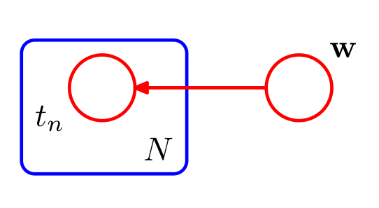

    
---

class: middle, center, inverse

# Introducción

---

## Representar gráficamente distribuciones de probabilidad. Ventajas

* Forma simple de visualizar la estructura de modelos probabilísticos.

* Diseño y motivación de nuevos modelos.

* Facilita comprender propiedades de los modelos, como la independencia condicional.

* Cálculos complejos pueden ser expresados en términos de manipulaciones gráficas sencillas.

---

class: middle, center, inverse

# Redes Bayesianas

---
## Introducción

* Podemos representar cualquier distribución de probabilidad utilizando un **grafo acíclico dirigido** (DAG).

* Cada nodo es una variable aleatoria de la distribución.

* Arcos entre nodos representan dependencias condicionales.

* Dado un DAG, la distribución de probabilidad conjunta es

\begin{equation}
p(x) = \prod_{k=1}^K p(x_k \vert \text{pa}_k)
\end{equation}

---

## Introducción

* **Ejercicio**: Factoriza y representa gráficamente la distribución $p(a,b,c)$.

* **Ejercicio**: ¿A qué distribución corresponde este DAG?

---

## Notación

* Para expresar multiplicidad de variables aleatorias se utiliza la siguiente notación

---

## Notación

* Los parámetros deterministas se representan usando círculos sólidos.

* Las variables observadas se colorean.

* **Ejercicio**: ¿Qué modelo representa esta Red Bayesiana?
---

class: middle, center, inverse

# Markov Random Fields

---

# Modelos gráficos no dirigidos

* También conocidos como **redes de Markov**.

* Los enlaces ahora **no son dirigidos**.

--

* **Ventaja**: la propiedad de independencia se puede verificar mucho más fácilmente:

  * **d-separación**: $A  \bigCI B | C$ sii todos los caminos entre $A$ y $B$ están bloqueados por nodos de $C$. 
  
  * Corolario: no hay fenómeno de **explaining away**.

---

class: middle, center, inverse

# Algoritmo suma-producto

---

class: middle, center, inverse

# Algoritmo max-suma

---

