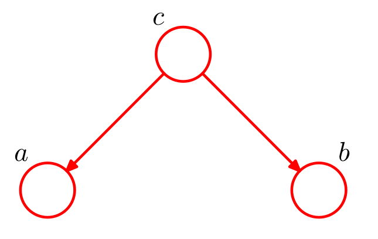
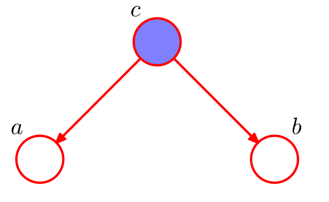
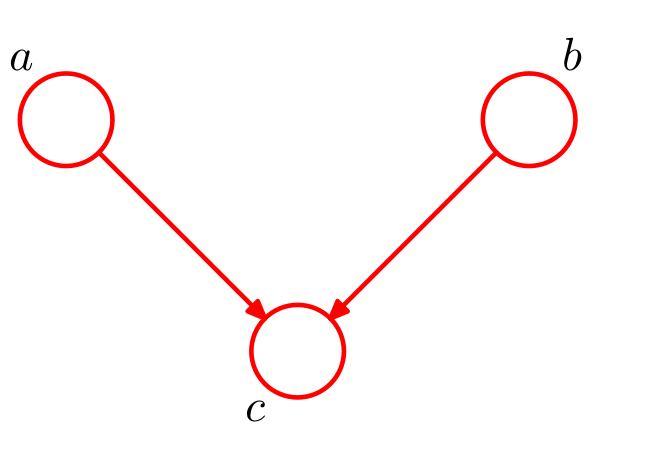
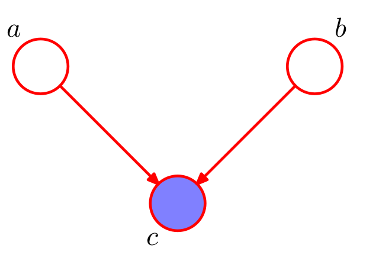
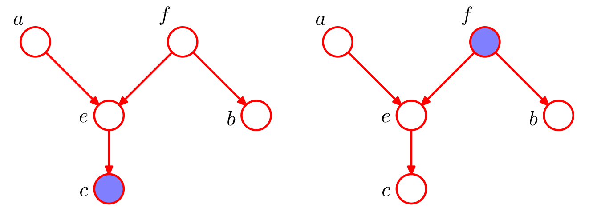
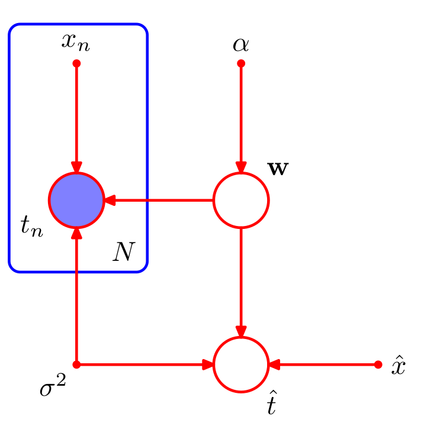

class: middle, center, inverse

# Introducción

---

## Representar gráficamente distribuciones de probabilidad. Ventajas

* Forma simple de visualizar la estructura de modelos probabilísticos.

* Diseño y motivación de nuevos modelos.

* Facilita comprender propiedades de los modelos, como la independencia condicional.

* Cálculos complejos pueden ser expresados en términos de manipulaciones gráficas sencillas.

---

class: middle, center, inverse

# Redes Bayesianas

---
## Introducción

* Podemos representar cualquier distribución de probabilidad utilizando un **grafo acíclico dirigido** (DAG).

* Cada nodo es una variable aleatoria de la distribución.

* Arcos entre nodos representan dependencias condicionales.

* Dado un DAG, la distribución de probabilidad conjunta es

\begin{equation}
p(x) = \prod_{k=1}^K p(x_k \vert \text{pa}_k)
\end{equation}

---

## Introducción

* **Ejercicio**: Factoriza y representa gráficamente la distribución $p(a,b,c)$.

* **Ejercicio**: ¿A qué distribución corresponde este DAG?

---

## Notación

* Para expresar multiplicidad de variables aleatorias se utiliza la siguiente notación

---

## Notación

* Los parámetros deterministas se representan usando círculos sólidos.

* Las variables observadas se colorean.

* **Ejercicio**: ¿Qué modelo representa esta Red Bayesiana?

---

## Independencia Condicional

* Decimos que $a$ y $b$ son condicionalmente independientes dado $c$ si $p(a \vert b,c) = p(a \vert c)$ o $p(a,b \vert c) = p(a \vert c) p(b \vert c)$.

* Los PGMs permiten identificar las propiedades de independencia condicional de la distribución conjunto de forma automática.

---

## Ejemplo 1

* Nodo *tail-to-tail*
* Si se condiciona en $c$ este nodo bloquea el camino entre $a$ y $b$, y se cumple independencia condicional.

---

## Ejemplo 2

* Nodo *head-to-tail*
* Si se condiciona en $c$ este nodo bloquea el camino entre $a$ y $b$, y se cumple independencia condicional.

---

## Ejemplo 3

* Nodo *head-to-head*
* Si se $c$ **no se observa** bloquea el camino entre $a$ y $b$ y estas son independientes.
* Si se $c$ **se observa** el camino se desbloquea: $a$ y $b$ y son dependientes.

---
## D-separación

* Consideremos un DAG general y sean $A$, $B$ y $C$ conjuntos de nodos diferentes.

* Queremos determinar si $A$ y $B$ son condicionalmente independientes dado $C$.

* Consideremos todas las trayectorias entre $A$ y $B$. Diremos que alguna de estas está bloqueada si:
  * Las flechas del camino encuentran un nodo *head-to-tail* o *tail-to-tail* y este está en $C$.
  
  * Las flechas del camino encuentran un nodo *head-to-head* y ni el nodo ni sus descendientes están en $C$.

* Si todos los caminos entre $A$ y $B$ están bloqueados, entonces $A$ y $B$ están $d$-separados por $C$ y son condicionalmente independientes dado $C$.

---
## D-separación
* Determinar si $a$ y $b$ son condicionalmente independientes dados los nodos observados en cada caso.

---
## D-separación
* Dibuja la red bayesiana de un modelo de Naive-Bayes

* Estudia la independencia condicional entre $t_n$ y $\hat{t}$.

---
## D-separación

* A efectos de $D$-separación, los parámetros se comportan como variables aleatorias observadas.

* Como nunca tienen padres son siempre nodos *tail-to-tail* y bloquean todas las trayectorias en las que intervienen.

* El conjunto de distribuciones que pueden ser expresadas en términos de la factorización implicada por un DAG, se denomina $\mathcal{DF}$.

* $\mathcal{DF}$ coincide con todas las distribuciones que cumplen las propiedades de independencia condicional del DAG.

* Se denomina *Markov Blanket* de una variable $x_i$ al conjunto de padres, hijos y co-padres de $x_i$.

* Demostrar que para una distribución arbitraria $p(x_1, \dots, x_D)$, $p(x_i \vert x_{\lbrace j \neq i \rbrace})$ depende únicamente de las variables del *Markov Blanket* de $x_i$.

---
class: middle, center, inverse

# Markov Random Fields

---

class: middle, center, inverse

# Algoritmo suma-producto

---

class: middle, center, inverse

# Algoritmo max-suma

---

