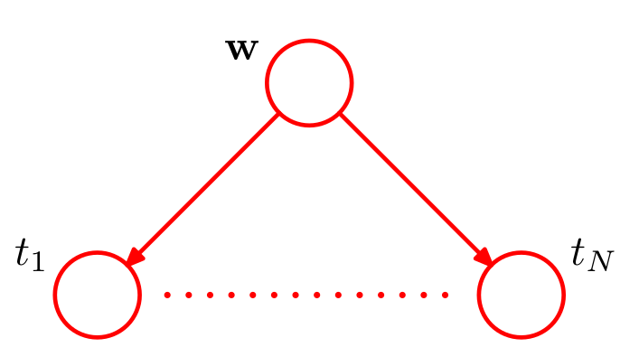
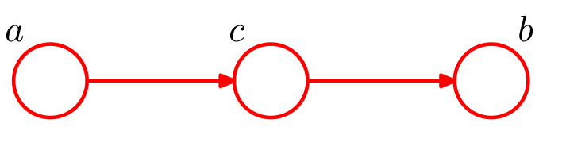
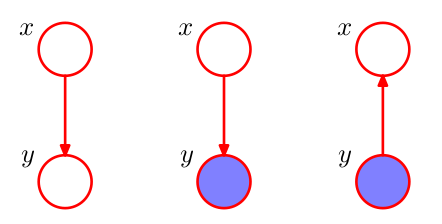
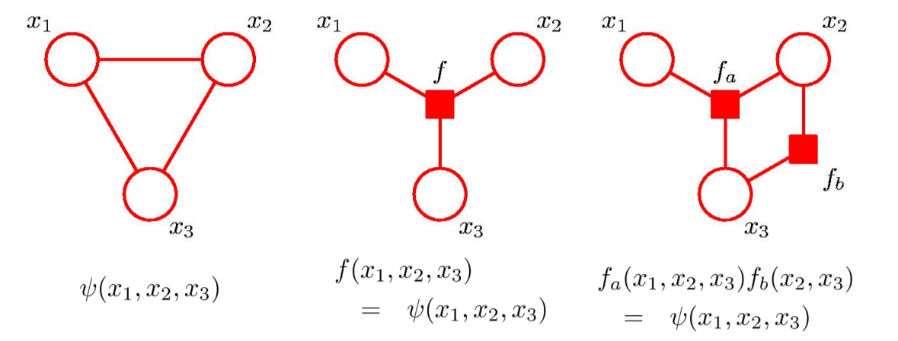
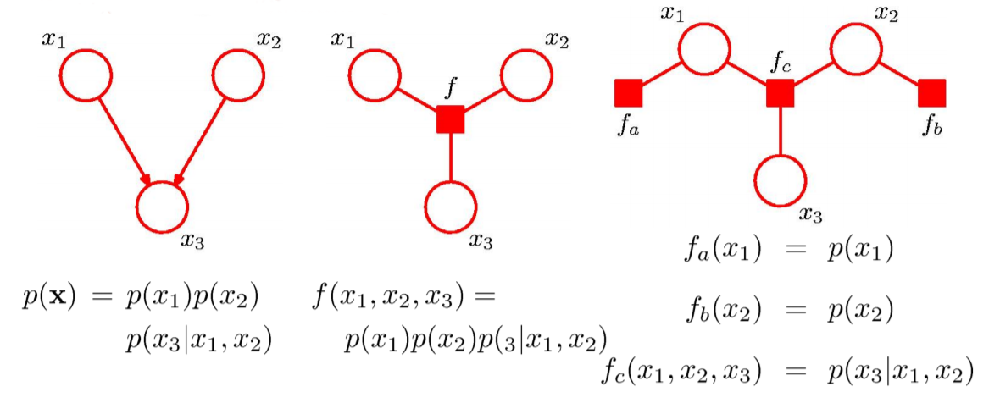

class: middle, center, inverse

# Introducción

---

## Representar gráficamente distribuciones de probabilidad. Ventajas

* Forma simple de visualizar la estructura de modelos probabilísticos.

* Diseño y motivación de nuevos modelos.

* Facilita comprender propiedades de los modelos, como la independencia condicional.

* Cálculos complejos pueden ser expresados en términos de manipulaciones gráficas sencillas.

---

class: middle, center, inverse

# Redes Bayesianas

---
## Introducción

* Podemos representar cualquier distribución de probabilidad utilizando un **grafo acíclico dirigido** (DAG).

* Cada nodo es una variable aleatoria de la distribución.

* Arcos entre nodos representan dependencias condicionales.

* Dado un DAG, la distribución de probabilidad conjunta es

\begin{equation}
p(x) = \prod_{k=1}^K p(x_k \vert \text{pa}_k)
\end{equation}

---

## Introducción

* **Ejercicio**: Factoriza y representa gráficamente la distribución $p(a,b,c)$.

* **Ejercicio**: ¿A qué distribución corresponde este DAG?

---

## Notación

* Para expresar multiplicidad de variables aleatorias se utiliza la siguiente notación

---

## Notación

* Los parámetros deterministas se representan usando círculos sólidos.

* Las variables observadas se colorean.

* **Ejercicio**: ¿Qué modelo representa esta Red Bayesiana?

---

## Independencia Condicional

* Decimos que $a$ y $b$ son condicionalmente independientes dado $c$ si $p(a \vert b,c) = p(a \vert c)$ o $p(a,b \vert c) = p(a \vert c) p(b \vert c)$.

* Los PGMs permiten identificar las propiedades de independencia condicional de la distribución conjunto de forma automática.

---

## Ejemplo 1

* Nodo *tail-to-tail*
* Si se condiciona en $c$ este nodo bloquea el camino entre $a$ y $b$, y se cumple independencia condicional.

---

## Ejemplo 2

* Nodo *head-to-tail*
* Si se condiciona en $c$ este nodo bloquea el camino entre $a$ y $b$, y se cumple independencia condicional.

---

## Ejemplo 3

* Nodo *head-to-head*
* Si se $c$ **no se observa** bloquea el camino entre $a$ y $b$ y estas son independientes.
* Si se $c$ **se observa** el camino se desbloquea: $a$ y $b$ y son dependientes.

---
## D-separación

* Consideremos un DAG general y sean $A$, $B$ y $C$ conjuntos de nodos diferentes.

* Queremos determinar si $A$ y $B$ son condicionalmente independientes dado $C$.

* Consideremos todas las trayectorias entre $A$ y $B$. Diremos que alguna de estas está bloqueada si:
  * Las flechas del camino encuentran un nodo *head-to-tail* o *tail-to-tail* y este está en $C$.
  
  * Las flechas del camino encuentran un nodo *head-to-head* y ni el nodo ni sus descendientes están en $C$.

* Si todos los caminos entre $A$ y $B$ están bloqueados, entonces $A$ y $B$ están $d$-separados por $C$ y son condicionalmente independientes dado $C$.

---
## D-separación
* Determinar si $a$ y $b$ son condicionalmente independientes dados los nodos observados en cada caso.

---
## D-separación
* Dibuja la red bayesiana de un modelo de Naive-Bayes

* Estudia la independencia condicional entre $t_n$ y $\hat{t}$.

---
## D-separación

* A efectos de $D$-separación, los parámetros se comportan como variables aleatorias observadas.

* Como nunca tienen padres son siempre nodos *tail-to-tail* y bloquean todas las trayectorias en las que intervienen.

* El conjunto de distribuciones que pueden ser expresadas en términos de la factorización implicada por un DAG, se denomina $\mathcal{DF}$.

* $\mathcal{DF}$ coincide con todas las distribuciones que cumplen las propiedades de independencia condicional del DAG.

* Se denomina *Markov Blanket* de una variable $x_i$ al conjunto de padres, hijos y co-padres de $x_i$.

* Demostrar que para una distribución arbitraria $p(x_1, \dots, x_D)$, $p(x_i \vert x_{\lbrace j \neq i \rbrace})$ depende únicamente de las variables del *Markov Blanket* de $x_i$.

---
class: middle, center, inverse

# Markov Random Fields

---

## Modelos gráficos no dirigidos

* También conocidos como **redes de Markov**.

* Los enlaces ahora **no son dirigidos**.

--

* **Ventaja**: la propiedad de independencia se puede verificar mucho más fácilmente:

  * **d-separación**: $A  \perp B | C$ sii todos los caminos entre $A$ y $B$ están bloqueados por nodos de $C$. 
  
  * Corolario: no hay fenómeno de **explaining away**.
  
* Markov blanket: todos los nodos adyacentes.
  

---

## Propiedades de factorización

* Consideremos dos nodos $x_i$ y $x_j$ que no estén conectados por arco. 

* Como no hay camino directo, dado el resto de nodos, todos los caminos están bloqueados.

* Por tanto, $p(x_i, x_j| x_{\setminus \lbrace i,j \rbrace}) = p(x_i| x_{\setminus  \lbrace i,j \rbrace})p(x_j| x_{\setminus  \lbrace i,j \rbrace})$.

--

Es conveniente introducir el concepto de **clique**:

* **Clique**: subgrafo donde cada par de nodos está conectado por **un** enlace.

* **Clique maximal**: clique al cual no es posible añadir más nodos sin que pierda la propiedad de ser clique.

---

## Distribución conjunta

* Para un clique $C$ y conjunto de variables contenidas en él, $x_C$, tenemos que

\begin{equation}
p(x) = \frac{1}{Z} \prod_{C}  \Psi_C(x_C),\qquad Z = \sum_x \prod_{C}  \Psi_C(x_C)
\end{equation}

* Hay que tomar

\begin{equation}
\Psi_C(x_C) = \exp \lbrace - E(x_C) \rbrace
\end{equation}

* donde $E(x)$ es la llamada **función de energía**.

* Con $M$ variables que tomen $K$ valores, la complejidad puede ser $\mathcal{O}(K^M)$.

---

## De dirigido a no dirigido

* Para pasar de un grafo dirigido a uno no dirigido, basta añadir nuevos enlaces entre todos los pares de parientes de cualquier nodo.

* Este proceso se conoce como **moralización**, y el grafo resultante, **grafo moral**.

* Ir de una representación en grafo dirigido a uno no dirigido descarta algunas propiedades de independencia condicional del grafo.

---

class: middle, center, inverse

# Inferencia Exacta en Modelos Gráficos

---

## Resumen

* **Inferencia**: algunos de los nodos del modelo estarán fijados a ciertos valores conocidos (observados), y deseamos calcular la distribución posterior sobre (subconjuntos de) el resto de nodos (no observados).

* Aprovecharemos la estructura gráfica del modelo para desarrollar algoritmos que eviten la explosión exponencial del número de configuraciones posibles del modelo.

* Caso más sencillo: supongamos que $p(x, y) = p(y|x)p(x)$, con el Teorema de Bayes

\begin{equation}
p(x|y) = \frac{p(y|x)p(x)}{p(y)}
\end{equation}

* Ahora el modelo se interpreta como $p(y)p(x|y)$. Ejemplo: MoG.

---

## Inferencia en una cadena

* Consideremos una cadena de nodos

\begin{equation}
p(x) = \frac{1}{Z} \psi_{1,2}(x_1, x_2)  \psi_{2,3}(x_2, x_3) \cdots \psi_{N-1,N}(x_{N-1}, x_N)
\end{equation}

* Echemos cuentas: supongamos que cada nodo es una VA discreta ($K$ clases), y cada potencial viene especificado como una tabla de tamaño $K \times K$: la conjunta tiene $(N-1)K^2$ parámetros.

* Queremos obtener la **distribución marginal sobre $x_n$** (sumando todos los demás nodos):

\begin{equation}
p(x_n) = \sum_{x_1} \sum_{x_2} \cdots \sum_{x_{n-1}}  \sum_{x_{n+1}} \cdots  \sum_{x_{N}} p(x)
\end{equation}

* La complejidad es $\mathcal{O}(K^N)$ !! Es **intratable** para $N$ moderados.

---

## Inferencia en una cadena (2)

* ¿Podemos hacerlo mejor? La clave consiste en utilizar la propiedad distributiva

\begin{equation}
ab + ac = a(b+c)
\end{equation}

* Podemos obtener ecuaciones recursivas para **transmitir mensajes**

\begin{align}
p(x_n) &= \frac{1}{Z} \left[  \sum_{x_{n-1}} \psi_{n-1,n}(x_{n-1}, x_n) \cdots \left[ \sum_{x_1} \psi_{x_1, x_2} (x_1, x_2) \right] \cdots \right] \\
&\left[  \sum_{x_{n+1}} \psi_{n,n+1}(x_{n}, x_{n+1}) \cdots \left[  \sum_{x_{N}} \psi_{N-1,N}(x_{N-1}, x_N) \right] \cdots \right]
\end{align}

* Esto es,

\begin{align}
p(x_n) = \frac{1}{Z} \mu_{\alpha}(x_n) \mu_{\beta}(x_n)
\end{align}

---

## Inferencia en una cadena (3)

\begin{align}
p(x) &= \left[  \frac{1}{Z} \sum_{x_{n-1}} \psi_{n-1,n}(x_{n-1}, x_n) \cdots \left[ \sum_{x_1} \psi_{x_1, x_2} (x_1, x_2) \right] \cdots \right] \\
&\left[  \sum_{x_{n+1}} \psi_{n,n+1}(x_{n}, x_{n+1}) \cdots \left[  \sum_{x_{N}} \psi_{N-1,N}(x_{N-1}, x_N) \right] \cdots \right]
\end{align}

* Ahora, el coste computacional es el de $N-1$ sumas, sobre variables con $K$ categorías.

* Cada suma local es la de una tabla de tamaño $K \times K$.

* Por tanto, la nueva complejidad es $\mathcal{O}(NK^2)$, esto es, lineal en $N$ !!

--

* Si el grafo fuera completo (todos los nodos tienen arcos a todos los restantes) no hubiéramos podido hacer lo anterior: volvemos al coste exponencial.

---

## Paso de mensajes (1)

* Intepretación más común: paso de mensajes entre los nodos del grafo.

* La marginal se descompone en un producto de dos factores y la constante de normalización:

\begin{equation}
p(x_n) = \frac{1}{Z} \mu_{\alpha}(x_n) \mu_{\beta}(x_n)\qquad Z = \sum_{x_n}  \mu_{\alpha}(x_n) \mu_{\beta}(x_n)
\end{equation}

* $\mu_\alpha(x_n)$ es un mensaje propagado hacia adelante en la cadena desde $x_{n-1}$ hasta $x_n$.

* $\mu_\beta(x_n)$ es un mensaje propagado hacia atrás en la cadena desde $x_{n+1}$ hasta $x_n$.

* Cada mensaje contiene un conjunto de $K$ valores (uno para cada elección de $x_n$), por lo que el producto de dos mensajes representa una multiplicación componente a componente de los correspondientes elementos.

---

## Paso de mensajes (2)

* El mensaje hacia adelante puede ser evaluado recursivamente

\begin{equation}
\mu_\alpha(x_n) = \sum_{x_{n-1}} \psi_{x_{n-1}, x_n} (x_{n-1}, x_n) \left[ \sum_{x_{n-2}} \ldots \right] =\sum_{x_{n-1}} \psi_{x_{n-1}, x_n} (x_{n-1}, x_n)  \mu_\alpha(x_{n-1}) 
\end{equation}

* Por tanto, primero evaluamos

\begin{equation}
\mu_\alpha(x_2) = \sum_{x_1} \psi_{1,2}(x_1, x_2)
\end{equation}

* El mensaje saliente se obtiene multiplicando el mensaje entrante por el potencial local y sumando en la variable del nodo.

* Los mensajes hacia atrás también tienen la misma estructura recursiva.

* Este tipo de grafos se denominan **cadenas de Markov** y las ecuaciones de paso de mensajes correspondientes son un ejemplo de las **ecuaciones de Chapman-Kolmogorov** para procesos de Markov.

---

## Inferencia en una cadena

* Para calcular distribuciones marginales:

  * Calcular y guardar todos los mensajes hacia adelante $\mu_\alpha(x_n)$.
  * Calcular y guardar todos los mensajes hacia atrás $\mu_\beta(x_n)$.
  * Calcular la constante de normalización $Z$.
  * Calcular $p(x_n) = \frac{1}{Z} \mu_{\alpha}(x_n) \mu_{\beta}(x_n)$.
  
* **Ejercicio**: la marginal para pares de nodos adyacentes es

\begin{equation}
p(x_{n-1}, x_n) = \frac{1}{Z} \mu_{\alpha}(x_{n-1}) \psi_{n-1,n}(x_{n-1},x_n) \mu_{\beta}(x_n)
\end{equation}

* Componentes básicas para hacer inferencia en sistemas dinámicos lineales y modelos ocultos de Markov (HMM).

---

## Inferencia en árboles

* El esquema propuesto de paso de mensajes generaliza fácilmente a cualquier grafo **individualmente conectado** (singly connected): a lo sumo un único camino entre cualquier par de nodos.

* Cada nodo envía por cada enlace el producto de los mensajes que ha recibido desde los otros enlaces.

* Ejemplo: árbol no dirigido, árbol dirigido y poliárbol.

---

## Grafos de factores

* También representamos los **factores como nodos especiales**.

* Ejemplo: $p(x) = f_a(x_1, x_2) f_b(x_1, x_2) f_c(x_2, x_3) f_d(x_3)$

* En general, $p(x) = \prod_s f_s (X_s)$.

* Cada potencial tiene su propio nodo de factor, conectado a todos los términos del potencial.

* Los grafos de factores son **bipartitos**: podemos dividir entre nodos de variables y nodos de factores $\rightarrow$ estructura para implementar paso de mensajes genérico.

---

## Grafos de factores para modelos no dirigidos

* Un grafo no dirigido puede ser convertido a un grafo de factores.

* Además, factorizaciones adicionales son posibles de representar(los **grafos de factores son más expresivos**)

---

## Grafos de factores para modelos dirigidos

* Los grafos dirigidos son un caso especial en que los factores representan **distribuciones locales condicionadas**.

* Un modelo individualmente conectado generará un grafo de factores individualmente conectado: preserva la sencillez de la inferencia en estos casos (esto no ocurre si pasamos de dirigidos a no dirigidos).

---

class: middle, center, inverse

# Algoritmo suma-producto

---

## Introducción

* Usando el marco de grafos de factores, derivaremos un algoritmo eficiente de **inferencia exacta** aplicable a grafos con estructura de árbol.

* Nos centraremos en evaluar marginales locales sobre nodos o conjuntos de nodos.

* Por sencillez, supondremos que todas las variables son discretas (la extensión a caso contínuo es trivial).

* Asumiremos que el grafo original es un **árbol no dirigido**, un **árbol dirigido** o un **poli-árbol**.

* En estos casos, el grafo de factores tiene estructura de árbol.

---
## Objetivos

* Primero de todo convertimos el grafo original en un grafo de factores.

* El objetivo es explotar la estructura del grafo para:

  1. Obtener un algoritmo eficiente de inferencia exacta para encontrar las marginales.
  
  2. En el caso de computar muchas marrginales, *compartir* los cálculos de manera eficiente.
  
---
## Algoritmo suma-producto (1)

* Empezamos por encontrar $p(x)$ para un nodo en concreto.

\begin{equation}
p(x) = \sum_{\textbf{x} / x} p(\textbf{x} ) = \sum_{\textbf{x} / x} \prod_{s} f_s(x_s)
\end{equation}

* La estructura de árbol permite dividir los factores en la distribución conjunta en grupos, cada uno asociado con un factor vecino de $x$.

---
## Algoritmo suma-producto (2)

* Llamamos a $\text{ne}(x)$ al conjunto de nodos factor vecinos de $x$.

* $X_s$: todas las variables **en el subárbol** conectado a $x$ via un nodo factor $f_s$.

* $F_s(x, X_s)$ el producto de **todos los factores** del grupo asociado a $f_s$.

* Entonces:

\begin{equation}
p(\textbf{x} ) = \prod_{s \in \text{ne}(x) } F_s(x, X_s)
\end{equation}

---
## Algoritmo suma-producto (3)

* Sustituyendo, cambiando orden suma producto y definiendo **mensajes** entre $f_s$ y x

\begin{equation}
p(x) = \prod_{s \in \text{ne}(x) } \left[ \sum_{X_s} F_s(x, X_s) \right] := \prod_{s \in \text{ne}(x) } \mu_{f_s \rightarrow x} (x)
\end{equation}

* Necesitamos evaluar los mensajes. Vemos que cada factor $F_s(x, X_s)$ es a su vez un grafo de factores y puede ser factorizado.

---
## Algoritmo suma-producto (4)

* Denotamos las variables asociadas a $f_s$ (a parte de $x$) como $x_1, \dots, x_M$.

\begin{equation}
F_s(x, X_s) = f_s(x, x_1, \dots, x_M) G_1(x_1, X_{s1}) \dots G_M(x_M, X_{sM})
\end{equation}

---
## Algoritmo suma-producto (5)

* Substituyendo y llamando $\text{ne}(f_s)$ al conjunto de nodos variable vecinos de $f_s$.

\begin{eqnarray}
\mu_{f_s \rightarrow x} (x) &=& \sum_{X_s} F_s(x, X_s) \\
&=& \sum_{x1,\dots,x_M} f_s(x, x_1, \dots, x_M) \prod_{m \in \text{ne}(f_s) / x} \left[ \sum_{X_{sm}} G_{m} (x_m, X_{sm})\right] \\
&=& \sum_{x1,\dots,x_M} f_s(x, x_1, \dots, x_M) \prod_{m \in \text{ne}(f_s) / x} \left[\mu_{x_m \rightarrow f_s} (x_m) \right]
\end{eqnarray}
 
* Existen dos tipos de mensajes: variable-factor y factor-variable.

* Evaluar mensaje de nodo factor a nodo variable requiere evaluar el **producto de mensajes recibidos** por el nodo factor, **multiplicar factor asociado** a este nodo y **marginalizar en variables asociadas a mensajes recibidos**.

---
## Algoritmo suma-producto (6)

* Para cerrar círculo, evaluamos los mensajes variable-factor.

* Vemos que $G_m(x_m, X_{sm})$ admite la factorización

\begin{equation}
\prod_{l \in \text{ne}(x_m)/f_s } F_l(x_m, X_{ml}) 
\end{equation}

---
## Algoritmo suma-producto (6)

* Con esto

\begin{eqnarray}
\mu_{x_m \rightarrow f_s} (x_m) &=& \prod_{l \in \text{ne}(x_m)/f_s } \left[ \sum_{X_{ml}} F_l (x_m, X_{ml})\right] \\
&=& \prod_{l \in \text{ne}(x_m)/f_s } \mu_{f_l \rightarrow x_m} (x_m)
\end{eqnarray}

* Para evaluar mensajes mandados por variable nodo a variable factor, calcular producto de todos los mensajes que llegan a la variable nodo.

---
## Algoritmo suma-producto (7)

* Cada mensaje puede ser calculado recursivamente en términos de otros mensajes.

* ¿Cómo empezar la recursión?

* Vemos $x$ como el nodo raíz, y nos vamos a loas nodos hoja.

---
## Algoritmo suma-producto (8)

* Para calcular todas las marginales de forma eficiente:
  
  1. Escoger nodo arbitrario como raíz.
  
  2. Calcular y propagar mensajes de las hojas hasta la raíz, guardando todos los mensajes recibidos en cada nodo.
  
  3. Calcular y propagar mensajes de la raíz hasta las hojas, guardando todos los mensajes recibidos en cada nodo.
  
  4. Calcular el producto de mensajes recibidos en cada nodo y normalizar si es necesario.
  
---
## Algoritmo suma-producto (9)

* **Ejercicio** :  Demostrar que las marginales sobre variables asociadas a un factor se pueden escribir como

\begin{equation}
p(\boldsymbol{x_s}) = f_s(\boldsymbol{x_s}) \prod_{m \in \text{ne}(f_s)} \mu_{x_m \rightarrow f_s} (x_m)
\end{equation}

---
## Algoritmo suma-producto (10)

* Cuando hay variables observadas, particionamos $\textbf{x}$ en variables observadas $\textbf{v}$ y ocultas $\textbf{h}$.

* Sean $\boldsymbol{\hat{v}}$ los valores observados. Redefinimos la conjunta como

\begin{equation}
p(\boldsymbol{x}) \prod_i I(v_i, \hat{v}_i)
\end{equation}

* Que no es más que la versión sin normalizar de $p(\boldsymbol{h} \vert \boldsymbol{v} = \boldsymbol{\hat{v}})$.

* Con el agoritmo suma-producto podemos calcular las versiones sin normalizar de

\begin{equation}
p(h_i \vert \boldsymbol{v} = \boldsymbol{\hat{v}})
\end{equation}

* Que es barato de normalizar.
---

class: middle, center, inverse

# Algoritmo max-suma

---

## Algoritmo max-suma (1)

* El algoritmo suma-producto nos permitía calcular marginales de forma eficiente.

* En muchas ocasiones, también nos interesará calcular una **configuración de variables $x$ que maximice la probabilidad del modelo**.

* Solución: usaremos el algoritmo **max-suma**.

* Objetivo: encontrar un algoritmo eficiente para
  
  1. Calcular $x_{max}$ tal que maximize $p(x)$.
  
  2. Calcular $p(x_{max})$.
  
--
  
* En general, **maximizar marginales $\neq$ máximo conjunto**:

---

## Algoritmo max-suma. Inferencia en cadena

Volvamos al caso de inferencia en una cadena...

* La clave vuelve a ser **intercambiar las operaciones**.

\begin{align}
p(x_{max}) &= \max_x p(x) = \max_{x_1} \ldots \max_{x_N} p(x) = \\
&= \frac{1}{Z} \max_{x_1} \ldots \max_{x_N} \left[  \psi_{1,2} (x_1, x_2) \cdots \psi_{N-1,N} (x_{N-1}, x_N)  \right] = \\
&= \frac{1}{Z} \max_{x_1} \left[  \max_{x_1} \left[  \psi_{1,2} (x_1, x_2) \left[ \cdots \max_{x_N} \psi_{N-1,N} (x_{N-1}, x_N)  \right] \right] \right]
\end{align}

* Al igual que con las marginales, intercambiar los operadores max y producto resulta en un algoritmo mucho más eficiente, dejando de tener coste exponencial.

* Puede ser interpretado en términos de un **paso de mensajes** desde $x_N$ hasta $x_1$.

---

## Algoritmo max-suma. Generalización a árboles

* Al igual que suma-producto, puede aplicarse en grafos de factores con estructura de árbol

\begin{equation}
\max_x p(x) = \max_{x_n} \prod_{f_s \in ne(x_n)} \max_{X_s} f_s(x_n, X_s)
\end{equation}

* Frente al original:

\begin{equation}
p(x) =  \prod_{f_s \in ne(x)} \left[ \sum_{X_s} F_s(x, X_s)   \right]
\end{equation}

* max-producto $\rightarrow$ max-suma

  1. Por razones numéricas, es más estable trabajar en espacio logarítmico:
    \begin{equation}
    \log (\max_x p(x)) = \max_x \log p(x)
    \end{equation}
  2. Y usamos la propiedad distributiva para los intercambios de operadores:
  
    \begin{equation}
    \max \lbrace a+b, a+c \rbrace = a + \max \lbrace b, c \rbrace
    \end{equation}
---

## Algoritmo max-suma

* Ya es directo pasar del algoritmo suma-producto al max-suma: basta cambiar los operadores:

  * $+ \rightarrow \max$,
  * $\times \rightarrow +$ (de logaritmos)
  
* **Inicialización** (los elementos neutros para ambos operadores):

  * $\mu_{f\rightarrow x}(x) = 0$
  * $\mu_{x\rightarrow f}(x) = \log f(x)$
  
* **Caso recursivo**:

\begin{equation}
\mu_{f \rightarrow x} = \max_{x_1, \ldots, x_M} \left[ \log f(x, x_1, \ldots, x_M) + \sum_{m \in ne(f_s)\ x} \mu_{x_m \rightarrow f} (x_m) \right]
\end{equation}

\begin{equation}
\mu_{x\rightarrow f} (x) = \sum_{l \in ne(x) \ f} \mu_{f_l \rightarrow x} (x)
\end{equation}

---

## Generalizaciones de suma-producto

* Consideramos un (semi-)anillo con dos operaciones:

  * $+,\times$: marginalización.
  * $\max, +$: MAP.
  * $\sim, +$: forward-filter, backward-sample (para obtener muestras del posterior).
  * ...
  
* Es lo que recientemente se ha denominado como **semiring dynamic programming**.

* Permite encontrar de forma natural algoritmos eficientes en más contextos aparte de PGMs.

* Por ejemplo: Belle, de Raedt, *Semiring Programming: A Framework for Search, Inference and Learning* (2016).

---

## Inferencia en grafos generales

* El algoritmo *junction tree* generaliza el marco visto a grafos arbitrarios (con ciclos), pero no es eficiente en general.

* Otra alternativa es usar métodos aproximados.

* *Loopy belief propagation* propone usar el algoritmo suma producto aunque haya ciclos.

* La información fluye indefinidamente por los ciclos. En algunos casos se converge (no garantizado!).

