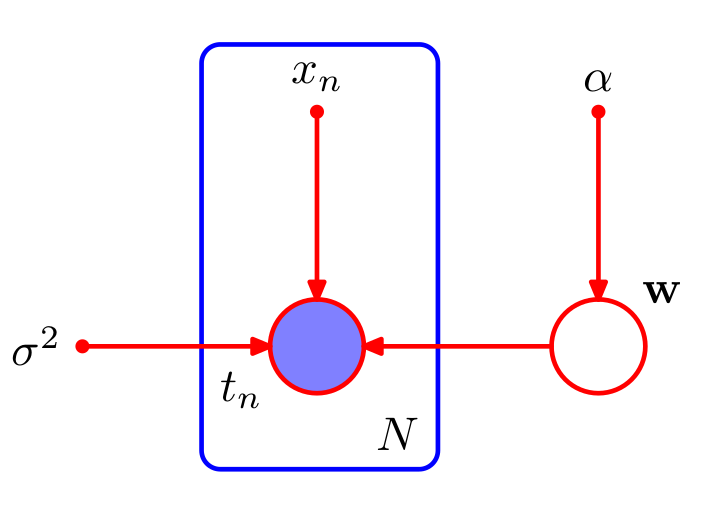
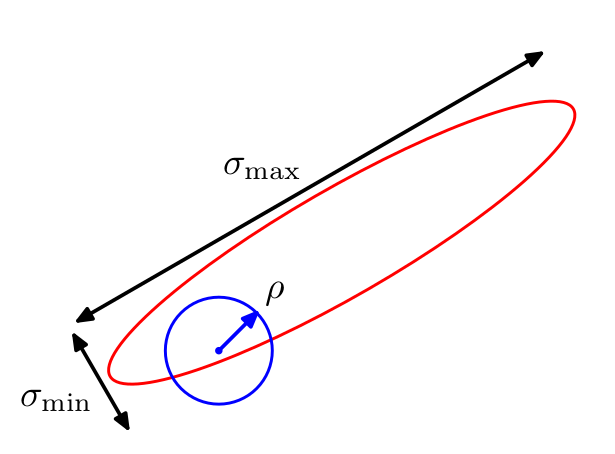
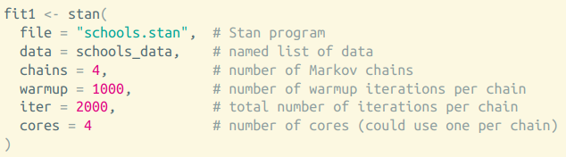
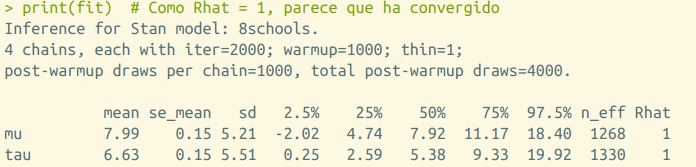

## Ventajas del enfoque Bayesiano de regresión y clasificación

* Previene el **overfitting**

* Aporta métodos automáticos para determinar la complejidad de los modelos, basados en datos.

* ...
---

class: middle, center, inverse

# Regresión Bayesiana

---

## Modelo de Regresión

* Objetivo: predecir uno o más targets **contínuos** $t$ a partir de un vector D-dimensional de inputs $x$.

* Modelo de ruido normal, $t = y(x,w) + \epsilon$

\begin{equation}
p(t \vert x, w, \beta) = \mathcal{N}(t \vert y(x,w), \beta^{-1})
\end{equation}

* Donde $y(x,w) = \sum_{j=0}^{M-1} w_j \phi_j(x) = w^\top \phi(x)$.

--

* Si tenemos datos $x_1, \dots, x_N$, $t_1, \dots, t_N$ y asumimos que son muestras iid de $p(t \vert x, w, \beta)$, la verosimilitud es

\begin{equation}
p(\boldsymbol{t} \vert X, w)\prod_{n=1}^N \mathcal{N}(t_n \vert w^\top \phi(x_n), \beta^{-1})
\end{equation}

* Donde $\boldsymbol{t}$ es el vector de los $N$ targets y $X$ la matriz de datos.

* Maximizando la log-verosimilitud con respecto a $w$ obtenemos la solución de mínimos cuadrados.

---

## Enfoque Bayesiano (1)

* Tratamos los parámetros desconocidos como variables aleatorias.

* Empezaremos asumiendo que conocemos la precisión $\beta$.

* Ponemos distribuciones a priori sobre los pesos $w$.

* Como la verosimilitud es la exponencial de una función cuadrática de w, el prior conjugado es normal

\begin{equation}
p(w) = \mathcal{N}(w \vert m_0, S_0)
\end{equation}

---
## Enfoque Bayesiano (2)

* Podemos calcular la distribución a posteriori

\begin{equation}
p(w \vert \boldsymbol{t}, X) \propto p(t \vert X, w)p(w)
\end{equation}

* Gracias a la conjugación, la distribución a posteriori será también Gaussiana. 

\begin{equation}
p(w \vert \boldsymbol{t}, X) = \mathcal{N}(w \vert m_N, S_N)
\end{equation}

* Donde

\begin{eqnarray*}
m_n &=& S_N(S_0^{-1} m_0 + \beta \Phi^\top \boldsymbol{t}) \\
S_N^{-1} &=& S_0^{-1} + \beta \Phi^\top \Phi
\end{eqnarray*}

* $\Phi$ es la matriz de diseño. La final i-ésima es el vector $[\phi_0(x_i), \dots, \phi_{M-1}(x_i)]$.

--

* **Ojo**: no siempre podremos calcular analíticamente la distribución a posteriori...
---
## Enfoque Bayesiano (3)

* **Ejercicio**: demostrar que si consideramos una distribución a priori infinitamente ancha, $(S_0 = \alpha^{-1} I, \alpha \rightarrow 0)$, la media (moda) de la distribución a posteriori converge a la solución de máxima verosimilitud dada por

\begin{equation}
w_{ML} = (\Phi^\top \Phi)^{-1} \Phi^\top \boldsymbol{t}
\end{equation}

---

## Enfoque Bayesiano (4)

* Consideremos el caso de distribución a priori isotrópica de media 0.

\begin{equation}
p(w \vert \alpha) = \mathcal{N}(w \vert 0, \alpha^{-1} I)
\end{equation}

--

---

## Enfoque Bayesiano (4)

* **Ejercicio:** demostrar que maximizar el log-posterior con respecto a $w$, equivale a encontrar el estimador de máxima verosimilitud de los pesos del problema de regresión con regularización $L2$. 

--

* En el caso bajo consideración, podemos escribir el log-posterior como la suma del log-prior y la log-verosimilitud.

\begin{equation}
-\frac{\beta}{2} \sum_{n=1}^N \left \lbrace t_n - w^\top \phi(x_n)\right \rbrace^2 - \frac{\alpha}{2} w^\top w + \text{cte}
\end{equation}

* Maximizar este posterior es equivalente a encontrar la solución de regresión ridge con parámetro de regularización $\alpha/\beta$.

---

## Enfoque Bayesiano (5)

* En la práctica, estamos interesados en hacer predicciones del target $t$ asociado a un nuevo input $x$.

* Esto requiere evaluar la **distribución predictiva a posteriori**

\begin{equation}
p(t \vert \boldsymbol{t},\alpha, \beta) = \int p(t \vert w \beta)p(w \vert \boldsymbol(t), \alpha, \beta) dw
\end{equation}

--

* Es fácil probrar que $p(t \vert \boldsymbol{t},\alpha, \beta) = \mathcal{N}(t \vert m_N^\top \phi(x), \sigma_N^2(x))$, con

\begin{equation}
\sigma_N^2(x) = \frac{1}{\beta} + \phi(x)^\top S_N \phi(x)
\end{equation}

* Dos fuentes de incertidumbre: la asociada al modelo y la asociada al desconocimiento de los $w$ (en el límite de muchos datos esta última es cero).

--

* **Ojo**: la distribución predictiva a posteriori no siempre puede calcularse analíticamente...

---

## Enfoque Bayesiano (6)

* En todos los casos hemos asumido conocido el valor de la precisión $\beta$.

* Si fuese desconocido, deberíamos poner un prior sobre $w, \beta$.

* Eligiendo una distribución Gaussiana-Gamma, se mantiene la conjugación.

* En este caso la distribución predictiva es una t de Student.

* Si también queremos asignar un prior al parámetro $\alpha$ (hiperprior), debemos recurrir a técnicas de inferencia aproximada.
---

## Comparación de modelos Bayesiana

---

class: middle, center, inverse

# Clasificación Bayesiana

---

class: middle, center, inverse

# Inferencia Aproximada

---

## Repaso

* **Inferencia**: algunos de los nodos del modelo estarán fijados a ciertos valores conocidos (observados), y deseamos calcular la distribución posterior sobre (subconjuntos de) el resto de nodos (no observados).

* Caso más sencillo: supongamos que $p(x, y) = p(y|x)p(x)$, con el Teorema de Bayes

\begin{equation}
p(x|y) = \frac{p(y|x)p(x)}{p(y)}
\end{equation}

* Salvo en casos sencillos, la integral $p(y) = \int p(x,y) dx$ es **intratable**.

--

* Introduciremos hoy dos familias de técnicas para **aproximar** el posterior:

  * **Basadas en muestreo**: Markov Chain Monte Carlo (MCMC).
  
  * **Basadas en optimización**: Inferencia Variacional (VI).

---

class: middle, center, inverse

# Markov Chain Monte Carlo

---

## Repaso de Monte Carlo

* El objetivo de los métodos Monte Carlo es el de calcular **esperanzas** con respecto a cierta distribución $p(z)$

\begin{equation}
\mathbb{E} \left[ f(z) \right] = \int_{\mathcal{Z}} f(z)p(z)dz
\end{equation}

* **Idea**: obtenemos una **muestra finita** $z^{(l)}, l=1,\ldots,L$ de $p(z)$, por lo que podemos aproximar mediante

\begin{equation}
\mathbb{E} \left[ f(z) \right] \approx \frac{1}{L} \sum_{l=1}^L f(z^{(l)})
\end{equation}

* ¿Qué hacer cuando no podemos muestrear directamente de $p(z)$?

--

  * Muestreo por rechazo (**rejection sampling**): no es muy general.
  
  * Muestreo por importancia (**importance sampling**): solo para calcular integrales, no permite obtener muestras directamente: con lo que si queremos cambiar la $f(z)$, hay que repetir todo desde 0 (costoso).
  
  * **Markov Chain Monte Carlo (MCMC)**: general y obtiene muestras directamente.

---

## MCMC: fundamentos

* **Objetivo**: obtener muestras de $p(z)$.

* **Asumimos**: sabemos evaluar $p(z)$ salvo constante de proporcionalidad.

  * Es decir, basta con saber evaluar $\tilde{p}(z) = Z p(z)$.
  
* **Idea**: generar muestras de una cadena de Markov cuya distribución invariante (límite) sea $p(z)$.

--

* **Esquema general**:

  1. A partir de la muestra actual $z^{(\tau)}$, generar una muestra *candidata* mediane una distribución (**proposal**),  $z^* \sim q(z | z^{(\tau)})$.
  
  2. Aceptamos la candidate mediante algún criterio.
  
  3. Si es aceptada, $z^{(\tau + 1)} = z^*$. Si no, $z^{(\tau + 1)} = z^{(\tau)}$, e iteramos.
  
  * Las muestras $z^{(1)}, z^{(2)}, \ldots$ forman una cadena de Markov.

---

## Algoritmo de Metropolis

* El proposal tiene que ser simétrico: $q(z_A|z_B) = q(z_B | z_A)$.

* Aceptamos la muestra con probabilidad

\begin{equation}
A(z^*, z^{(\tau)}) = \min (1, \frac{\tilde{p}(z^*)}{\tilde{p}(z^{(\tau)})})
\end{equation}

--

* Típicamente, $q(z | z^{(\tau)}) \sim \mathcal{N}(z | z^{(\tau)}, \sigma)$ (Random Walk Metropolis)

* Visualización interactiva en https://chi-feng.github.io/mcmc-demo/app.html#RandomWalkMH,banana.

---

## ¿Por qué funciona Metropolis?

---

### Algoritmo de Metropolis-Hastings

* Generalización que permite el uso de **cualquier proposal**.

* Ahora aceptaremos una muestra con probabilidad:

\begin{equation}
A(z^*, z^{(\tau)}) = \min (1, \frac{\tilde{p}(z^*) q(z^{(\tau)} | z^*)  }{\tilde{p}(z^{(\tau)}) q(z^* | z^{(\tau)}) })
\end{equation}

### Efecto de hiperparámetros

* Si el proposal es $q(z | z^{(\tau)}) \sim \mathcal{N}(z | z^{(\tau)}, \rho)$, valores **bajos** de $\rho$ hacen que la tasa de aceptación sea alta, pero explore muy lentamente. Valores **altos** de $\rho$ provocan que se explore más regiones del espacio, a costa de aumentar las muestras rechazadas.

---

## Convergencia

* Rhat

* Muestra efectiva

* Disminuyendo correlaciones

---

## Gibbs sampling

* Caso especial de Metropolis-Hastings, utilizado cuando
  
  * El objetivo es multidimensional: $p(z) = p(z_1, \ldots, z_M)$.
  
  * Se conocen las marginales condicionadas $p(z_i | z_{\setminus i})$.

---

## Hamiltonian Monte Carlo (HMC)

* ¿Podemos mejorar el camino aleatorio de la cadena? 

* Además de aliviar el problema del tamaño del paso en Metropolis-Hastings.

--

* También conocido como Hybrid Monte Carlo, HMC es adecuado para espacios continuos:

  * Permite dar grandes saltos en el espacio.
  
  * Baja tasa de muestras rechazadas.
  
  * Necesita evaluar el gradiente de la logprobabilidad respecto a $z$.

---

class: middle, center, inverse

# Extra: breve intro a Stan

---

## Stan como PPL

* Lenguajes de **programación probabilística**.

* Separación entre **modelo** e **inferencia**.

---

## Flujo de trabajo con un PPL

1. Escribir el **modelo probabilístico** (priores + verosimilitudes).

2. Ejecutar el **motor de inferencia** (MCMC, VI, MAP, ...).

3. Diagnosticar la **convergencia**.

4. Realizar la **inferencia** (muestras del posterior).

---

## Modelos en Stan

* Se escriben en un mini-lenguaje (DSL) simple (no en R) para que posteriormente puedan ser compilados a C.

* Especificamos **parámetros** y **variables latentes**.

* Pantallazo de ejemplo:

---

## Motores de inferencia en Stan

* HMC/NUTS

* VI (**V**ariational **B**ayes, siguiente capítulo)

---

## Diagnósticos en Stan

* También visualizaciones:

  * plot(fit)
  
  * pairs(fit, pars = c("mu", "tau"))
  
  * traceplot(fit, pars = c("mu", "tau"), inc_warmup = TRUE, nrow = 2)

---

class: middle, center, inverse

# Inferencia Variacional

---

