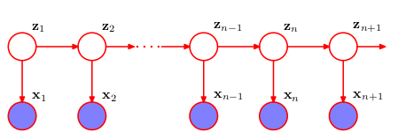

```{r setup, include=FALSE}
knitr::opts_chunk$set(echo = TRUE)
```

## Hidden Markov Models

Un tipo de modelo gráfico bastante popular son los modelos de Markov ocultos (HMMs), cuyo grafo es el siguiente:

<center>

</center>

donde tenemos las siguientes variables (todas ellas son discretas(categóricas)):

* $z_t$ se denomina estado latente en instante $t$, puede tomar $K$ valores distintos.
* $x_t$ es una observación, puede tomar $N$ valores distintos.

Y hay tres distribuciones para definir el modelo:

* $\pi = (\pi_1, \ldots, \pi_K)$: distribución inicial sobre el primer estado latente, $\pi_k = p(z_1 = k)$.
* $A$ matriz de transiciones, de tamaño $K \times K$: $A_{ij} = p(z_{t+1} = j | z_t = i)$.
* $B$ matriz de emisiones, de tamaño $N \times K$: $B_{ij} = p(x_{t} = i | z_t = j)$.

La distribución conjunta se puede factorizar como (comprobarlo con el grafo):

$$
p(x_{1:T}, z_{1:T}) = p(z_1) \prod_{t=2}^T p(x_t | z_t) p(z_t | z_{t+1})
$$


## Ejercicio

Supongamos que un casino usa un dado insesgado la mayor parte del tiempo pero ocasionalmente lo cambia por un dado trucado. Observamos la tirada del dado pero no sabemos qué dado se ha utilizado. Nos gustaría predecir qué dado han utilizado en cada momento a partir de las observaciones.

Esto es, queremos obtener $z^* = \arg \max_{z_{1:T}} p(z_{1:T} | x_{1:T})$, para ello utilizaremos el algoritmo max-suma, que en la literatura de HMMs se conoce como algoritmo Viterbi: https://en.wikipedia.org/wiki/Viterbi_algorithm


### Datos

Por simplicidad, asumiremos que tenemos acceso a la siguiente información sobre los parámetros del HMM:

* El dado trucado tiene un 50% de probabilidades de obtener 6, el resto es uniforme.

* Si en la tirada anterior se ha usado un dado insesgado, el casino volverá a usar un dado insesgado en esta tirada con un 95% de probabilidad.

* Si en la tirada anterior se ha usado un dado trucado, el casino volverá a usar un dado trucado en esta tirada con un 90% de probabilidad.


**Representa** la información anterior en el siguiente fragmento de código (trabajaremos con log-probabilidades):
```{r }
# Representaremos el dado insesgado como I y el dado trucado como S
s <- c("I", "S")

# Definimos la matriz de transiciones A, representando las probabilidades de que el casino cambie de dado
# A es de tamaño 2 x 2
A <- t(matrix(data = log(c(0.95, 0.05, 0.1, 0.9)), nrow = 2, ncol = 2, dimnames = list(c("I", "S"), c("I", "S"))))

# Definimos la matriz de emisiones B, indicando las probabilidades de sacar cada cara de cada dado
# B es de tamaño 6 x 2
B <- matrix(data = log(c(rep(1/6, 6), c(rep(1/10, 5), 1/2))), nrow = 6, ncol = 2, dimnames = list(seq(1,6), c("I", "S")))

# Definimos el prior sobre el primer estado.
pi <- matrix(data = log(c(0.5, 0.5)), nrow = 2, ncol = 1, dimnames = list(c("I", "S"), ""))

# Observamos 300 tiradas de dados
observaciones<-c(6,6,4,1,5,3,2,1,6,1,6,2,1,1,5,2,3,4,6,5,3,2,1,4,3,5,6,6,3,4,2,6,1,6,5,5,2,3,4,2,3,2,3,1,5,1,4,2,4,         6,4,1,5,6,6,6,3,2,4,6,2,6,6,5,6,5,6,3,6,5,6,4,6,6,3,1,5,6,3,4,6,3,6,4,5,6,5,1,4,3,1,3,2,6,1,6,3,3,1,2,3,6,1,6,6,5,4,3,6,1,1,5,1,3,3,3,2,1,2,6,6,6,5,2,6,5,6,1,5,2,2,4,2,4,4,3,4,2,5,3,3,5,6,1,2,3,5,6,6,6,3,6,3,2,6,3,6,1,6,6,2,3,3,5,3,2,3,2,6,2,4,6,4,6,6,5,5,6,6,3,1,2,1,3,1,4,3,6,6,4,2,4,6,3,4,2,3,3,2,4,2,3,4,5,3,6,6,1,2,3,2,4,6,6,4,5,2,3,5,6,4,2,1,5,1,4,6,6,1,5,1,4,6,2,2,1,4,5,5,6,1,4,4,4,6,1,5,5,4,3,5,1,3,4,5,1,2,3,6,6,6,2,6,6,4,6,4,6,5,6,6,1,2,4,6,4,2,6,5,6,2,6,5,1,5,2,1,1,1,6,6,6,6,6,4,6,3,3,4,6)

```


**Inspecciona** los datos de observaciones mediante un histograma

```{r }
hist(observaciones)
```

Todo indica que el casino ha empleado el dado trucado en algún momento. Para inferir en cuáles concretamente, implementaremos el algoritmo max-suma.

**Deriva** las siguientes ecuaciones recursivas (Chapman-Kolmogorov) para el HMM, donde $t$ va hasta el valor final $T = 300$:

$$
V_{1,k} = p(x_1 | z_1 = k) p( z_1 = k)
$$

$$
V_{t,k} = \max_l p(x_t | z_t = k) A_{l,k} V_{t-1,l}
$$

donde $V_{t,k} = \max_{x_1, \ldots x_t, z_1, \ldots, z_t} p(x_1, \ldots, x_t, z_1, \ldots, z_t)$, con $z_t = k$.


**Implementa** las siguientes ecuaciones recursivas, completando el caso recursivo. Nota: además de ir calculando $V_t$ en cada iteración, también necesitaremos ir guardando el valor $z^*_t$ en cada iteración en la matriz Ptr.

```{r }
V <- matrix( nrow = length(observaciones), ncol = 2)
Ptr <- matrix( nrow = length(observaciones), ncol = 2)


# Caso inicial
V[1, ] <- B[observaciones[1],] + pi
Ptr[1,] = c(1, 2)

for (t in 2:length(observaciones)) {
  
  # Caso recursivo
  V[t, ] <- apply(B[observaciones[t], ] + A[,] + V[t-1,], 2, max)
  Ptr[t, ] <- apply(B[observaciones[t], ] + A[,] + V[t-1,], 2, which.max)
}
```

¿Cuál es el valor del MAP? ¿Cuál es el valor de $z^*_T$?

```{r}
print(exp(max(V[length(observaciones),])))
print(s[which.max(V[length(observaciones),])])
```

Para terminar de obtener la secuencia $z_{1:T}^*$, ahora propagamos los mensajes hacia atrás siguiendo la recurrencia

$$
z^*_t = Ptr(z^*_{t+1}, t)
$$

**Impleméntalo** en el siguiente fragmento de código, y obtén la lista $z^*_{1:T}$

```{r }
z_max <- rep(0, length(observaciones))
z_max[length(observaciones)] <- which.max(V[length(observaciones), ])
for (t in (length(observaciones)-1):1) {
  z_max[t] <- Ptr[t, z_max[t+1]]
}

viterbi.path <- s[z_max]
```


Una inspección nos ha chivado que los dados que realmente utilizó el casino en cada tirada fueron éstos

```{r }
real.path<-c("S","S","S","S","S","S","S","S","S","S","S","S","S","S","I","I","I","I","I","I","S","S","S","S","S","S","S","S","S","S","S","S","S","S","I","I","I","I","I","I","I","I","I","I","I","I","I","I","I","I","I","I","S","S","S","S","S","S","S","S","S","S","S","S","S","S","S","I","I","I","S","S","S","S","S","I","I","I","I","I","I","I","I","I","I","I","I","I","I","I","I","I","I","I","I","I","I","I","I","I","I","I","I","S","S","S","S","S","S","S","S","S","S","S","S","S","S","S","S","S","S","S","S","S","S","S","I","I","I","I","I","I","I","I","I","I","I","I","I","I","I","I","I","I","I","I","I","I","I","S","S","S","S","S","S","S","S","S","S","I","I","I","I","I","S","S","I","I","I","I","I","I","I","I","I","I","I","I","I","I","I","I","I","I","I","I","I","I","I","I","I","I","I","I","I","I","I","I","I","I","I","I","I","I","I","I","I","I","I","I","S","S","S","S","I","I","I","I","I","I","I","I","I","I","I","S","S","S","S","S","S","S","S","I","I","I","I","I","I","I","I","I","I","I","I","I","I","I","I","I","I","I","I","I","I","I","I","I","S","S","S","S","I","I","I","I","I","I","I","I","S","S","S","S","S","S","S","S","S","S","S","S","S","I","I","I","S","S","S","S","S","S","S","S","S","S","I","I","S","S")
```

**Calcula** la tasa de acierto del algoritmo max-suma implementado

```{r }
viterbi.table <- table(viterbi.path == real.path)
cat(paste(round(viterbi.table["TRUE"] / sum(viterbi.table) * 100, 2), "% accuracy\n", sep = ""))
```