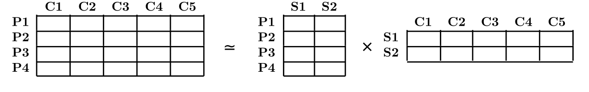

## Aprendizaje Supervisado


* Espacio de las muestras de entrada: $\mathcal{X}$

* Espacio de las salidas: $\mathcal{Y}$

**Dados**:

* Conjunto de **entrenamiento**: $S = \{x_i,\, y_i\}_{i=1}^N$, con $x_i, y_i \in \mathcal{X} \times \mathcal{Y}$

* Visión probabilística: $x_i, y_i \sim P(X,Y)$


**Objetivo**: 

  * Aprender una regla de predicción (hipótesis), $h: \mathcal{X} \rightarrow \mathcal{Y}$
  
  * Visión probabilística: estimar $P(Y|X)$
  
---

## Aprendizaje Supervisado
**Estrategia básica**: 

  * MLE de algún modelo paramétrico
  
  $$\arg\max_{w} \prod_{i=1}^N P(y_i|x_i, w)$$
  
**Facilidades**:

  * $\mathcal{Y}$ es tiene dimensión baja
  
  * Es sencillo cuantificar el error
  

---

## Aprendizaje No Supervisado

**Dados**:

* No hay salidas: $S = \{x_i\}_{i=1}^N$, con $x_i \in \mathcal{X} $

* Visión probabilística: $x_i \sim P(X)$

**Objetivo**: 

  * Estimar $P(X)$
  
  * Inferir alguna propiedad de $P(X)$


---

## Retos del Aprendizaje No Supervisado

* $X$ generalmente es de alta dimensión

* Propiedades de interés que queremos inferir son más complejas que simples parámetros

* No hay una medida directa de cuantificar el error

* Métodos heurísticos no solo para motivar los algoritmos sino también para medir la calidad de los resultados

```{r, fig.height=3.5, fig.align='center', echo=F}
library(ggplot2)
pages = c(0.1, 0.9, 0.23, 0.77)
Topico = c("UL", "SL", "UL", "SL")
Libro = c("ESL", "ESL", "Bishop", "Bishop")
data = data.frame(pages, Topico, Libro)
p = ggplot(data, aes(x=Libro, y=pages, fill=Topico)) + 
  geom_bar(stat = "identity", position = "dodge")
p = p + xlab("Libro")+ ylab("Proporción de páginas")
p
```

**Buen proxy de la dificultad de cada área !!**
---

## Una taxonomía de algoritmos de aprendizaje no supervisado según su objetivo

* Métodos de estimación de densidades

* Manifold learning: PCA, PCA no lineal, self-organizing maps, modelos de variables latentes, ...

* Encontrar regiones convexas del espacio que contengan modas de $P(X)$: análisis de cluster, modelos de mixturas,
...

* Muestrear de $P(X)$: GAN, autoencoders, autoencoders variacionales, ...

---

class: middle, center, inverse

# Métodos Lineales reducción de dimensionalidad
# Análisis de Componentes Principales 

---

## Dos definiciones alternativas

* Proyección ortogonal de datos a subespacio de dimensión inferior tal que varianza de proyecciones es máxima

* Proyección lineal que minimiza el *coste medio de proyección* = distancia media cuadrática entre datos y sus proyecciones

* Ambos dan lugar al mismo algoritmo!

* Diferentes aplicaciones: reducción de dimensionalidad, compresión, visualización de datos, extracción de variables predictoras...

---

## PCA: minimización de error de proyección (1)

* Considérese  el conjunto de observaciones $\lbrace x_n \rbrace_{n=1}^{N}$, donde $x_n \in \mathbb{R}^D$

* $\lbrace u_i \rbrace_{i=1}^{D}$: base ortonormal completa de dimension $D$

\begin{equation}
x_n = \sum_{i=1}^D \alpha_{ni} u_i
\end{equation}

--

* Sin pérdida de generalidad

\begin{equation}
x_n = \sum_{i=1}^D (x_n^\top u_i) u_i
\end{equation}

* Interés: aproximar dato usando representación que requiera $M<D$ parámetros.

---

## PCA: minimización de error de proyección (2)

* Representamos el subespacio de dimensión $M$ con los primeros $M$ vectores de la base

\begin{equation}
\tilde{x}_n = \sum_{i=1}^M (z_{ni} u_i)  + \sum_{i=M+1}^D b_i u_i
\end{equation}

* Escogemos $\{z_{in}\}$, $\{b_{i}\}$ y $\{u_{i}\}$ para distorsión introducida por reducción de dimensión

\begin{equation}
J = \frac{1}{N}\sum_{n=1}^N \Vert x_n - \tilde{x}_n \Vert^2
\end{equation}

--

* Minimizando respecto $\{z_{in}\}$

\begin{equation}
z_{nj} = x_n^\top u_j
\end{equation}

* Minimizando respecto $\{b_{i}\}$

\begin{equation}
b_{j} = \left( \frac{1}{N} \sum_{n=1}^N x_n^\top \right)^\top u_j = \bar{x}^\top u_j
\end{equation}

---

## PCA: minimización de error de proyección (3)

* Substituyendo en la expresión de $\tilde{x}_n$

\begin{equation}
x_n - \tilde{x}_n = \sum_{i=M+1}^D \left \lbrace (x_n - \bar{x})^\top u_i  \right \rbrace u_i
\end{equation}

* Vector desplazamiento ortogonal al *subespacio principal*. Substituendo en $J$

\begin{equation}
J = \frac{1}{N} \sum_{n=1}^N \sum_{i=M+1}^D \left( x_n^\top u_i - \bar{x}^\top u_i \right)^2 = \sum_{i=M+1}^D u^\top_i S u_i
\end{equation}

Donde $S = \frac{1}{N} \sum_{i=1}^N (x_n - \bar{x})(x_n - \bar{x})^\top$.

* Falta minimizar respecto de $\{u_{i}\}$, sujeto a $u_i^\top u_i = 1$

---

## PCA: minimización de error de proyección (4)

* Intuición: $D=2$ y $M=1$: encontra $u_2$ que minimice $J = u^\top_2 S u_2$, sujeto a $u_2^Tu_2 = 1$.

\begin{equation}
\tilde{J} = u_2^\top S u_2 + \lambda_2(1-u_2^\top u_2)
\end{equation}

* Derivando e igualando a 0: $S u_2 = \lambda_2 u_2$ $\Rightarrow$ todo autovector define un punto estacionario.

* En el mínimio $J=\lambda_2$: escogemos $u_2$ con autovalor mínimo. Luego **subespacio principal** definido por autovectores de autovalor máximo.

---

## PCA: minimización de error de proyección (5)

* Solución general: escoger como $\{u_{i}\}$ los autovectores de la matriz de covarianza

\begin{equation}
S u_i = \lambda_i u_i
\end{equation}

* El valor de distorsión es entonces $J = \sum_{i= M+1}^D \lambda_i$. 

* $J$ será mínimo si escogemos los $D-M$ autovectores de menor autovalor.

* Los autovectores definiendo el subespacio principal, serán los de mayor autovalor.


---

## Aplicación: compresión de datos

* Cada punto de dimensión $D$ se representa como vector de dimensión $M$

\begin{equation}
\tilde{x}_n = \bar{x} \sum_{i=1}^M (x_n^\top - \bar{x}^\top u_i)u_i
\end{equation}

* M = 1
```{r, fig.height=5.5, fig.align='center', echo=F, cache=T, message=F}
library(jpeg)
#
plot_jpeg = function(jpg, add=FALSE)
{
  require('jpeg')
  res = dim(jpg)[2:1] # get the resolution, [x, y]
  if (!add) # initialize an empty plot area if add==FALSE
    plot(1,1,xlim=c(1,res[1]),ylim=c(1,res[2]),asp=1,type='n',xaxs='i',yaxs='i',xaxt='n',yaxt='n',xlab='',ylab='',bty='n')
  rasterImage(jpg,1,1,res[1],res[2])
}
##
ine = readJPEG("img/ine.jpg")
##
r = ine[,,1]
g = ine[,,2]
b = ine[,,3]
##
ine.r.pca <- prcomp(r, center = FALSE)
ine.g.pca <- prcomp(g, center = FALSE)
ine.b.pca <- prcomp(b, center = FALSE)
##
rgb.pca <- list(ine.r.pca, ine.g.pca, ine.b.pca)
##
compress = function(M=2, pca_obj){
  pca.img <- sapply(pca_obj, function(j) {
    compressed.img <- j$x[,1:M] %*% t(j$rotation[,1:M])
  }, simplify = 'array')
  pca.img[pca.img<0] = 0
  pca.img[pca.img>1] = 1
  return(pca.img)
}
##
plot_jpeg( compress(1, rgb.pca) )
```

---

## Aplicación: compresión de datos

* M = 3
```{r, fig.height=7.5, fig.align='center', echo=F, message=F}
#
plot_jpeg( compress(3, rgb.pca) )
```

---

## Aplicación: compresión de datos

* M = 10
```{r, fig.height=7.5, fig.align='center', echo=F, message=F}
#
plot_jpeg( compress(10, rgb.pca) )
```


---

## Aplicación: compresión de datos

* M = 20
```{r, fig.height=7.5, fig.align='center', echo=F, message=F}
#
plot_jpeg( compress(20, rgb.pca) )
```


---

## Aplicación: compresión de datos

* M = 50
```{r, fig.height=7.5, fig.align='center', echo=F, message=F}
#
plot_jpeg( compress(50, rgb.pca) )
```

---

## Aplicación: compresión de datos

* M = 200
```{r, fig.height=7.5, fig.align='center', echo=F, message=F}
#
plot_jpeg( compress(200, rgb.pca) )
```


---

class: middle, center, inverse

# Métodos Lineales reducción de dimensionalidad
# Factorización de matrices no negativas


---
## NMF - Algoritmo

* Sea $\textbf{X}$ la matriz $N \times p$ de observaciones. Buscamos aproximarla por

\begin{equation}
\textbf{X} \simeq \textbf{W} \textbf{H}  
\end{equation}

* $\textbf{W}$ matrix $N \times r$ y $\textbf{H}$ matriz $r \times p$. $\textbf{X}$, $\textbf{W}$ y $\textbf{H}$ tiene todos sus elementos no negativos.

* $\textbf{W}$ y $\textbf{H}$ son tales que minimizan alguna función de coste.

--

* Tantos algoritmos diferentes como funciones de coste. Dos comunes:

  1. Norma de Frobenius
\begin{equation}
\Vert \textbf{X} - \textbf{W} \textbf{H} \Vert^2 = \sum_{i=1}^N \sum_{j=1}^p \left ( \textbf{X}_{ij} - [\textbf{W} \textbf{H}]_{ij} \right)^2
\end{equation}
  2. *Divergencia Kullback-Leibler*
\begin{equation}
D( X\Vert \textbf{W} \textbf{H}  ) =  \sum_{i=1}^N \sum_{j=1}^p \left( \textbf{X}_{ij} \log \frac{\textbf{X}_{ij}}{[\textbf{W} \textbf{H}]_{ij}} - \textbf{X}_{ij} + [\textbf{W} \textbf{H}]_{ij} \right)^2
\end{equation}


Aquí se explica cómo resolver los problemas de optimización correspondientes.

* Lee and Seung [Algorithms for Non-negative Matrix Factorization](https://papers.nips.cc/paper/1861-algorithms-for-non-negative-matrix-factorization.pdf)
   
---
# Ejercicio

Demuéstrese que encontrar $\textbf{W} \textbf{H}$ que minimizan la *Divergencia Kullback-Leibler*, equivale a maximizar la log-verosimilitud de un modelo que asume $\textbf{X}_{ij} \sim \text{Po}([\textbf{W} \textbf{H}]_{ij})$. Es decir, $\textbf{X}_{ij}$ sigue una distribución de Poisson de media $[\textbf{W} \textbf{H}]_{ij}$.


---
# NMF - Sistemas de Recomendación

* Muchos usos: sistemas de recomendación, minería de textos, reducción de dimensionalidad
* Ejemplo: **Sistemas de recomendación**. 

<center>  </center>

* Cada elemento de $\textbf{X}$ es número de compras que el cliente ha realizado del producto.
--

* Cada columna de $\textbf{W}$ define un segmento. Cuanto mayor es el *peso* de un producto en el segmento, más determinado está este segmento por el producto. 

* Las columnas de $\textbf{H}$ asignan a cada cliente pesos de pertenencia a cada segmento.

* Cada cliente está descrito por una combinación lineal de segmentos, con coeficientes dados por las columnas de $\textbf{H}$.


---
# NMF - Sistemas de Recomendación

* **Cada cliente se genera como combinación de variables ocultas (segmentos). NMF genera estas variables.**

* El analista debe interpretar los segmentos

--

* **¿Cómo recomendar?**

1. Reconstruír la matrix $\textbf{X}$.

2. Para un cliente dado, recomendar productos con mayor peso.

3. Para un producto dado, recomendar a los clientes que mayor peso dan al producto.

--

¿Cómo usarías la Factorización No Negativa de Matrices en problemas de minería de textos?

???

Para un cliente dado, la matriz reconstruida dará mucho peso a los productos que pertenezcan a los segmentos a los que más peso asigna este cliente.

Para un producto dado, la matriz reconstruida dará mucho peso a los clientes que den peso a los segmentos de los que este producto es más representativo.

Para minería de textos, cada columnda de X es un documento y cada fila una palabra. Los elementos de X son número de apariciones. Las variables ocultas o segmentos pueden identificarse con distintas temáticas. Entonces cada documento se expresa como combinación lineal de temáticas.

---
# Referencias

   1. Randal J. Barnes [Matrix Differentiation (and some othe stuff)](https://atmos.washington.edu/~dennis/MatrixCalculus.pdf)
   
   2. Lee and Seung [Algorithms for Non-negative Matrix Factorization](https://papers.nips.cc/paper/1861-algorithms-for-non-negative-matrix-factorization.pdf)
   
   


???

Dos culturas:

Una asume que los datos han sido generados por un modelo estocástico específico. 
Otra usa modelos algorítmicos y asume que el mecanismo de generación de los datos es desconocido

